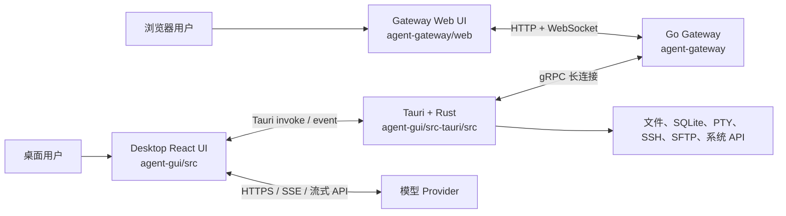
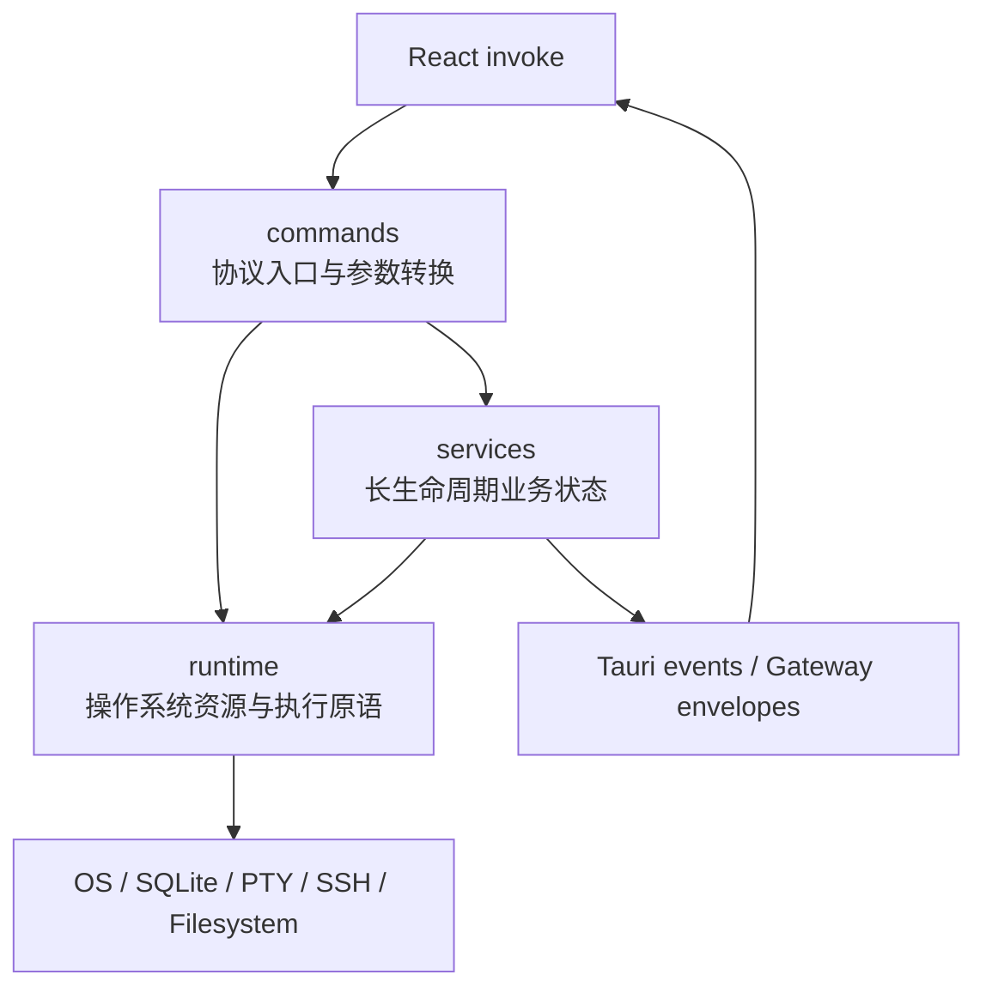

# 第 2 章：总体架构与仓库地图

## 本章目标

读完本章后，你应当能够画出四个运行单元的关系，理解 Tauri 后端的 command/runtime/service 分层，并能根据功能快速判断应该进入哪个目录。

## 先读哪些文件

- [`agent-gui/src/main.tsx`](../../agent-gui/src/main.tsx) 与 [`App.tsx`](../../agent-gui/src/App.tsx)；
- [`agent-gui/src-tauri/src/main.rs`](../../agent-gui/src-tauri/src/main.rs) 与 [`lib.rs`](../../agent-gui/src-tauri/src/lib.rs)；
- [`agent-gateway/cmd/gateway/main.go`](../../agent-gateway/cmd/gateway/main.go)；
- [`agent-gateway/internal/server/http.go`](../../agent-gateway/internal/server/http.go) 与 [`grpc.go`](../../agent-gateway/internal/server/grpc.go)；
- [`agent-gateway/web/src/main.tsx`](../../agent-gateway/web/src/main.tsx) 与 [`GatewayApp.tsx`](../../agent-gateway/web/src/app/GatewayApp.tsx)。

## 1. 四个运行单元

这张图有三个必须牢记的结论：

1. 模型 Provider 主要由桌面 TypeScript Runtime 调用；
2. 高权限系统资源由 Rust 持有，而不是 React 组件持有；
3. 远程浏览器通过 Gateway 找到桌面 Agent，Gateway 本身不替代桌面 Runtime。

## 2. 进程和状态边界

| 边界 | 调用方式 | 典型数据 | 失败表现 |
| --- | --- | --- | --- |
| React → Rust | `invoke(command, payload)` | 文件操作、设置、历史、终端、Gateway 控制 | Promise reject，Rust 端通常返回中文错误字符串 |
| Rust → React | Tauri event | 终端输出、Gateway 同步、退出确认、工作区变化 | UI 订阅不到事件或事件顺序异常 |
| Desktop → Gateway | gRPC 双向流 | 认证、命令 envelope、状态、聊天流、终端流 | Gateway 显示 Agent offline，命令等待或超时 |
| Web UI → Gateway | HTTP/WebSocket | 登录、历史、聊天命令、项目工具调用 | 浏览器断线、request id 超时或鉴权失败 |
| Chat Runtime → Provider | Provider adapter | messages、tools、thinking、attachments | 流式 error、重试或兼容恢复分支 |

状态不能跨边界“自动共享”。每次跨边界都要通过序列化数据、事件或协议显式同步。因此排查状态不一致时，先检查边界 payload，而不是只检查界面最终值。

## 3. 仓库根目录

| 路径 | 责任 |
| --- | --- |
| `agent-gui/` | 桌面 React 与 Tauri/Rust 应用 |
| `agent-gateway/` | Go Gateway、协议和 Gateway Web UI |
| `docs/` | 设计、计划和学习文档；仓库默认 `.gitignore` 会忽略该目录，提交时需显式处理 |
| `scripts/release/` | 版本注入、updater manifest、发布说明和 GitHub secrets 脚本 |
| `Cargo.toml` | Rust workspace，目前成员是 `agent-gui/src-tauri` |
| `Makefile` | 桌面、Gateway、协议、Docker 和发布统一入口 |
| `Dockerfile` | 构建嵌入 Web UI 的 Gateway 容器 |

## 4. 桌面 React 目录

### 4.1 应用入口

[`main.tsx`](../../agent-gui/src/main.tsx) 只负责创建 React root、启用 `StrictMode` 和加载全局样式。真正的应用级装配在 [`App.tsx`](../../agent-gui/src/App.tsx)：

- 加载并标准化设置；
- 管理主题、语言和设置页面；
- 启动 Automation 与 Memory Organizer 宿主；
- 监听 Gateway settings sync；
- 把权威 settings、context 和更新函数传给 `ChatPage`。

### 4.2 功能目录

| 目录 | 主要内容 |
| --- | --- |
| `src/pages/chat/` | Chat 页面拆分后的组件、runtime、queue、gateway、history、transcript |
| `src/lib/chat/` | 与 React 视图相对独立的 conversation、runner、compaction、history、message 逻辑 |
| `src/lib/providers/` | 模型构造、请求选项、厂商适配、流重试、搜索和附件 |
| `src/lib/tools/` | Builtin Tool catalog、registry、schema、执行器和审批策略 |
| `src/lib/memory/` | Memory prompt、提取、organizer 和前端 API |
| `src/lib/subagents/` | Subagent 调度、协议、存储、roster 和工具 |
| `src/components/project-tools/` | 右侧 Dock、文件树、Git review、终端和 Tunnel 面板 |
| `src/components/workspace-editor/` | Monaco 编辑器、Markdown/图片/文件预览、SFTP 和 SSH overlay |
| `src/lib/settings/` | 类型、默认值、标准化、存储和 Gateway 同步 |

这里采用“页面编排 + lib 纯逻辑”的混合结构。`ChatPage.tsx` 仍然是大型组合组件，但大量可测试行为已下沉到 `src/pages/chat/*` 和 `src/lib/chat/*`。

## 5. Tauri/Rust 三层结构

### 5.1 `commands`

`commands` 是 Tauri 暴露面。函数通过 `#[tauri::command]` 注册，并在 `app_invoke_handler!` 中列入允许调用的清单。它通常负责：

- 接收可序列化参数；
- 从 Tauri `State` 取得 manager/registry；
- 做一次边界校验和类型转换；
- 调用 runtime/service；
- 把内部错误转换成 `Result<T, String>`。

并非每个 command 都只是薄壳。例如 Git 和部分文件命令包含较多业务判断，这是历史和功能复杂度造成的例外，阅读时仍要以“谁持有状态和资源”为判断标准。

### 5.2 `runtime`

`runtime` 封装操作系统资源：Shell runner、managed process、PTY terminal、SSH channel、SFTP session、项目路径和平台判断。它处理的重点不是 UI 业务，而是：

- 资源所有权；
- 并发与锁；
- 子进程退出和清理；
- 输入输出流；
- 跨平台实现差异。

### 5.3 `services`

`services` 管理需要跨多次 command 存活的业务对象，例如：

- `GatewayController`：远程 gRPC 连接与命令处理；
- `MemoryStore`：Memory 文件与 SQLite 索引；
- `AutomationStore/Scheduler`：Cron 与 Hook 持久化和调度；
- Skills manager：发现、安装、校验和后台任务；
- Tunnel store/proxy、Workspace watcher、Power activity。

[`lib.rs`](../../agent-gui/src-tauri/src/lib.rs) 的 `run()` 是后端 composition root。它创建这些对象，用 `.manage()` 注册为 Tauri state，在 `.setup()` 中启动数据库迁移、托盘、Skills seed、Gateway 和后台监控。

## 6. Go Gateway 目录

| 目录 | 责任 |
| --- | --- |
| `cmd/gateway/` | 配置加载、gRPC/HTTP server 启动和优雅关闭 |
| `internal/auth/` | HTTP bearer token 与 gRPC interceptor |
| `internal/server/` | gRPC、HTTP、WebSocket 路由和协议转换 |
| `internal/session/` | 在线 Agent、命令队列、聊天流、状态同步和远程资源状态 |
| `internal/handler/` | 健康检查、上传、图片代理、Provider model 等 HTTP handler |
| `proto/v1/` | Desktop ↔ Gateway 的正式 gRPC 协议 |
| `web/` | 浏览器 React 客户端 |

[`cmd/gateway/main.go`](../../agent-gateway/cmd/gateway/main.go) 创建一个共享 `session.Manager`，然后把它同时交给 gRPC server 和 HTTP server。这样浏览器发出的命令与桌面 gRPC session 在同一个进程内汇合。

## 7. Gateway Web UI 与桌面 UI 的关系

两个 UI 有大量相似组件和模型，但没有被打成共享前端 package。原因是运行环境不同：

- 桌面端 backend 是 Tauri `invoke/event`；
- Web UI backend 是 Gateway HTTP/WebSocket；
- 桌面端可以本地调用模型，Web UI 只能请求桌面 Agent 执行；
- Web UI 需要认证、重连、resume cursor 和远程可用性判断。

代码复制的代价是行为容易漂移，因此仓库中存在专门的一致性测试，例如 Git graph、Markdown 图片策略、设置标准化等。修改共享视觉或数据结构时，应同时搜索 `agent-gui/src` 与 `agent-gateway/web/src`。

## 8. 数据所有权速查

| 数据 | 权威所有者 | UI 中的副本 |
| --- | --- | --- |
| 当前输入框草稿 | React composer/runtime cache | 会话切换时有草稿缓存 |
| 正在流式生成的 round | `LiveTranscriptStore` | React 通过 external store 订阅 |
| 已持久化对话 | Rust History SQLite | Sidebar 和 Conversation state 缓存 |
| 设置 | Rust `config.sqlite` | `App.tsx` 中的 normalized settings/ref |
| Memory 正文 | `.agent/memory/*.md` | Memory overview/panel 数据 |
| Memory 搜索索引 | `memory-index.sqlite3` | 可从 Markdown 重建 |
| Terminal/SSH session | Rust registry | React/Web 的 session snapshot |
| 在线 Agent session | Go `session.Manager` | Web UI status snapshot |
| 远程正在运行的聊天 | Desktop runtime + Gateway stream/ledger | Web transcript store |

## 9. 架构设计亮点

1. **高权限资源不进入 WebView**：React 只通过明确的 command 和 schema 请求系统操作；
2. **Gateway 不复制 Agent Runtime**：模型与工具语义只在桌面端维护一套；
3. **状态所有权明确但允许投影**：Web UI、Sidebar、transcript 都是权威状态的可恢复投影；
4. **注册表作为组合中心**：Tauri invoke handler、Builtin Tool Registry、WebSocket route map 都集中表达可用能力；
5. **测试关注跨副本一致性**：桌面和 Web 的重复代码通过契约测试降低漂移风险。

## 验证与扩展

- 关键测试：`agent-gui/test/ui`、`agent-gui/test/tools/builtin-registry-subagent-mcp.test.mjs`、`agent-gateway/internal/server/*_test.go`。
- 修改入口：新增跨层能力时，先决定权威所有者，再补 command/protocol 和 UI adapter，避免多个层次同时持有可写状态。
- 练习：从 `agent-gui/src-tauri/src/lib.rs` 中任选四个 `.manage()` 对象，判断它们为什么需要跨 command 存活。

[上一章：项目导读与运行](01-project-overview-and-setup.md) · [相关：Tauri / Rust 后端](11-tauri-rust-backend.md) · [返回总览](README.md) · [下一章：请求生命周期](03-agent-request-lifecycle.md)
