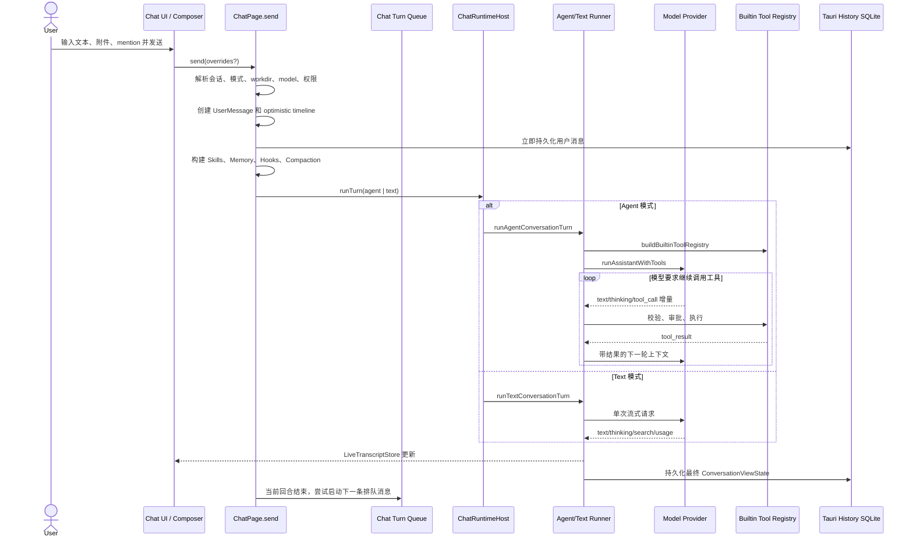
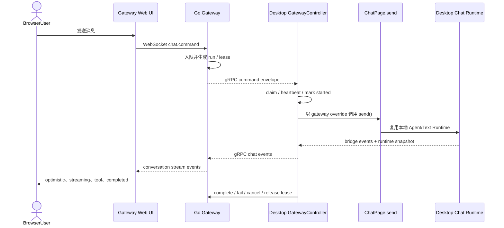

# 第 3 章：一次 Agent 请求的完整生命周期

## 本章目标

本章把后续所有模块串成一条主线。读完后，你应当能够从用户点击发送开始，追踪模型请求、工具循环、流式 UI、历史持久化、Memory 提取和 Gateway 同步，并理解取消或失败时系统如何收尾。

## 先读哪些文件

- [`agent-gui/src/pages/ChatPage.tsx`](../../agent-gui/src/pages/ChatPage.tsx)：请求组合入口，核心函数是 `send()`；
- [`ChatRuntimeHost.ts`](../../agent-gui/src/pages/chat/runtime/ChatRuntimeHost.ts)：Agent/Text 模式分派；
- [`runAgentConversationTurn.ts`](../../agent-gui/src/pages/chat/turns/runAgentConversationTurn.ts)；
- [`runTextConversationTurn.ts`](../../agent-gui/src/pages/chat/turns/runTextConversationTurn.ts)；
- [`agentRunner.ts`](../../agent-gui/src/lib/chat/runner/agentRunner.ts)：`runAssistantWithTools()` 工具循环；
- [`conversationState.ts`](../../agent-gui/src/lib/chat/conversation/conversationState.ts)：请求上下文与展示时间线；
- [`chatHistory.ts`](../../agent-gui/src/lib/chat/history/chatHistory.ts)：前端持久化队列；
- [`chat_history/commands.rs`](../../agent-gui/src-tauri/src/commands/history/chat_history/commands.rs)：Rust 历史 command。

## 1. 先认识三个核心对象

### 1.1 `ConversationViewState`

它同时保存持久化 segment、当前 active segment、summary/meta 和用于 UI 的 render timeline。它不是简单的 `messages[]`。长对话压缩后，模型请求所见上下文与用户界面所见完整历史并不完全相同。

### 1.2 `LiveTranscriptStore`

它保存本次尚未持久化的流式文本、thinking、tool call 和 tool result。React 通过 external store 订阅，避免每个 token 都让整个 `ChatPage` 进行普通 state 更新。

### 1.3 Conversation Runtime Cache

`ChatPage` 为会话保存 runtime entry，包括 state、workdir、sessionId、是否发送中、错误、compaction 状态等。切换侧栏会话时，运行中的会话不能因为当前页面不可见而丢失。

## 2. 本地请求的端到端时序



`Queue` 不一定出现在每次手动发送的前置路径中。当前会话已经运行时，新消息可以进入 `chatTurnQueue`；回合 `finally` 阶段调用 `requestQueuedChatTurnProcessing()`，再用 `takeNextQueuedChatTurn()` 取出下一项。

## 3. `ChatPage.send()` 的十二个阶段

### 3.1 解析会话和运行时覆盖项

`send()` 既服务本地发送，也服务 Gateway 领取的远程请求，因此参数允许覆盖：conversation id、execution mode、approval policy、workdir、系统工具、runtime controls、Gateway request 和编辑重发基准。

它先取得目标 conversation runtime entry，并拒绝以下状态：

- 找不到 runtime；
- 同一会话已经 `isSending`；
- 正在导入大段粘贴；
- 完整历史仍在 hydration；
- 历史 hydration 已失败。

这里的设计重点是按 conversation 隔离，而不是用一个全局 `isSending` 锁住所有会话。

### 3.2 计算有效执行配置

有效配置来自“显式 override → Gateway override → 当前 settings”的优先级。主要结果包括：

- Agent/Text execution mode；
- workdir 与项目 path key；
- approval policy 与自定义规则；
- system tools；
- SSH project association；
- 是否启用 Skills；
- 是否需要把本地运行镜像到 Gateway。

这种显式优先级使远程请求可以复用本地 Runtime，同时避免临时参数写回全局设置。

### 3.3 解析模型和 Provider Runtime

`resolveEffectiveChatModelSelection()` 验证当前 provider/model 是否仍启用；`buildProviderRuntimeConfig()` 把 base URL、API key、request format、reasoning、prompt caching、native web search 和 model config 组合成运行时配置。

标题生成和 Memory 提取可以使用独立模型。若独立 Memory 模型失效，代码会只清理对应设置，而不会让主回合失败。

### 3.4 处理 composer、附件和大段粘贴

普通文本、文件 mention、Skill mention、Git commit/file mention 会被转换为模型可读文本。Agent 模式下的大段粘贴先通过 `system_import_pasted_texts` 写入工作区，再用文件引用代替巨量内联内容。

设计亮点是让大型输入进入文件工具链：既减小上下文，也让后续 Read/Grep 操作拥有稳定路径。

### 3.5 创建用户消息和取消域

`createUserMessageWithUploads()` 生成包含展示元数据的 `UserMessage`。随后创建 `createTurnCancellation()`：

- `userStop` 是整个回合的根取消信号；
- 主请求、压缩摘要、标题等各自派生 scope；
- 用户停止时能够覆盖所有子任务，同时避免替换 AbortController 产生竞态窗口。

### 3.6 创建 pending history 和标题任务

首次回合会立即在 Sidebar 插入 pending conversation，并异步启动标题任务。标题失败时使用首条用户文本生成 fallback title，因此标题是增强能力，不是主请求成功的前置条件。

### 3.7 先显示用户消息，再执行慢操作

代码先执行：

1. `appendMessagesToConversation()`；
2. `applyConversationState()`；
3. 清空 live transcript；
4. 设置 abort controller 和 sending 状态；
5. 清空 composer。

然后才等待 Gateway 标记、历史持久化、Skills refresh 和 Memory overview。这样用户点击发送后立即看到 optimistic bubble，不会因后端准备耗时而误以为按钮失效。若准备阶段失败，`restoreComposerOnStartFailure()` 会恢复草稿和附件。

### 3.8 立即持久化用户回合

`persistConversationWithHistorySync()` 在助手完成前先写入用户消息。原因有两个：

- Sidebar 和远程 Web UI 能尽早看到最新会话；
- 编辑重发或进程中断时，用户输入已经有持久化基准。

正在生成的内容不通过 History 高频同步，而通过 `ChatRuntimeSnapshot`/Gateway stream 投影，避免每个 token 都写数据库。

### 3.9 组装 Skills、Memory、Hooks 和 Compaction

- Skills：只把 metadata 放入 system prompt，具体正文由模型按需读取；
- Memory：读取当前 workdir 的 overview section；
- Hooks：创建 conversation scope 和 lifecycle；
- Compaction：绑定本回合的 Provider、取消域、上下文 builder、状态 sink 和 rollback 持久化函数。

这些能力都围绕同一个 `ConversationViewState` 工作，但各自通过明确接口接入，不直接修改彼此内部状态。

### 3.10 进入 Agent 或 Text 分支

`createChatRuntimeHost().runTurn()` 是非常薄的分派层：

- Agent 模式进入 `runAgentConversationTurn()`；
- Text 模式进入 `runTextConversationTurn()`。

Agent 模式会创建 Builtin Tool Registry，并由 `runAssistantWithTools()` 循环处理模型输出。Text 模式没有本地工具循环，但仍处理 thinking、hosted search、usage、恢复和持久化。

### 3.11 提交流式、错误或取消结果

正常结束时，runner 把 final assistant message 追加到 conversation state 并持久化。

用户取消时：

1. `compaction.handleTurnAbort()` 尝试回滚压缩中间状态；
2. 若没有压缩回滚，`commitVisibleAbortedConversation()` 从 live snapshot 提取可见文本；
3. 未完成或错误的工具伪影被剔除；
4. 可见部分仍被写入 History。

非取消错误会通过 `commitErroredConversation()` 保存已经可见的部分，再追加一个 error assistant message。这样“失败”不会等于“整轮内容消失”。

### 3.12 `finally` 统一收尾

无论成功、失败还是取消，都会：

- 取消该 request 的审批会话；
- 解绑 Compaction；
- 结束 Hook lifecycle 和 scope；
- 清理 abort snapshot；
- 清除 sending/abort 状态；
- 完成 Gateway runtime run；
- 清理空闲 cache；
- 请求处理下一条 queued turn。

把资源清理放在统一 `finally` 是避免“按钮一直发送中”“审批卡片残留”“下一条队列不启动”的关键。

## 4. Agent Tool Loop 的实现逻辑

`runAssistantWithTools()` 的简化结构如下：

```text
准备 system prompt、messages、tools 和 abort signal
循环：
  调用 Provider 并消费流式事件
  规范化工具名称与 Provider 特殊格式
  如果没有可执行工具调用：结束
  对连续、允许并行的 Agent 调用做并发批处理
  其他工具按策略顺序执行
  把 ToolResultMessage 追加到上下文
  必要时运行 onBeforeNextTurn/Compaction
达到终止原因、取消或错误后返回
```

这里包含大量 Provider 兼容处理，例如 DeepSeek DSML、被展平的工具文本、流式参数截断保护、工具名大小写漂移和 provider-native web search bridge。核心原则是：可以恢复“明确表达的工具意图”，但不能猜测不完整参数并执行高风险操作。

## 5. 远程请求生命周期



远程链路额外需要处理：

- `clientRequestId`：浏览器 optimistic request 的稳定身份；
- `runId`：Gateway 接受后的运行身份；
- `workerId/lease owner`：防止多个桌面 worker 重复执行；
- heartbeat：区分长时间运行与 worker 已失联；
- runtime snapshot：重连或漏事件后恢复当前可见状态；
- sequence/resume cursor：WebSocket 重连时去重并补齐事件。

远程链路最终仍调用同一个 `send()`，因此本地和远程在工具权限、Memory、Compaction 和历史写入方面保持一致。

## 6. 三种时间尺度的状态

| 时间尺度 | 示例 | 所有者 | 生命周期 |
| --- | --- | --- | --- |
| UI 瞬时状态 | composer、overlay、滚动、pending upload | React component/store | 页面或会话切换期间 |
| 回合运行状态 | abort、live rounds、tool status、approval session | runtime cache / LiveTranscriptStore | 一次 send 开始到 finally |
| 持久化状态 | conversation segments、settings、memory、subagent run | Rust SQLite/Markdown | 跨进程重启 |

许多 bug 来自把三者混用。例如把 live round 立即当作已持久化 history，会造成重复消息；只更新 UI state 不写 History，会在重启后丢失；只写 History 不更新 optimistic state，会让界面显得迟钝。

## 7. 关键设计亮点与取舍

1. **单个 `send()` 支持本地、排队、远程和编辑重发**：行为一致，但组合函数规模较大；
2. **用户消息先持久化，流式内容走 snapshot**：兼顾恢复能力与写入性能；
3. **Conversation 级运行缓存**：支持后台会话继续运行，代价是必须主动做 LRU 清理；
4. **可见部分在取消后仍持久化**：改善用户体验，但必须过滤未完成工具伪影；
5. **明确的 finally 清理**：审批、Hook、Compaction、Gateway 和 queue 都在统一出口收尾；
6. **远程执行复用本地 Runtime**：减少语义分叉，但 Gateway 协议必须携带足够的 override 和恢复状态。

## 验证与扩展

- 关键测试：`agent-gui/test/chat/agent-runner.test.mjs`、`chat-turn-queue.test.mjs`、`conversation-state.test.mjs`、`gateway-bridge-events.test.mjs`。
- 修改入口：改变一次回合的总体顺序从 `ChatPage.send()` 开始；改变 Agent 工具循环从 `runAssistantWithTools()` 开始；改变状态/History 结构先看 `conversationState.ts` 与 `chatHistory.ts`。
- 练习：在不修改代码的情况下，列出一次 Agent 模式请求中至少四次“状态先更新、后台工作后执行”的位置，并解释这种顺序带来的用户体验收益。

[上一章：总体架构](02-architecture-and-repository-map.md) · [相关：Go Gateway 与 Web UI](12-gateway-and-webui.md) · [返回总览](README.md) · [下一章：前端应用与聊天界面](04-frontend-shell-and-chat-ui.md)
