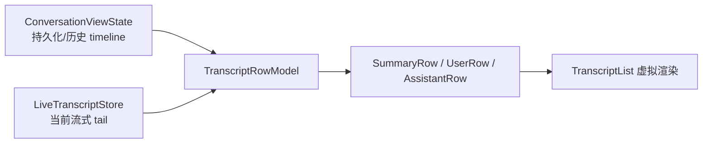

# 第 4 章：前端应用外壳与聊天界面

## 本章目标

读完本章后，你应当能够理解 React 应用如何启动和装配全局状态，聊天输入如何变成用户消息，持久化历史和实时流怎样合并成 transcript，以及项目如何处理长对话性能、滚动跟随和 Markdown 安全。

## 先读哪些文件

- [`src/main.tsx`](../../agent-gui/src/main.tsx) 与 [`src/App.tsx`](../../agent-gui/src/App.tsx)；
- [`src/pages/ChatPage.tsx`](../../agent-gui/src/pages/ChatPage.tsx)；
- [`ChatComposerBar.tsx`](../../agent-gui/src/pages/chat/components/ChatComposerBar.tsx)；
- [`ChatTranscript.tsx`](../../agent-gui/src/pages/chat/transcript/ChatTranscript.tsx) 与 [`rowModel.ts`](../../agent-gui/src/pages/chat/transcript/rowModel.ts)；
- [`AssistantBubble.tsx`](../../agent-gui/src/pages/chat/components/AssistantBubble.tsx)；
- [`Markdown.tsx`](../../agent-gui/src/components/Markdown.tsx)；
- [`scrollFollowCore.ts`](../../agent-gui/src/lib/chat-scroll/scrollFollowCore.ts)；
- [`sidebar/store.ts`](../../agent-gui/src/lib/sidebar/store.ts)。

## 1. React 启动与应用装配

`main.tsx` 保持极薄，只做三件事：创建 React root、启用 `React.StrictMode`、加载全局 CSS/KaTeX/Streamdown 样式。复杂初始化放在 `App.tsx`，使启动入口不掺入业务状态。

`App.tsx` 持有五类应用级状态：

1. `settings` 与 `settingsRef`：React 展示值和供异步回调读取的权威快照；
2. `settingsSaveState`：idle/saving/saved/error；
3. `context`：当前 ChatPage 的初始上下文载体；
4. 设置页面的 section/open/overlay 状态；
5. system theme version 与计算出的 effective theme。

### 1.1 为什么同时使用 state 和 ref

设置保存具有副作用，不能把持久化逻辑放在 React functional updater 中。StrictMode 在开发环境可能重复调用 updater，若其中生成 UUID 或执行 IPC，就会产生两次写入。

因此代码采用：

- `settingsRef.current`：同步读取最新设置；
- `setSettingsState`：驱动 React 渲染；
- `queueSettingsSave()`：把持久化写入串行放进 Promise chain。

这是一种典型的“React state 负责视图，ref 负责异步权威读取”的设计。

### 1.2 App 中的后台宿主

在 settings ready 后，App 同时挂载：

- `CronPromptRunner`：领取并执行到期的 prompt 型自动化任务；
- `MemoryOrganizerHost`：根据配置触发记忆整理；
- `ChatPage`：主工作区；
- `SettingsPage` overlay：管理配置。

App 还监听 `gateway:settings-sync`，把 Web UI 产生的可同步设置合并回本地，同时对 Provider key、SSH password/private key 等敏感更新做专门识别。

## 2. `ChatPage` 是组合层，不是单一组件

`ChatPage.tsx` 体积很大，因为它负责把多个系统接到同一个会话生命周期，但实际 UI 和纯逻辑已拆到子目录：

| 子目录 | 责任 |
| --- | --- |
| `pages/chat/components` | Composer、Header、Assistant 卡片、审批、Todo/Usage 面板 |
| `pages/chat/transcript` | 行模型、虚拟列表、用户/助手行和上传附件展示 |
| `pages/chat/runtime` | runtime entry、host、上下文 builder、标题任务 |
| `pages/chat/turns` | Agent/Text 两类回合执行器 |
| `pages/chat/queue` | 同会话发送队列 |
| `pages/chat/gateway` | 远程请求领取、runtime snapshot 和 bridge listener |
| `pages/chat/history` | 打开、重发、截断等历史操作 hook |

阅读时应把 `ChatPage` 看作 composition root：它持有 refs、stores 和 React state，然后把小而明确的依赖传入这些模块。

## 3. Composer 如何构建一条用户消息

`ChatComposerBar` 不只返回字符串，而是维护 `MentionComposerDraft`。草稿 segment 可以是：

- 普通文本；
- 工作区文件 mention；
- Skill mention；
- Git commit mention；
- Git file mention；
- 大段粘贴引用。

发送时 `ChatPage.send()` 调用 `buildTextFromComposerDraft()`：

- 文件 mention 转为约定的文件引用 token；
- Skill mention 转为 `$skill-name`，同时保留结构化 mention；
- commit/file mention 尽可能生成安全的 Markdown 链接；
- 大段粘贴在 Agent 模式下先导入工作区文件。

附件通过 `PendingUploadedFile[]` 单独保存。`createUserMessageWithUploads()` 同时生成模型可用内容和展示元数据，后续 `buildRequestContext()` 会按 Provider 能力决定保留原生附件元数据还是只保留文件引用。

### 3.1 队列 UI

当会话正在运行时，Composer 可以显示和管理 `ChatQueueTurnPreview`：追加、提升优先级、移动、编辑或删除。队列项保留 draft、uploads、execution mode 和必要的 override，使其真正执行时与最初提交意图一致。

### 3.2 立即清空与失败恢复

点击发送后，输入框与附件在 optimistic user bubble 出现的同一时刻清空。若在 Runtime 真正开始前发生失败，`restoreComposerOnStartFailure()` 会把草稿和附件恢复到可见会话或会话草稿缓存中。

这避免了两个常见问题：慢准备阶段让用户重复点击；失败后用户输入永久丢失。

## 4. Transcript 的两路数据

聊天界面不是直接渲染一个 `messages[]`，而是合并：

### 4.1 持久化区域

`ConversationViewState.historyRenderItems` 已按 summary、user、assistant group 整理。它可以包含被压缩的旧消息展示项，但模型请求只从 active segment 和 summary 构建。

### 4.2 Live tail

当前回合的文本、thinking 和工具块先进入 `LiveTranscriptStore`。`createTranscriptRowModel()` 把 live tail 接在持久化 rows 后面，并尽量保持行对象与 key 稳定。

稳定 key 很重要：如果每个 token 都改变上方行的 identity，React 会重复布局，虚拟列表会失去测量缓存，滚动位置也会抖动。

### 4.3 行类型

- `SummaryRow`：Compaction checkpoint；
- `UserRow`：用户文本与附件；
- `AssistantRow`：一个或多个 round、错误、running 状态和高度估算信息。

`rowModel.ts` 同时计算助手文本和预估高度，供虚拟列表在 DOM 尚未实际测量时保持大致正确的滚动范围。

## 5. Assistant 内容如何渲染

`AssistantBubble` 把一个 assistant row 交给 `RoundContent` 等子组件，按 block 类型渲染：

- thinking：运行中可显示，阶段完成后折叠或隐藏；
- text：交给 `Markdown`；
- hosted search：单独的搜索卡和来源；
- tool call/result：合并成 tool trace，普通工具默认折叠；
- Image、Todo、Agent：使用专门展示路径；
- usage：统一在 composer 上方的 conversation usage panel 维护，避免每条消息重复显示。

工具调用的 streaming arguments 会先生成受限预览，最终 call/result 到达后再升级同一张卡，而不是新增第二张卡。相关去重逻辑同时存在于桌面 transcript 和 Gateway Web transcript reducer 中。

## 6. 长对话虚拟化

`TranscriptList` 使用 `@tanstack/react-virtual`，但项目额外实现了三层优化：

1. `rowEstimates.ts`：根据文本长度、round 和工具数量估算初始高度；
2. `liveRangeExtractor.ts`：让 live tail 即使超出普通可见范围也能参与渲染；
3. `entranceOnce.ts`：只对短时间内首次出现的行执行入场动画，避免滚动回来重复动画。

虚拟化解决的是 DOM 数量问题，不能单独解决“流式 token 导致频繁提交”。因此 LiveTranscript 还会按 animation frame 或隐藏标签页 timer 批量提交变化。

## 7. 滚动跟随状态机

简单的“每次更新都滚到底部”会让用户无法阅读历史。项目把跟随行为拆成纯状态机 `reduceFollowEvent()` 和 DOM hook `useScrollFollow()`。

状态机考虑：

- 当前距底部是否在 8px attach threshold 内；
- 用户是否在 192px reattach zone 内向下滚动；
- wheel 是否主要为纵向；
- pointer drag、scrollbar track click、touch drag；
- PageUp/Home 等历史键和 End 等跟随键；
- WebView2 的陈旧 smooth-scroll frame；
- ResizeObserver 引发的布局变化；
- reduced motion。

核心原则是区分“内容增长造成的滚动变化”和“用户明确离开底部”。只有后者应解除跟随。

## 8. Sidebar 的缓存与一致性

Sidebar 不是每次操作后全量重载。`SidebarStore` 维护：

- 当前列表、分页和 workdir summaries；
- running conversation 集合；
- pending optimistic rows；
- rename/pin/delete mutation；
- 定时 reconcile 与 reconnect refresh。

`reconcileSidebarConversations()` 会依据服务端页面覆盖范围删除 ghost row，同时保留 pending draft、正在运行或显式 retained 的 conversation。`openController` 则把会话打开拆成 `opening → hydrating → ready/failed`，并延迟 150ms 显示 loading overlay，避免快速缓存命中也闪烁遮罩。

## 9. Markdown 和链接安全

`Markdown.tsx` 使用 Streamdown 的 code、math、mermaid、CJK 插件，并自定义 rehype sanitize 协议。聊天正文有两条重要安全策略：

### 9.1 Markdown 图片不直接渲染

普通 Markdown 图片语法会被 `MarkdownImageFallback` 转成文本 fallback。原因是模型文本中的本地路径、`file://` 或远程 URL 不应自动触发读取和显示。助手要显示图片必须调用 `Image` 工具，由工具执行路径校验、MIME/大小处理和结果元数据构建。

### 9.2 外部链接先确认

点击链接不会直接打开。`ExternalLinkModal` 显示目标 URL，用户可以复制、取消或确认，然后通过 Tauri opener 打开。只读预览还使用 `MarkdownReadOnlyLink`，避免预览内容拥有与聊天相同的交互能力。

## 10. UI 层的异常边界

- `AppErrorBoundary` 捕获顶层 React render 错误；
- 发送前失败恢复 composer；
- hydration failure 会阻止继续发送，避免基于不完整历史生成；
- Sidebar mutation 使用 optimistic update，但失败会回滚并记录 per-row error；
- Markdown 图片和外部链接采用安全 fallback；
- Tauri-only listener 在浏览器环境通过 `isTauri()` 分支跳过。

## 11. 设计亮点与取舍

1. **历史区与 live tail 分离**：高频流式更新不重建全部历史；
2. **行模型稳定 identity**：为 React 和虚拟列表同时降低抖动；
3. **纯滚动状态机**：复杂 WebView 行为可以用 Node 测试覆盖；
4. **Sidebar 是可恢复投影**：optimistic 操作快，同时定期与 SQLite 权威状态对账；
5. **ChatPage 集中组合**：跨模块顺序清楚，但文件规模大，新增功能应优先下沉纯逻辑。

## 验证与扩展

- 关键测试：`agent-gui/test/ui/agent-shell.test.mjs`、`test/chat/transcript-row-model.test.mjs`、`scroll-follow-core.test.mjs`、`sidebar-*.test.mjs`、`markdown-image-policy.test.mjs`。
- 修改入口：调整输入看 `ChatComposerBar`；调整消息结构看 `rowModel`/`AssistantBubble`；调整列表行为看 `TranscriptList` 和 `scrollFollowCore`。
- 练习：选一张 ToolCall 卡，从 `LiveTranscriptStore` 更新追踪到 `AssistantBubble` 最终渲染，记录中间经过的 row 和 round 结构。

[上一章：请求生命周期](03-agent-request-lifecycle.md) · [相关：Memory、History 与 Compaction](09-memory-history-and-compaction.md) · [返回总览](README.md) · [下一章：Chat Runtime](05-chat-runtime-and-context.md)
