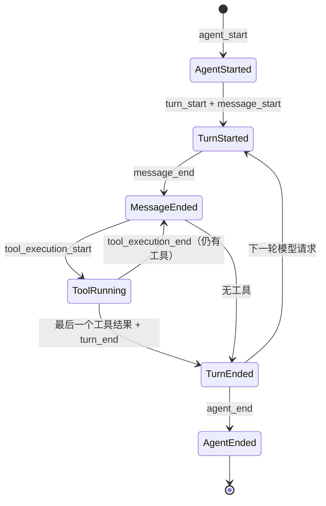

# 第 5 章：Chat Runtime、上下文与 Hooks

## 本章目标

本章深入一次回合内部。读完后，你应当能够说明 Runtime 的输入来自哪里、Agent 与 Text 模式如何分派、队列和取消怎样工作、system prompt 如何组装、Hook 生命周期如何与工具循环对齐，以及回合结束后有哪些后台任务。

## 先读哪些文件

- [`ChatRuntimeHost.ts`](../../agent-gui/src/pages/chat/runtime/ChatRuntimeHost.ts)；
- [`chatPageRuntime.ts`](../../agent-gui/src/pages/chat/runtime/chatPageRuntime.ts)；
- [`runAgentConversationTurn.ts`](../../agent-gui/src/pages/chat/turns/runAgentConversationTurn.ts)；
- [`runTextConversationTurn.ts`](../../agent-gui/src/pages/chat/turns/runTextConversationTurn.ts)；
- [`agentRunner.ts`](../../agent-gui/src/lib/chat/runner/agentRunner.ts)；
- [`hookLifecycle.ts`](../../agent-gui/src/lib/chat/conversation/run/hookLifecycle.ts)；
- [`gatewayBridgeEvents.ts`](../../agent-gui/src/lib/chat/conversation/run/gatewayBridgeEvents.ts)；
- [`extractionController.ts`](../../agent-gui/src/lib/chat/memory/extractionController.ts)。

## 1. Runtime 的输入、状态和输出

### 1.1 输入

一次回合的主要输入不是单一 context，而是一组按来源组合的依赖：

| 输入 | 来源 | 注入时机 |
| --- | --- | --- |
| conversation state | runtime cache / History hydration | `send()` 开始 |
| provider/model/runtime controls | settings 或 Gateway override | 模型创建前 |
| workdir 与 execution mode | conversation/project/settings | 工具注册前 |
| active Agent prompt | Agent template/settings | 构建 prepared context 时 |
| Skills metadata | selected skills + explicit mention | Runtime 启动前 |
| Memory overview | Rust Memory search/read | Runtime 启动前 |
| Builtin/MCP tools | registry build | Agent turn 开始 |
| attachments | composer/upload metadata | Provider payload finalize 时 |
| approval policy | settings 或远程 override | 每次工具执行前 |
| Gateway bridge | 本地镜像或远程 claim | 流事件产生时 |

### 1.2 运行状态

`ConversationRuntimeEntry` 保存 state、compactionStatus、isSending、errorMessage、hookWarning、sessionId、createdAt 和 workdir。缓存以 conversation id 为 key，并用插入顺序实现 LRU。

`pruneIdleConversationRuntimeCaches()` 只清理：非当前、非运行、非 protected 的最老 idle entry。默认最多保留 12 个 idle runtime；正在运行的后台会话不受这个上限影响。

### 1.3 输出

Runtime 同时产出四类结果：

- `ConversationViewState`：最终可持久化状态；
- LiveTranscript 更新：即时 UI；
- Gateway bridge event/snapshot：远程 UI；
- 派生任务：Memory extraction、标题、History sync、usage/Todo 状态。

## 2. Agent 与 Text 模式

`ChatRuntimeHost` 是一个 discriminated union 分派器：

```text
{ mode: "agent", params } -> runAgentConversationTurn(params)
{ mode: "text",  params } -> runTextConversationTurn(params)
```

它故意不持有状态。真正状态由 ChatPage、ConversationState、LiveTranscriptStore 和各 manager 持有，因此 host 可以稳定、易测，也不会成为第二个全局 store。

### 2.1 Agent 模式

`runAgentConversationTurn()` 的主要阶段：

1. `memoryExtraction.noteTurnBoundary()` 关闭前一轮提取窗口；
2. 创建 file state、todo state、Subagent scheduler/store；
3. `buildBuiltinToolRegistry()` 组合当前可用工具；
4. `compaction.maybeCompactPreSend()` 检查发送前上下文；
5. `hookLifecycle.startAgent()`；
6. `runAssistantWithTools()` 消费模型流并执行工具；
7. 将 text/thinking/tool delta 同时投影到 live UI 和 Gateway；
8. 工具后或 mid-stream 压力触发 `compactDuringRun()`；
9. 追加 final messages 并持久化；
10. 异步请求 Memory extraction。

连续的 `Agent` 子代理工具调用可以并发，普通 Bash 等工具保持顺序。并行资格由 runner 显式判断，不能只因为多个 tool call 出现在同一消息就全部并发。

### 2.2 Text 模式

Text 模式不注册本地业务工具，但并不是“简单 fetch”：

- 仍组装 Agent prompt、Skills、Memory 和 attachments；
- 仍处理 thinking、hosted search 和 usage；
- 仍执行发送前和 mid-stream Compaction；
- 首次流失败且尚未产生不可重放内容时可恢复一次；
- DeepSeek 历史中的结构化工具调用会被补成“文本模式不支持工具”的 ToolResult，保持 Provider 消息合法。

## 3. 上下文组装顺序

`buildPreparedContext()` 最终以 `ConversationViewState` 为事实输入。概念上的 system prompt 顺序是：

```text
基础 system prompt
+ 当前 Agent prompt
+ Skills metadata / 显式 Skill 指令
+ Memory overview
+ 工具规则或文本模式约束
```

消息区域来自 active segment，并经过 sanitizer：

- 过滤旧版静默 Memory extraction 伪消息；
- 默认排除 cancelled/aborted rounds；
- 去掉只供 UI 使用的上传元数据；
- 保留用户真实图片内容；
- 对 Provider 原生附件路径可选择保留 metadata；
- Compaction 后注入 summary 与 file ledger。

`buildResumeContext()` 用于压缩后恢复或工具恢复路径，会追加内部 resume user message，但这条消息属于 Runtime 协议，不应显示成普通用户气泡。

## 4. 回合队列

`chatTurnQueue.ts` 是纯函数模块，队列状态仍由 ChatPage 持有。每项 `QueuedChatTurn` 包含稳定 id、conversation id、draft/attachments 和创建顺序。

主要操作：

- `appendQueuedChatTurn()`：追加；
- `promoteQueuedChatTurn()`：提到同会话队首；
- `moveQueuedChatTurn()`：在作用域内移动；
- `insertQueuedChatTurnAtSlot()`：编辑后放回原优先级槽；
- `takeNextQueuedChatTurn()`：只取目标 conversation 的下一项；
- `removeQueuedChatTurnsForConversation()`：删除会话时清理。

队列按 conversation 隔离的好处是多个会话可以并行运行，而同一会话保持严格消息顺序。

## 5. 取消和竞态控制

取消分为三层：

1. **用户回合取消**：`createTurnCancellation().userStop`；
2. **子请求取消**：Provider、标题、Compaction 从根信号派生 scope；
3. **工具执行取消**：同一 signal 传给 approval broker 和 executor。

Runtime 还防护以下竞态：

- conversation 已在发送时拒绝重复启动；
- Gateway request registry 避免重复 claim；
- Compaction single-flight；
- Sidebar/History 每 conversation 写入串行化；
- streaming tool argument delta 通过 animation frame 批量刷新；
- Gateway event controller close 后拒绝普通事件，只允许必要的强制标题更新。

## 6. Hook 生命周期

`createConversationHookLifecycle()` 把模型/工具事件映射为稳定的 Hook 事件：



关键实现是 `pendingToolExecutions: Map<round, count>`。Assistant message 完成后，只有该 round 的全部工具结果都到达，才触发 `turn_end`。`endAgent()` 是幂等的，并会主动关闭仍未结束的 turn。

Hook 的实际脚本/HTTP 执行由 `createHookRunScope()` 异步调度。Hook 失败只写 `hookWarning`，默认不破坏主回合；取消回合时 scope 也被取消。

## 7. Gateway Bridge

`createGatewayBridgeEventController()` 负责把桌面 Runtime 事件转换为远程协议事件：

- token/thinking/tool call delta；
- tool call/result/status；
- hosted search；
- user message 与编辑重发 base ref；
- compaction checkpoint；
- error、usage、title 和 completion。

它记录是否已经转发非空文本，用于在 Provider 只产生最终 message、没有逐 token 事件时补发最终文本。事件进入 batcher 后还会触发 runtime snapshot debounce，以便重连恢复。

`useGatewayBridgeListeners()` 负责相反方向：领取远程请求、建立 lease、按 2.5 秒 heartbeat、检测 conversation busy、处理 queue policy，并以 override 调用同一个 `send()`。

## 8. Memory 提取控制器

主回合结束后，Memory extraction 是后台增强任务，不阻塞用户得到答案。控制器按 conversation 保存：

- 当前 generation/turn boundary；
- 是否已有 in-flight 提取；
- 待合并的下一次请求；
- 最近处理的 user message key；
- 已写入的 slug，防止短时间重复。

若新的回合在提取中到达，控制器合并或跳过旧请求，而不是无限并发。实际 engine 使用独立模型或主模型，构建候选 Memory、运行 `MemoryManager` 计划工具，再由 Rust Memory service 做风险校验和写入。

## 9. 回合结束后的工作

同步关键路径包括：

- final state 写入 runtime cache；
- live transcript 清理；
- `hookLifecycle.endAgent()`；
- Gateway completed/failed/cancelled；
- sending/abort/approval/compaction 状态清理。

可以后台执行的工作包括：

- History sync 的部分通知；
- Memory extraction；
- conversation title；
- debug JSONL；
- Sidebar 对账和 idle cache prune。

区分同步与后台的原则是：会影响下一条消息上下文正确性的工作必须完成；只影响增强展示或后续召回的工作可以异步。

## 10. 设计亮点与取舍

1. **Host 无状态、依赖显式传入**：便于测试，但参数对象较大；
2. **Agent/Text 共享外围生命周期**：History、Memory、Gateway、Compaction 行为一致；
3. **Hook lifecycle 独立状态机**：不会把 Hook 语义散落在 Provider callback 中；
4. **派生取消域**：一个 Stop 能覆盖整轮任务，又能安全管理子请求；
5. **按会话并行、会话内顺序**：兼顾多任务能力和上下文一致性。

## 验证与扩展

- 关键测试：`agent-runner.test.mjs`、`chat-turn-queue.test.mjs`、`hook-lifecycle.test.mjs`、`gateway-bridge-events.test.mjs`、`memory/extraction-controller.test.mjs`。
- 修改入口：增加回合阶段先改 Agent/Text turn executor；新增 Hook 事件先改 lifecycle 和 automation schema；改变远程实时事件先改 bridge controller 与 Web reducer。
- 练习：画出有两个工具调用的一轮 Hook 事件顺序，并解释为什么 `message_end` 早于最后一个 `tool_execution_end`。

[上一章：前端与聊天界面](04-frontend-shell-and-chat-ui.md) · [相关：Memory、History 与 Compaction](09-memory-history-and-compaction.md) · [返回总览](README.md) · [下一章：Provider 与流式处理](06-model-providers-and-streaming.md)
