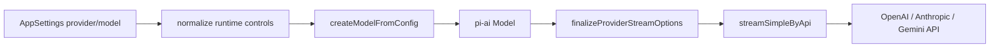

# 第 6 章：模型 Provider 与流式处理

## 本章目标

读完本章后，你应当能够说明自定义 Provider 配置如何变成统一模型对象，不同厂商的 Thinking、工具、搜索和附件怎样适配，流式事件如何安全重试，以及 DeepSeek 等兼容接口为何需要额外恢复层。

## 先读哪些文件

- [`providers/llm.ts`](../../agent-gui/src/lib/providers/llm.ts)：Provider facade；
- [`runtime/modelFactory.ts`](../../agent-gui/src/lib/providers/runtime/modelFactory.ts)；
- [`runtime/streamByApi.ts`](../../agent-gui/src/lib/providers/runtime/streamByApi.ts)；
- [`runtime/payloadPipeline.ts`](../../agent-gui/src/lib/providers/runtime/payloadPipeline.ts)；
- [`runtime/thinkingLevels.ts`](../../agent-gui/src/lib/providers/runtime/thinkingLevels.ts)；
- [`runtime/streamRetry.ts`](../../agent-gui/src/lib/providers/runtime/streamRetry.ts)；
- [`nativeWebSearch.ts`](../../agent-gui/src/lib/providers/nativeWebSearch.ts)；
- [`nativeResponsesAttachments.ts`](../../agent-gui/src/lib/providers/nativeResponsesAttachments.ts)；
- [`deepSeekProviderAdapter.ts`](../../agent-gui/src/lib/providers/deepSeekProviderAdapter.ts)。

## 1. Provider facade

`llm.ts` 不实现复杂逻辑，而是统一重新导出 model factory、request options、stream、thinking、message utils 和错误标准化。调用方只依赖 facade，可以在内部继续拆分适配逻辑而不频繁修改 Chat Runtime import。

核心类型是：

- `ProviderRuntimeConfig`：base URL、API key、request format、reasoning、cache、native search、model config；
- `StreamOptionsEx`：在 pi-ai 原始 stream options 上增加 payload hook、workdir、debug 和项目自定义项；
- `ModelOption`：设置页面展示和选择所需的模型描述。

## 2. 从设置到模型对象

`createModelFromConfig()` 负责：

- 优先匹配 pi-ai 已知模型目录；
- 为自定义 OpenAI/Codex/Gemini endpoint 构造兼容模型；
- 规范化 base URL，例如 Gemini API version、Codex `/v1` 与 `/responses`/`chat/completions`；
- 推断输入能力、max tokens 和 thinking level map；
- 对 DeepSeek endpoint 注入专用 defaults。

不要用 provider id 单独判断实际 API。`requestFormat` 和 base URL 也参与决定，例如同一个 Codex provider 可以使用 Responses 或 Chat Completions。

## 3. Payload middleware 管线

Provider 请求在发送前经过 `finalizeProviderStreamOptions()`。中间件按确定顺序组合，前一个 hook 的输出是后一个 hook 的输入。主要能力包括：

- debug payload logging；
- OpenAI Responses storage；
- Anthropic prompt caching；
- Provider-native web search；
- Gemini function tool/search 混用规则和 thought signature；
- DeepSeek payload 规范化；
- 原生附件转换。

这种 middleware 设计避免在 `streamByApi.ts` 中堆积所有厂商条件。测试会专门验证 hook 的先后顺序，因为顺序错误可能导致后一个适配器覆盖前一个的字段。

## 4. API 分派

`streamSimpleByApi()` 根据 `model.api` 分派到底层实现，并转换 tool choice、auth header 和 thinking 参数：

| API | 主要处理 |
| --- | --- |
| OpenAI Responses | reasoning effort、storage、native search、input file/image |
| OpenAI Completions | tool choice 映射、兼容 endpoint、部分视觉模型推断 |
| Anthropic Messages | adaptive/budget thinking、cache control、web search tool 版本 |
| Google Generative AI | thinking level/budget、function declarations、googleSearch 混用 |

认证 header 也不是统一的 `Authorization`：Gemini 可以使用 API key header，代理端点可能需要双 header，因此由 `requestOptions.ts` 集中构建。

## 5. Thinking 映射

UI 使用统一档位：`off/minimal/low/medium/high/xhigh/max`，但厂商字段不同。

| Provider | 适配方案 |
| --- | --- |
| Anthropic adaptive | 映射为 effort，并启用 summarized display |
| Anthropic budget | 映射为固定 thinking token budget，并调整 max tokens |
| OpenAI/Codex | 根据模型目录 `thinkingLevelMap` 裁剪后发送 reasoning effort |
| Gemini 3 / Gemma 4 | 使用 `thinkingLevel` 字段，不同模型族支持档位不同 |
| Gemini 2.5 | 使用 `thinkingBudget`，按 Pro/Flash/Flash-Lite 映射预算 |

项目优先使用模型目录声明，而不是仅靠 model id 猜测；只有 pi-ai 本身仍依赖模型族判断的字段才镜像同样规则。这样自定义模型也可以通过 `modelConfig` 明确覆盖能力。

## 6. Text-only Runtime 与工具历史恢复

`streamAssistantMessage()` 为 Text 模式构建“不允许本地工具执行”的 system suffix 和 stream options。历史中如果存在结构化 tool call，消息序列必须仍符合 Provider 协议：

- 为没有结果的工具调用补一个 synthetic ToolResult；
- 告诉模型当前是文本模式，不能继续依赖该工具；
- 对 DeepSeek 历史做额外标准化，避免 tool call 文本再次泄漏或重复执行。

这不是执行工具，而是修复历史协议，使 Text 模式可以继续回答。

## 7. 流式重试的提交边界

`withStreamRetry()` 默认最多尝试 3 次，使用带随机抖动的指数退避，最大 8 秒。它只在“尚未提交用户可见内容”时重试。

被视为 commit 的事件包括文本/thinking delta、工具调用等。一旦这些事件已经交给 UI，自动重放可能产生重复文本或重复工具，所以立即停止重试。以下情况也不重试：

- AbortSignal 已取消；
- 错误明确不可重试；
- 达到 max attempts；
- backoff 期间用户取消。

因此项目把“网络是否可重试”与“结果是否仍可安全重放”同时作为条件。

## 8. 搜索的两类事件

### 8.1 Provider-native search

`attachProviderNativeWebSearch()` 在 payload 中加入 OpenAI web search、Anthropic web search tool 或 Gemini googleSearch。它会检查：

- Provider/模型是否支持；
- 是否已经存在同类工具；
- Gemini function tools 与 server-side search 是否允许混用；
- 某些 reasoning 档位是否被上游拒绝。

这些原生工具调用通常不显示成普通 Builtin Tool 卡，而是聚合为 Hosted Search UI。

### 8.2 Hosted search event 聚合

Provider 流中搜索元数据格式差异很大。`hostedSearchEvents.ts` 通过结构化事件、citation annotation、partial JSON 和必要的 fetch probe 聚合出统一的 query/status/sources。

聚合器会去重重复更新，并把“搜索调用完成”和“整个请求完成”分开，防止延迟 citation 在流结束前丢失。

## 9. 原生附件

用户上传的文件默认可以留在工作区，由模型通过 Read 工具读取。若当前 Provider/API 支持原生附件，`nativeResponsesAttachments.ts` 会在 payload 最后阶段转换：

- OpenAI Responses：`input_image` / `input_file`；
- OpenAI Chat Completions：`image_url` block；
- Anthropic：image/document block；
- Gemini：`inlineData`。

适配器会跳过 tool output turn 和 synthetic tool image turn，避免把已经作为工具结果出现的内容重复塞回用户消息。Gemini 还计算整个请求的 base64/JSON 预算，超限时回退到工作区 Read 路径，而不是构造必然失败的巨大请求。

## 10. DeepSeek 兼容和 DSML 恢复

DeepSeek 兼容端点可能出现：

- reasoning content 字段差异；
- DSML/XML 风格的工具调用文本；
- 工具标记泄漏到 thinking；
- native tool call 与文本化工具调用重复；
- stream 缺少标准终止事件；
- tool arguments 截断。

`deepSeekProviderAdapter.ts` 处理 payload，`deepSeekDsmlToolCallStream.ts` 处理流事件，`agentRunner.ts` 再做执行前去重与完整性检查。

恢复原则：

1. 能明确解析且完整的调用可转换为结构化 tool call；
2. 与已有 native call 相同的恢复调用被去重；
3. 缺少 `toolcall_end` 或参数流截断的调用不执行；
4. 非 DeepSeek 普通文本不应用这些修复，避免误伤用户内容。

## 11. 统一事件到 UI 的映射

| 事件 | 产生位置 | Runtime 消费 | UI 表现 |
| --- | --- | --- | --- |
| text delta | Provider stream | append live text | Markdown 文本实时增长 |
| thinking delta | Provider stream | update live thinking | thinking/status 区域 |
| tool call delta | Provider/runner | 参数预览、去重 | running tool card |
| tool call | runner | Hook + executor | tool trace |
| tool result | executor | append result、下一轮 context | 成功/错误结果卡 |
| hosted search | search aggregator | live round block | 搜索卡与来源 |
| usage | terminal assistant message | conversation usage state | Composer 上方 Usage Panel |
| error | stream/adapter | commit error assistant | 错误消息或通知 |
| done | Provider stream | final message/persist | running 状态结束 |

## 12. 设计亮点与取舍

1. **Facade + middleware**：厂商差异可以独立演进；
2. **统一 UI 档位、厂商专用映射**：用户体验一致，同时尊重 API 约束；
3. **重试以“尚未提交”为安全边界**：避免重复输出和重复工具；
4. **附件有原生与工作区双路径**：兼顾能力、成本和请求大小；
5. **兼容恢复多层防护**：容忍非标准 Provider，但高风险工具不靠猜测执行。

## 验证与扩展

- 关键测试：`thinking-levels.test.mjs`、`stream-retry.test.mjs`、`native-web-search.test.mjs`、`hosted-search-events.test.mjs`、`native-responses-attachments.test.mjs`、`deepseek-dsml-stream.test.mjs`。
- 修改入口：新增 API 先改 model factory 与 `streamByApi`；新增 payload 特性优先写 middleware；新增事件类型必须同步更新 Runtime 和两端 transcript。
- 练习：选择同一个 `high` reasoning 档位，分别写出 Anthropic budget、OpenAI 和 Gemini 2.5 最终发送的概念字段。

[上一章：Chat Runtime](05-chat-runtime-and-context.md) · [相关：Go Gateway 与 Web UI](12-gateway-and-webui.md) · [返回总览](README.md) · [下一章：Tools 与审批](07-tools-and-approval.md)
