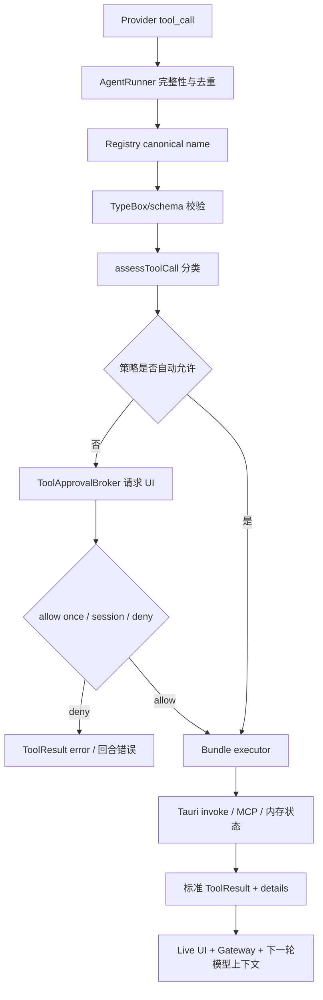

# 第 7 章：Builtin Tools、审批与安全边界

## 本章目标

读完本章后，你应当能够解释工具如何按运行环境组合、模型 tool call 如何经过名称解析、审批和执行，文件/命令/网络能力如何分类，以及新增或修改工具时必须维护哪些安全边界。

## 先读哪些文件

- [`builtinRegistry.ts`](../../agent-gui/src/lib/tools/builtinRegistry.ts)；
- [`builtinToolCatalog.ts`](../../agent-gui/src/lib/tools/builtinToolCatalog.ts)；
- [`builtinTypes.ts`](../../agent-gui/src/lib/tools/builtinTypes.ts)；
- [`toolApprovalPolicy.ts`](../../agent-gui/src/lib/tools/toolApprovalPolicy.ts)；
- [`toolApprovalBroker.ts`](../../agent-gui/src/lib/chat/approval/toolApprovalBroker.ts)；
- [`fsTools.ts`](../../agent-gui/src/lib/tools/fsTools.ts)；
- [`shellTools.ts`](../../agent-gui/src/lib/tools/shellTools.ts)；
- [`mcpTools.ts`](../../agent-gui/src/lib/tools/mcpTools.ts)；
- [`skillTools.ts`](../../agent-gui/src/lib/tools/skillTools.ts)。

## 1. Catalog、Bundle 与 Registry

三个概念不要混淆：

### 1.1 Catalog

`builtinToolCatalog.ts` 是展示用纯数据，列出工具名、分类、图标、只读属性、runtime scope 和是否条件启用。该文件会镜像到 Gateway Web UI，因此不能 import 桌面 Runtime bundle。

### 1.2 Bundle

每个功能组通过 `createXxxTools()` 返回 `BuiltinToolBundle`：

```text
groupId
tools: Tool[]            # 给模型的名称、描述和 TypeBox schema
executeToolCall()        # 实际执行器
metadataByName           # 审批和 UI 分类元数据
```

### 1.3 Registry

`createBuiltinToolRegistry()` 合并 bundles，并建立：

- `tools`：本轮发给模型的工具列表；
- `executorsByName`；
- `metadataByName`；
- 大小写不敏感的 canonical name lookup。

若两个 bundle 注册同名工具会立即抛错。若模型返回 `bash` 而实际名是 `Bash`，且没有大小写冲突，registry 会规范化后执行。

## 2. 工具可用性如何决定

`buildBuiltinToolRegistry()` 根据每一轮实时参数组合工具，而不是在应用启动时固定一次。

| 条件 | 影响 |
| --- | --- |
| `runtimeScope=chat` | 可启用 ManagedProcess、Terminal、Todo、Subagent、SSH、Tunnel |
| `runtimeScope=cron_auto_prompt` | 禁用 Todo、Subagent、Terminal 等交互或长期能力 |
| Skills enabled | 加入 SkillsManager，并允许文件工具访问获准 Skill |
| enabled MCP servers | 动态发现并加入 MCP business tools |
| selected system tools | 加入用户选择的自定义系统工具 |
| project SSH association | 条件加入 SSHManager |
| remote web tunnels enabled | 条件加入 TunnelManager |
| subagent runtime | 加入 Agent 与 SendMessage，并构建子代理受限 registry |

子代理不会简单继承父工具：worktree child 禁用 Skills 写入和系统工具，Memory 只读；read-only child 进一步去掉写入和 Shell。这个最小权限组合在 registry 构建阶段完成。

## 3. 一次工具调用的完整流程



AgentRunner 在 registry 前还检查流式参数是否完整。一个“勉强解析出来但末尾缺失”的 Write/Agent 调用会被拒绝，而不会把残缺 JSON 交给执行器。

## 4. 审批策略

审批策略有四种：

| 策略 | 自动允许 | 需要询问 |
| --- | --- | --- |
| `full` | 所有分类 | 无 |
| `ask` | read、internal | write、command、network、MCP、system |
| `agent` | read、internal、非 destructive 的 workspace write | Delete、command、network、MCP、外部路径等 |
| `custom` | 由规则允许的 workspace write/command/network/MCP | 未允许分类、Delete、默认外部路径 |

`assessToolCall()` 把调用分成 read/write/command/network/mcp/system/internal，并收集 `path/cwd/root/directory/file_path/paths` 参数判断是否越出 workdir。

`Agent`、`SendMessage`、`TodoWrite`、`ReadTerminal` 被视为 internal。Delete 始终标记 destructive；即使 custom 允许 workspace writes，Delete 仍需询问。

### 4.1 Broker 的会话授权

`ToolApprovalBroker` 维护 pending request 和 session allowance。用户可以：

- `allow-once`：只放行当前调用；
- `allow-session`：同 session、同工具名、同分类、同 workspace/external 范围继续自动放行；
- `deny`：抛出 `ToolApprovalDeniedError`。

回合 `finally` 调用 `cancelSession()`，清除 pending request 和 allowance，避免授权泄漏到下一轮或另一会话。

## 5. 文件工具的实现方案

文件 bundle 包括 Read、Image、Write、Edit、Delete、List、Glob、Grep。核心不是直接拼路径调用 fs，而是先经过 ToolPathResolver/`fsBackend`：

- workspace 相对或绝对路径；
- `skill://` 以及已启用 Skill 的真实路径；
- 经过意图与审批的 external absolute path；
- Windows 与 POSIX 路径归一化；
- 旧版 `workspace:`/`skill:` 前缀兼容。

### 5.1 读后写保护

`FileToolState` 记录完整读取 snapshot、fileId、hash 和 mtime。Write/Edit 会自动 prime 必要的完整 snapshot，用于生成 diff、检测路径别名和在 UI 中展示修改统计。

### 5.2 写入语义

- Write 是完整覆盖，不猜测文件名；
- Edit 要求精确 `old_string`，并控制 replacement count；
- Delete 是显式 destructive 工具；
- directory path 会在进入 backend 前给出文件名指导；
- backend 错误保留 display path，并提供 Glob/List 恢复提示。

### 5.3 图片显示

Image 是助手侧唯一支持的图片展示路径。它可接受 workspace、Skill、外部绝对路径、HTTP(S)、base64 data URL 和 SVG，返回 `display_image` details。Markdown 图片语法只显示 alt fallback，避免文本绕过文件权限。

## 6. Shell 与后台进程

`Bash` 名称保持跨模型兼容，但在 Windows 运行时描述和执行策略是 Windows-native，不要求 POSIX Bash。

主要保护：

- timeout schema 允许较大值，但按 Provider/runtime policy 裁剪；
- 拒绝不受支持的 `root` 参数；
- POSIX 下识别 `&` 背景命令是否真正 detach stdio；
- Windows 不错误套用 POSIX `&` 判定；
- 普通 Bash 响应若 stdout/stderr 仍未关闭，会标记为错误；
- Skill cwd/脚本只能来自当前 allowlist；
- workspace 命令不能猜测或穿透固定 Skills root。

`ManagedProcess` 用于真正的长期后台命令，返回可管理的 process id，并由 Rust registry/journal 提供 status、log、stop 和重启恢复。Cron scope 不暴露它，避免无人值守任务留下不可控进程。

## 7. 其他工具组

### 7.1 MCP

`createMcpTools()` 把远端 `tools/list` 转成安全名称，并保存 safe name → server/tool 映射。同一 MCP server 的 business call 串行，不同 server 可并发，防止单个 server 内部状态竞争。

`McpManager` 管配置和 runtime，可 list/read/create/update/delete/validate/test/tools/restart/stop。读取会 redact env/header；Cron scope 禁止写配置和 restart/stop。

### 7.2 Skills

`SkillsManager` 处理 list/read/install/create/validate/package 等动作，并强制 `SkillAccessPolicy`。内置 Skill 不允许被普通工具直接覆盖；管理动作完成后把新 Skill 名和 baseDir 回传给 ChatPage 动态启用。

### 7.3 Memory、Todo、Cron

- `MemoryManager`：list/read/search/write/update/delete/accept/apply batch；子代理可配置为只读；
- `TodoWrite`：每次提交完整替换列表，只允许最多一个 `in_progress`；状态按 conversation 保存；
- `CronTaskManager`：管理 task 和 run logs，默认继承当前 chat model 信息。

### 7.4 SSH 与 Tunnel

`SSHManager` 只暴露与当前项目关联的 host，读取结果 redact 凭据。它支持复用、强制新建或要求已有 session；keyboard-interactive 连接必须由可见 UI 完成交互，模型工具不能自己回答凭据提示。

`TunnelManager` 只在 Remote Web Tunnels 启用时注册，支持 list/create/close/check，并把 project path key、TTL 和 public base URL 绑定到 Gateway tunnel state。

## 8. ToolResult 为什么带 `details`

给模型的 `content` 是文本或图片内容；给 UI 和系统的 `details` 是结构化元数据，例如：

- fileId、hash、mtime、行数和 diff；
- image source、MIME、load mode；
- Subagent cards 和 batch；
- MCP/Skills 管理动作；
- process/session/tunnel 状态。

这样模型可以消费简洁文本，UI 不必重新解析自然语言来画卡片，History/Gateway 也能保存稳定结构。

## 9. 远程执行边界

Web UI 展示 catalog，并通过 Gateway 提供文件、Git、终端等项目工具，但 Agent Runtime 的 Builtin Tool Registry 仍在桌面前端创建。远程 Chat request 进入桌面 `send()` 后，按远程设置决定是否允许 SSH terminal、Tunnel 和其他系统能力。

因此“Web UI 能显示某个工具”不等于“远程模型当前一定能调用它”。最终可用性由桌面 registry 的 runtime scope、settings、project association 和 approval override 决定。

## 10. 设计亮点与取舍

1. **Bundle 组合代替巨型 switch**：每组工具独立 schema、executor 和 metadata；
2. **可用性按回合构建**：权限和连接状态实时反映，但 registry 创建有一定成本；
3. **审批位于统一 registry 边界**：所有 bundle 自动获得同一策略；
4. **结构化 details**：模型、UI、持久化各取所需；
5. **子代理最小权限 registry**：能力继承是显式白名单，不是复制父上下文。

## 验证与扩展

- 关键测试：`tool-approval-policy.test.mjs`、`tool-schema-validation.test.mjs`、`path-and-system-tools.test.mjs`、`shell-tools.test.mjs`、`builtin-registry-subagent-mcp.test.mjs`。
- 修改入口：新增工具先实现 bundle，再加入 `buildBaseBuiltinToolBundles()` 或条件组合，补 catalog、metadata、审批分类和测试。
- 练习：为一个“读取 HTTP 状态”的假想工具判断 category、默认审批策略、runtime scope 和 ToolResult details，说明每项选择的原因。

[上一章：Provider 与流式处理](06-model-providers-and-streaming.md) · [相关：Tauri / Rust 后端](11-tauri-rust-backend.md) · [返回总览](README.md) · [下一章：Skills 与 MCP](08-skills-and-mcp.md)
