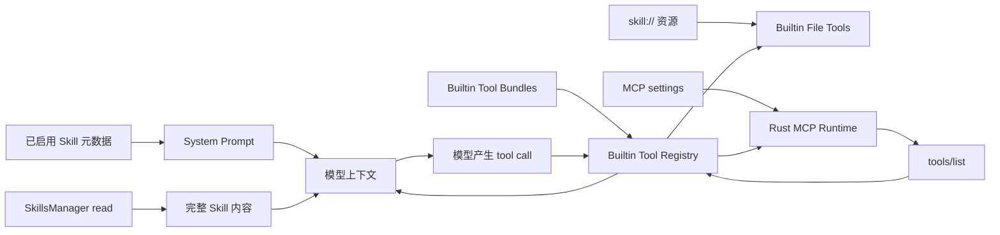
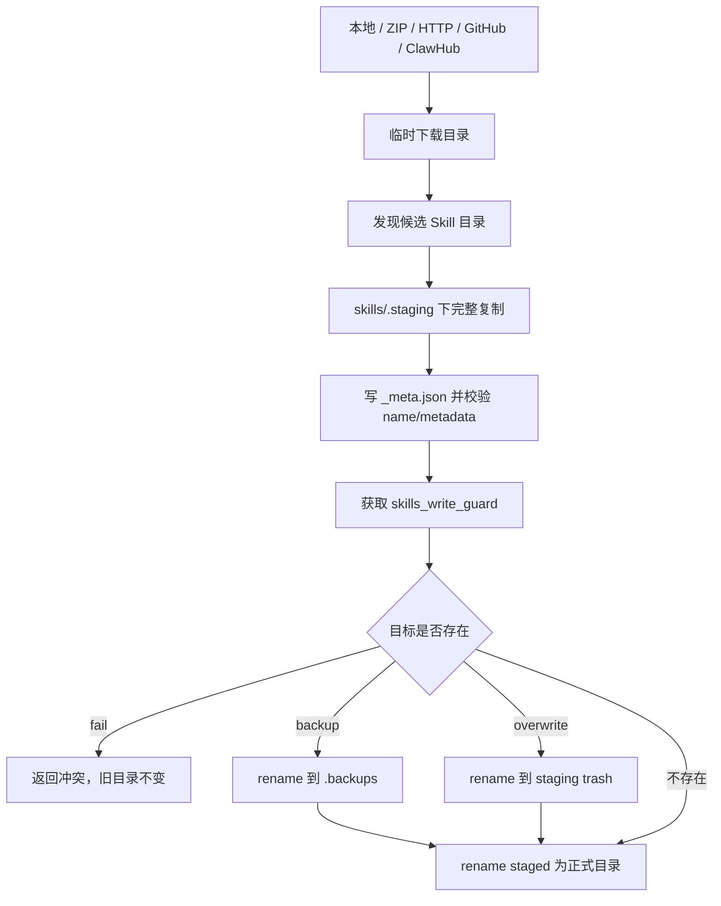

# 第 8 章：Skills 与 MCP

## 本章目标

读完本章后，你应当能够区分 Skill、MCP 与 Builtin Tool，说明 Skill 从发现到进入模型上下文的完整生命周期，理解安装过程为什么不会暴露半成品目录，并能追踪一个 MCP server 从设置、初始化、工具发现到实际调用和故障恢复的实现链路。

## 先读哪些文件

- [`skills/index.ts`](../../agent-gui/src/lib/skills/index.ts) 与 [`skills/builtin.ts`](../../agent-gui/src/lib/skills/builtin.ts)；
- [`skillTools.ts`](../../agent-gui/src/lib/tools/skillTools.ts) 与 [`skillAccessPolicy.ts`](../../agent-gui/src/lib/tools/skillAccessPolicy.ts)；
- [`services/skills`](../../agent-gui/src-tauri/src/services/skills)；
- [`mcpTools.ts`](../../agent-gui/src/lib/tools/mcpTools.ts) 与 [`mcpManagerTools.ts`](../../agent-gui/src/lib/tools/mcpManagerTools.ts)；
- [`commands/integration/mcp.rs`](../../agent-gui/src-tauri/src/commands/integration/mcp.rs)；
- [`mcpRegistry/index.ts`](../../agent-gui/src/lib/mcpRegistry/index.ts)。

## 1. 三类扩展能力的边界

三者最终都可能影响模型行为，但进入 Runtime 的方式不同：

| 能力 | 本质 | 主要载体 | 谁负责执行 |
| --- | --- | --- | --- |
| Skill | 方法知识、提示词和配套资源 | `SKILL.md`、`skill.md`、`skill.json`、README fallback 与资源目录 | 模型阅读后遵循；文件访问仍经 Builtin File Tools |
| MCP | 外部进程或网络服务暴露的运行时工具 | MCP JSON-RPC、`tools/list`、`tools/call` | Tauri `McpRuntimeManager` 维护连接并转发调用 |
| Builtin Tool | Agent 应用内建能力 | TypeBox schema、bundle、registry、Tauri command/service | 桌面 TypeScript Runtime 与 Rust backend |



Skill 不会因为安装在磁盘上就自动获得当前会话访问权；MCP server 也不会因为写入设置就保证启动成功。两者都在每轮 Runtime 构建时经过启用状态、访问策略和运行状态筛选。

## 2. Skill 的来源与根目录

Rust 的 `skills_root_dir()` 把用户 Skills 放在应用数据目录的 `skills` 子目录中，并先创建、再 canonicalize 根目录。前端发现结果中的 `rootDir` 主要用于展示和构造受控路径；模型访问资源时应使用 `skill://<baseDir>/...`，而不是猜测绝对目录。

项目支持三类来源：

1. **Builtin**：`skills-installer` 与 `skills-creator` 被编译进 Rust binary，由 `ensure_builtin_agent_skills_sync()` 在发现前写入；内容变化或目录无效时先备份再更新。这两个 Skill 始终启用，但受保护，模型不能覆盖或删除。
2. **用户安装 Skill**：来自本地目录、压缩包、HTTP 下载、GitHub 仓库或 ClawHub；安装后成为普通用户 Skill。
3. **External 扫描结果**：`external.rs` 只读扫描 Claude Code、Codex、CodeBuddy 的常见 Skills 目录，UI 让用户明确选择后再复用 install 流程导入，不会直接把外部目录加入当前会话。

ClawHub 既有浏览器侧 API 适配 `skills/clawHub.ts`，也有 Rust 安装路径。安装时会把 registry、slug、version、publishedAt 写入 `_meta.json`，供后续显示来源和更新判断。

## 3. Skill 发现与元数据读取

`discoverSkills()` 的主链是：

```text
ensureBuiltinSkills()
→ manageSkill({ action: "list" })
→ Rust list_installed_skills()
→ 读取并验证元数据
→ managedSkillListToDiscovery()
→ 排序、按 name 去重、缓存结果
```

### 3.1 支持的元数据形态

Rust `metadata.rs` 优先寻找标准元数据文件，并支持：

- `SKILL.md` 或 `skill.md` 的 YAML frontmatter；
- `skill.json`；
- 没有标准元数据时，以 README 文件名和首个有效描述行作为管理界面 fallback。

README fallback 比标准 Skill 更弱。前端 `maybeAttachReadmeFallbackInline()` 会读取最多 10000 行并直接放进 prompt，因为它没有足够元数据支持渐进披露。标准 Skill 只把 name、description、skillFile 和 baseDir 注入 prompt，完整内容等真正需要时再由 `SkillsManager(action=read)` 读取。

### 3.2 缓存与失效

前端同时维护 `cachedDiscovery`、`inFlightDiscovery` 和 `discoveryCacheEpoch`：

- 多个组件同时发现时共享同一个 in-flight Promise；
- install/create/delete 或安装 job 完成后清空缓存；
- epoch 防止旧请求在一次强制刷新之后重新覆盖新缓存；
- `agent:skills-discovery-updated` 浏览器事件通知选择器和设置页重取数据。

这是一个小型 single-flight + generation 方案，解决页面并发挂载和后台安装同时发生时的陈旧结果问题。

## 4. Skill 如何进入当前回合

### 4.1 选择和显式 mention

会话先从设置和选择器得到 enabled Skills。`buildSkillsSystemPrompt()` 只披露这些 Skill，并明确告诉模型完整内容的读取规则。

用户输入中的 `$skill-name` 由 `extractSkillMentionNamesFromText()` 解析，同时排除 PATH、HOME、PWD 等常见环境变量，避免把 Shell 文本误认为 Skill。`resolveExplicitSkillMentions()` 再按结构化 skillFile、精确名称、唯一的大小写不敏感名称依次匹配。

显式 mention 表示“优先阅读和遵循”，不是新的授权渠道：未启用的 Skill 即使被写进文本也不会加入上下文。

### 4.2 访问策略

`SkillAccessPolicy` 同时约束：

- 可见的 Skill name 与 baseDir；
- 是否允许列出整个 inventory；
- 是否允许安装、创建、打包、删除等管理动作；
- 是否允许修改 Skill 内文件。

File Tools 在解析 `skill://` 或 Skills 根目录路径时调用同一策略。错误信息还明确禁止使用 Bash、绝对路径或扫描用户目录绕过限制。子代理通常只得到父回合显式授予的 baseDir；只读子代理进一步禁止 mutation。

内置 Skill 始终可以读取，但 `assertSkillMutationAllowed()` 会单独阻止对 `skills-creator` 和 `skills-installer` 的写入。

## 5. Skill 管理动作

模型侧只有一个 `SkillsManager` 工具，但 Rust `system_manage_skill_sync()` 会按 action 分发：

| action | 实现目标 |
| --- | --- |
| `list` / `read` | 列出当前允许的 Skills，按行窗口读取 Skill 文件 |
| `create` | 生成带 frontmatter 的新 Skill 模板 |
| `install` / `install_start` | 从本地、压缩包、HTTP、GitHub 安装；后者返回后台 job |
| `install_status` / `install_cancel` | 查询进度或设置取消标记 |
| `validate` / `package` | 检查结构并打包为可分发归档 |
| `delete` | 删除用户 Skill；Builtin 会被拒绝 |
| `clawhub_search` / `clawhub_install` | 搜索并安装 ClawHub Skill |
| `scan_external` | 扫描其他 CLI 的 Skill 目录 |

`skillTools.ts` 在调用 Rust 前先做参数、路径、action 和访问策略检查；返回后又过滤 inventory，并把新安装的 name/baseDir 收集起来授予当前会话。这样用户明确安装后可以继续使用新 Skill，但不会顺带暴露其他已安装项。

## 6. 安装可靠性与安全

Skill 安装采用“准备源 → 私有暂存 → 校验 → 原子换入”方案：



关键保护包括：

- 名称只允许小写字母、数字、单连字符，拒绝 Windows 保留名；
- 相对路径拒绝根路径、盘符、`..`、冒号和隐藏控制目录；
- ZIP 使用 enclosed path，拒绝目录穿越和符号链接；
- 限制最多 2000 个归档项、解压后 50 MiB、单 Skill 文件大小；
- 普通目录复制不跟随 symlink；
- 下载有 30 秒 HTTP timeout、总大小限制和分块取消检查；
- 新内容先在同一文件系统的 `.staging` 完整构建，最终 `rename`，读者只会看到旧版或新版；
- 同名并发安装在最终 swap 阶段由全局 write guard 串行化；24 小时以上的废弃 staging 会被清理；
- conflict 可选 fail、backup、overwrite，失败时 live target 保持不变。

后台安装 job 记录 phase、下载字节、总量、消息、错误和结果。取消是协作式的：下载、候选遍历和安装阶段检查标记；已经完成的 job 不允许再取消。

## 7. MCP 配置层

`McpManager` 管理的是设置和 runtime，不负责调用业务工具。它支持 stdio、Streamable HTTP 和 legacy SSE 三种 transport。

创建或更新前，TypeScript 会：

- 规范化 id、args、env、headers、cwd、timeout；
- 校验 stdio 必须有 command，HTTP/SSE 必须有合法 URL；
- 通过 `ToolPathResolver` 解析 cwd，允许工作区路径或明确的外部目录；
- 在 list/read 结果中把 env 与 headers 的值替换为 `<redacted>`；
- 在非 chat runtime scope 禁止 CRUD、enable/disable、restart/stop。

设置提交采用同步 read-modify-write：每次 commit 都重新读取 `getMcpSettings()` 的权威值，并在任何 `await` 前调用 `applyMcpOps()`。这是为了让 UI 编辑、Gateway settings sync 和并发回合不会用旧快照覆盖彼此。

配置提交是事实源；之后停止旧 runtime 只是 best effort。即使 stop 失败，下次 `ensure_client()` 发现同 id 配置已改变也会替换旧 client。

## 8. MCP Runtime 生命周期

Tauri 的 `McpRuntimeManager` 是进程级连接池，key 为 server id。完整链路为：

1. `createMcpTools()` 过滤 enabled servers 并先检查配置完整性；
2. `mcp_list_tools` 对每个 server 调用 `ensure_client()`；
3. client 按 transport 启动子进程或 HTTP/SSE 会话；
4. `ensure_initialized()` 依次尝试支持的 MCP protocol version，成功后发送 `notifications/initialized`；
5. `tools/list` 返回工具名、描述和 JSON Schema；
6. TypeScript 把 server id + tool name 变成不超过 64 字符的稳定安全名称；
7. 模型调用动态 `mcp_*` 工具后，映射回原 server/tool；
8. `mcp_call_tool` 发送 `tools/call`，把 text/image content、isError 和 details 转成统一 ToolResult。

### 8.1 锁粒度

Rust 的 clients map lock 只用于短暂 get/insert，不在启动进程、网络请求或 client lock 期间持有。相同 server 的调用由 client mutex 串行，不同 server 可以并发。

TypeScript `withMcpServerCallLock()` 又在业务调用入口按 server id 排队。双层约束的目标一致：同一 MCP 协议流不被交错写入，同时避免一个慢 server 阻塞所有 server。

### 8.2 工具名称和 schema

MCP 原始工具名可能含空格、斜线或过长字符串。`buildSafeToolName()` 将 server/tool 分段清洗，并在超长时追加稳定 FNV-1a hash。`toolNameMap` 保存反向映射，模型看见的名称不需要与 server 原始名称相同。

MCP 已提供 JSON Schema，所以动态工具直接把 `inputSchema` 交给 Provider；真正调用前仍经过统一 Builtin Registry 的 schema 校验和 MCP 审批分类。

## 9. MCP 故障恢复与诊断

MCP 的失败被分成配置、启动、initialize、tools_list 和业务调用几个阶段：

- 普通对话加载某个 server 失败时，`mcp_list_tools` 记录日志并跳过它，其他 MCP 和主对话继续；需要严格加载的路径可以选择 throw；
- Streamable HTTP session 返回 404 时，client 清 session、重新 initialize 一次并重试原请求；第二次 404 才失败；
- 同 id 配置变化时 `ensure_client()` 创建新 transport，旧 Arc 释放后关闭旧资源；
- `test` 可以使用临时 client，不污染共享连接池；`restart` 会先停止持久 client；
- `diagnose` 可返回 stderr tail，并根据 spawn、timeout、401/403、SSE message URL 等错误生成建议；
- `runtime_status` 查询不会为了检查状态而启动一个不存在的 server。

`McpManager` 的 restart/stop 会影响所有共享该 client 的会话，因此被当作写操作审批，而不是普通只读诊断。

## 10. 桌面端与远程端边界

MCP 进程和连接实际运行在桌面 Tauri 后端。浏览器 Web UI 可以修改可同步的 MCP 设置并发起远程 Chat，但请求最终由已连接桌面端领取；动态 MCP 工具仍由桌面 Runtime 在该轮重新发现和执行。

因此应区分：

- Web UI 显示的配置：远程控制面；
- Gateway 保存和转发的设置：同步面；
- Tauri `McpRuntimeManager`：真正的数据面；
- 当前回合的 Builtin Registry：最终能力与审批边界。

## 11. 设计亮点与取舍

1. **Skill 渐进披露**：默认只注入元数据，降低上下文成本；README fallback 才内联全文。
2. **安装 stage-then-swap**：校验失败和并发更新不会暴露半成品。
3. **访问授权与安装状态分离**：磁盘上存在不等于当前会话可读取。
4. **MCP 设置与 runtime 分离**：配置可持久化、连接可按需重建。
5. **按 server 锁而非全局锁**：保护协议顺序，同时保留跨 server 并发。
6. **诊断不污染共享运行时**：非 chat scope 的 test 使用临时连接，适合设置页和自动检查。

## 验证与扩展

- 关键测试：`agent-gui/test/skills/explicit-skill-mentions.test.mjs`、`test/tools/mcp-tools.test.mjs`、`mcp-manager-tools.test.mjs`、`mcp-registry.test.mjs`，以及 Rust `services::skills` 和 `commands::integration::mcp` 测试。
- 修改入口：新增 Skill 来源从 `services/skills/sources.rs` 和 manager action 开始；新增 MCP transport 从 Rust transport enum、配置校验和设置模型开始。
- 练习：选择一个已启用 Skill 和一个 MCP 工具，分别画出它们从设置/选择到进入模型上下文的链路，并标出哪一步真正授予了执行权限。

[上一章：Tools 与审批](07-tools-and-approval.md) · [相关：Tauri / Rust 后端](11-tauri-rust-backend.md) · [返回总览](README.md) · [下一章：Memory、History 与 Compaction](09-memory-history-and-compaction.md)
