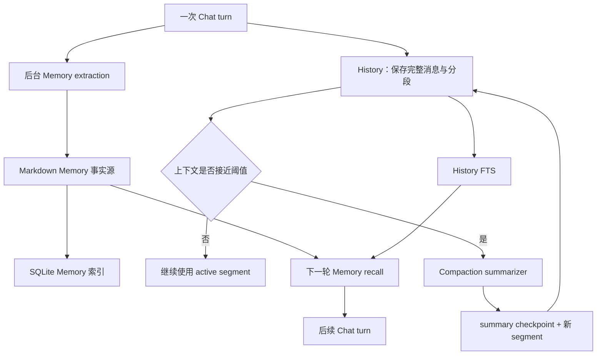
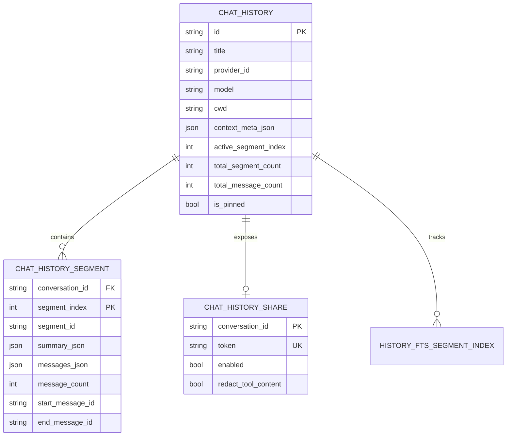

# 第 9 章：Memory、History 与 Compaction

## 本章目标

读完本章后，你应当能够区分 Memory、History 和 Compaction 的职责，解释 Memory 为什么以 Markdown 为事实源、SQLite 为可重建索引，理解历史会话的 conversation/segment/message 模型，并能追踪上下文压缩从 token 决策、摘要请求、checkpoint 到恢复继续执行的完整方案。

## 先读哪些文件

- [`memory/schema.ts`](../../agent-gui/src/lib/memory/schema.ts)、[`memory/api.ts`](../../agent-gui/src/lib/memory/api.ts)；
- [`memory/extraction`](../../agent-gui/src/lib/memory/extraction) 与 [`memory/organizer`](../../agent-gui/src/lib/memory/organizer)；
- [`services/memory`](../../agent-gui/src-tauri/src/services/memory)；
- [`chatHistory.ts`](../../agent-gui/src/lib/chat/history/chatHistory.ts)；
- [`commands/history/chat_history`](../../agent-gui/src-tauri/src/commands/history/chat_history) 与 [`history_db.rs`](../../agent-gui/src-tauri/src/commands/history/history_db.rs)；
- [`conversationState.ts`](../../agent-gui/src/lib/chat/conversation/conversationState.ts)；
- [`chat/compaction`](../../agent-gui/src/lib/chat/compaction)。

## 1. 三套持久上下文解决不同问题

| 系统 | 保存什么 | 主要用途 | 生命周期 |
| --- | --- | --- | --- |
| Memory | 用户偏好、反馈、项目事实、参考知识、每日记录 | 跨会话召回和行为个性化 | 可跨多个会话长期存在 |
| History | 完整会话元数据、分段、消息、summary、分享状态 | 恢复 UI、继续对话、搜索和远程同步 | 以 conversation 为单位 |
| Compaction | 对旧活跃上下文的累积摘要与文件账本 | 在模型 context window 内继续长任务 | 属于 History 中的 segment/checkpoint |



History 是“发生过什么”的会话记录；Memory 是“未来还值得知道什么”的提炼结果；Compaction 是“在不删除 History 的前提下，模型下一轮实际看什么”的上下文控制机制。

## 2. Memory 的文件与索引模型

### 2.1 Markdown 是事实源

`MemoryStore` 使用用户目录下的 `.agent/memory`：

```text
.agent/memory/
├─ global/                 # global project/reference
│  ├─ user/                # user/feedback
│  ├─ daily/               # daily-YYYY-MM-DD
│  └─ MEMORY.md            # 机器生成的范围索引
├─ projects/<workdirHash>/ # 项目记忆与 .workdir.json
└─ memory-index.sqlite3    # 搜索/列表/审计/organizer run 索引
```

普通 Memory 文件包含规范化 frontmatter 和 Markdown body。文件是可阅读、可同步、可备份的事实源；SQLite 记录 meta、FTS、审计和 organizer run，用于高效查询，不承担唯一数据来源角色。

`MemoryStore::open()` 会先创建目录、检查数据库完整性、初始化 schema，再执行 `reconcile()`。数据库损坏时，SQLite/WAL/SHM 被移动到 `.quarantine/corrupt-*`，新数据库可从 Markdown 重建。

### 2.2 Scope、type 与项目身份

Memory scope 只有：

- `global`：所有项目可见；
- `project`：只对一个工作区可见。

项目身份不是直接用路径做数据库主键，而是 canonicalized workdir 的 SHA-256 前 16 位。项目目录还保存 `.workdir.json`，让 UI 可以把 hash 映射回可读路径。显式传入 workdirHash 时必须是 16 位十六进制，防止任意路径拼接。

普通可写 type 为：

- `user`：用户身份、偏好和稳定习惯；
- `feedback`：用户对助手行为的纠正；
- `project`：当前仓库的持久事实；
- `reference`：长期可复用参考知识。

`daily` 是单独的日志 facet，只能 append，不能通过普通 write 创建，也不能被 accept。每日边界默认在本地 4 点 rollover，旧日志可以归档到按年份组织的目录。

### 2.3 Meta、review 与 evidence

SQLite `memory_meta` 记录 slug、scope、workdirHash、type、description、headline、日期、append count、归档状态、body hash、文件时间/大小、source 和 links。

review 状态由 `unreviewed` 表达：

- extractor 创建或实质更新的候选默认 unreviewed；
- 用户直接写入默认已确认；
- `accept` 会保留正文，把 unreviewed 清为 false，并写审计日志；
- evidence-only update 不会无故把原已确认状态重新变成未确认。

证据字段包括 confidence、source quote、reasoning、aliases、conflicts、supersedes 和 overrideReject。TypeScript 只传结构化字段，Rust `evidence.rs` 是唯一序列化与强制契约的位置：

- high 至少需要 5 个字符的原文 quote；
- medium 至少需要非空 quote；
- 不满足时逐级降为 medium/low，并返回 `autoDowngraded`；
- daily 的 confidence 固定为 unknown。

## 3. Memory 提取链路

提取是主回合后的后台增强任务，不阻塞答案展示。

### 3.1 Gating：先判断是否值得调用模型

`extractionSkipReason()` 是无 I/O 的纯函数，过滤：

- 空消息、只有标点或短到没有信息量的消息；
- 简单问候、感谢和确认；
- 30 秒最小间隔内的重复运行；
- 已处理过的同一用户消息。

短的“是/yes”是例外：若可能是在确认一条 unreviewed hypothesis，就延迟到候选加载后再决定，而不是过早丢弃。

### 3.2 构造有限证据窗口

`buildConversationWindowBlock()` 只保留最近 4 个 user turns，单消息和整个窗口都有字符上限；超限时从前面裁剪，保护最新一轮。工具只保留短摘要和成功/失败状态，不重新发送整个 Chat system prompt。

`deriveWorkspaceMutations()` 额外从最后一轮的 Write/Edit/Delete、可能修改工作区的 Bash 和带工作区路径的未知工具推导确定性 mutation digest。项目 scope 的提取由此可以证明“本轮确实改变或明确讨论了项目事实”，不靠模型猜测。

### 3.3 单一 plan tool

提取模型只能通过 `SubmitMemoryPlan` 提交 write、update、accept、delete、append_daily。每个 item 独立校验：一个坏 item 不会让整次提取静默丢失。

主要 gate 包括：

- write 必须有 slug、scope、type、description、body；
- project scope 必须有工作区；
- body 不得超过 8 KiB；
- 同一 plan 内同 slug 只允许一次 mutation，必要时可随后 accept；
- 本轮已经写过的 slug 不重复写；
- 用户最近拒绝/删除的 slug 必须提供 overrideReject 理由；
- daily body 不得为空。

通过的 item 被转换成 `memory_apply_batch`，这是 extraction、organizer 和手动批量应用共享的持久化协议。

### 3.4 写入与风险策略

写入路径依次执行：normalize slug/scope/type/description → body 上限 → risk 分类 → quota → Markdown 渲染 → 原子替换文件 → SQLite 索引事务 → audit log → 重建范围 MEMORY.md。

风险规则分两层：

- 类似 private key、AWS key、GitHub/Slack token 的高风险内容直接拒绝；
- 绕过认证、禁用校验、sudo/eval 等软风险内容允许保存，但自动标为 unreviewed 并加 risk flag。

`atomic_write()` 在目标目录创建临时文件，写入、fsync 后 persist 替换，再尽力 fsync 父目录。注意文件和 SQLite 不是一个跨介质事务：若文件已换入而索引更新失败，文件仍是真实内容，后续 reconcile 可以修复索引。这是“文件可恢复优先”的明确取舍。

## 4. Memory 搜索、召回与 Organizer

### 4.1 双 FTS 与 fallback

Memory 同时维护：

- unicode61 FTS：适合分词文本；
- trigram FTS：改善 CJK、子串和无空格查询。

搜索会扩展 query terms、合并候选、按 scope/type/workdir 过滤、去重，并处理 project memory 对同 slug global memory 的 shadow。FTS 不可用或结果不足时扫描 Markdown fallback，因此索引异常不会让记忆完全不可检索。

`memory_search` 还可以调用 History FTS，把会话 message/segment 命中放进 `historyMatches`。Memory recall 因而同时给出“已经提炼的长期记忆”和“仍只存在于旧会话中的证据”。

### 4.2 注入上下文

Runtime 通常先取 overview，再按需要 search/read。注入 prompt 会限制总字符和每个 bucket 的条数，避免把整个记忆库直接塞给模型。未确认和低 confidence 条目会带状态，让模型把它们当候选而不是确定事实。

### 4.3 Organizer

Organizer 不直接让模型输出任意替换正文，而是：

1. 列出并读取目标 scope 的普通 Memory；
2. 先按 scope/workdir/type 建立结构分组，必要时再让模型生成 topic clusters；
3. 模型通过结构化 plan tool 提交 keep、merge_into、delete、mark_review、rewrite_hint；
4. 客户端检查 slug、scope、type、reviewed 保护、risk 和 evidence 保留；
5. 安全决策转为同一个 `memory_apply_batch`，merge group 先更新目标，成功后才执行延迟 delete；
6. run 表记录 phase、输入数、压缩比、token 用量、错误和完整报告。

每个 scope 最多 500 条普通 Memory。`deriveQuotaLadder()` 只计算 normal/notice/degraded/critical/exhausted 和建议 compression target，本身不会擅自归档或删除；真正修改仍由 Organizer 的受控决策完成。

## 5. History 数据模型

History 采用“主表 + 分段表”，而不是把整场对话永久放在一列巨大 JSON 中。



### 5.1 Conversation meta

`StoredChatContextMeta` 当前 schemaVersion 为 3，保存基础 system prompt、tools、activeSegmentIndex、总 segment 数和总 message 数。主表还保存 provider/model/session/cwd、标题、创建更新时间和 pin 状态。

### 5.2 Segment

每个 `StoredContextSegment` 有稳定 segmentId、可选 summary、messages、messageCount、首尾 message id 和时间。active segment 永远是最后一段；旧段仍保留用于 UI 回看和完整 History 搜索，但模型请求只使用 active segment 的 summary + messages。

Compaction 产生的新 summary 存在新 segment 上，语义是“这段开始时已经知道的旧上下文”。这使 segment 可以追加，避免每次压缩重写所有旧消息。

### 5.3 FTS

History 同时建立 segment FTS 与 message FTS。索引正文会抽取用户/助手文本、tool call 摘要等，并保存 message id、role 和时间。

`chatHistoryFtsSegmentIndex` 记录上次索引时的 segment/conversation updatedAt。搜索前只回填有限批次的陈旧 segment，而不是启动时重建全部历史。时间过滤可按 message、segment updated 或 conversation updated 解释。

## 6. History 持久化与操作

### 6.1 TypeScript 串行写队列

`conversationWriteQueues` 按 conversation id 维护 Promise tail。persist、rename、pin、share 和 delete 都经过同一把逻辑锁，因此同一会话不会出现“晚开始的旧状态先落盘”或 rename 被一次旧 persist 覆盖的问题；不同会话仍可并发。

差量写选择也在锁内完成：

- 首次保存或形状不匹配：全量 `chat_history_upsert`；
- 只有 active segment 改变：`chat_history_upsert_active_segment`；
- Compaction 正好追加一段：`chat_history_append_segment`。

只有 IPC 成功后才推进 `commitPersistedState()` 基线。失败后下一次 persist 会用旧基线重新判断，并可退回全量 upsert 自愈。

### 6.2 Rust 事务与一致性校验

Rust 对三种写法都：验证 meta/segment → 开 SQLite transaction → 写 header/segment → `verify_chat_history_consistency()` → commit。append 还检查：

- 现有 active segment 必须是末段；
- 新 segmentIndex 必须恰好等于旧 totalSegmentCount；
- 不能覆盖已存在 segment；
- 新的 active/total 值必须连续。

commit 后才发布 Gateway history sync。远程端看到的摘要不会先于本地事务完成。

### 6.3 其他操作

- rename：修改标题并更新 Sidebar/Gateway 投影；
- pin：保存 `is_pinned` 与 `pinned_at`，列表按 pin 再按更新时间排序；
- delete：外键级联删除 segment/share/FTS，并清理关联 subagent 数据；
- share：生成 9 字符随机 token，唯一冲突最多重试 8 次；关闭时 token 失效；可保存 tool content 脱敏选项；
- schema migration：共享 History DB 使用 `PRAGMA user_version`，列迁移是幂等的，兼容旧版单 JSON 结构和后续 Subagent 表。

## 7. Compaction 的触发策略

Compaction 有三种 trigger：

- `pre-send`：发送前 optimization，留更宽输出余量；
- `mid-stream`：生成中检测到上下文压力；
- `post-tool`：工具结果加入后进行 protection。

### 7.1 TokenLedger

每次模型请求开始时 `TokenLedger.rebase()` 找最后一个真实 usage 作为 observed anchor。该 usage 已包含 system、tools 和之前所有消息；其后的消息只做字符估算。没有 usage 时才使用 system/tools 估算 + 全消息估算。

因此热路径判断是 O(1)：`observedTokens + trailingTokens + pending stream chars`，不会每个 token 都重新序列化整个 context。Compaction checkpoint 的 usage 恒为零且被排除，避免把 summarizer 自己的请求用量误当成会话上下文规模。

### 7.2 阈值与压力阶梯

非 Codex Provider 的阈值大致为：

```text
contextWindow - maxOutputToken × reserveFactor
```

optimization factor 为 1.5，protection 为 1.2；Codex 直接以 context window 为边界。若模型没有声明 contextWindow/maxOutputToken，则关闭自动压缩。

连续压缩后仍高于阈值 90% 会提升 pressure level。压力不会硬性拒绝继续对话，而是逐步：

- 更积极 prune 旧 tool result；
- 减少保护的旧工具 token 与近期 user turns；
- 在最高压力时把 protection reserve factor 收紧到 1.0。

压缩间隔少于 60 秒且 active segment 中 user 消息少于 3 条时启用 cooldown，避免刚压缩完又被一个超大回合反复触发。

## 8. Compaction 四阶段实现

### 阶段一：构建与裁剪 payload

`buildCompactionPayload()` 读取当前 active segment，序列化 system prompt、previous summary、消息和下一条 user text。模型上下文 sanitizer 先移除 UI-only 元数据和不应继续的内容。

payload 有双重预算：默认硬上限 32000 tokens，同时依据目标模型 context window、输出 reserve 和 prompt budget 取更小值。超限时依次：

1. 裁剪 system prompt、previous summary 和 next user envelope；
2. 压缩单条 tool result/details 和长文本；
3. 保留尾部消息、必要时少量头部，丢弃中间消息并记录 omitted count。

### 阶段二：请求并校验摘要

Summarizer 使用当前 Provider/model；Codex 强制 minimal reasoning，且关闭 cache retention。失败恢复策略为：

- context overflow：进一步 shrink payload 后重试一次；
- timeout/network/5xx：退避后重试一次；
- authentication、quota、forbidden：不重试；
- 输出格式不合法：把无效输出和具体校验错误回喂模型做一次 self-repair。

摘要必须包含 task、state、next_steps、artifacts 等结构段；artifacts 要有可解析条目。校验器还从近期 payload 抽取路径/命令信号，若摘要一个技术引用都没有保留，就判定可能发生关键事实丢失。

### 阶段三：创建 checkpoint 和新 segment

摘要被包装成 `api=agent-compaction` 的 assistant checkpoint，正文 usage 固定为零，真实的 conversationTokens 和 summarizer input/output 放在 `compactionStats`。

`applyCompactionCheckpoint()` 触发 `appendCheckpoint()`：

- 计算覆盖到的 message id 和累计 covered count；
- 把上一 summary 的 fileLedger 与本段消息中的 Read/Write/Edit/Delete 合并；
- 创建下一段，并把累积 summary 放在新段开头；
- activeSegmentIndex 前进一位。

### 阶段四：持久化与恢复继续

Controller 先 best-effort persist checkpoint state，再 apply 到 UI/Runtime，并把状态排入 Gateway checkpoint。运行中压缩还构造一条内部 continue user message，用 `buildResumeContext()` 继续原工具循环；该内部消息在 History normalize 时被过滤，不显示为真实用户气泡。

## 9. File Ledger

模型生成的摘要可能遗漏“已经读过或改过哪些文件”。`fileLedger.ts` 直接扫描成功的 Read/Write/Edit/Delete tool call，维护确定性下界：

- modified 是粘性的：文件一旦改过，之后读取也不会降级为 read-only；
- 相同路径再次触碰会刷新到最新位置；
- 失败 tool result 对应的调用被剔除；
- Shell、Glob、Grep、List、Image 不做不可靠路径猜测；
- 路径先去控制字符并限制 200 字符，防止把数据伪装成 prompt 指令；
- 每类最多 100 项，总渲染预算 4000 字符，modified 优先但为 read 保留 1000 字符。

账本随 summaryMeta 持久化，但不会发给 summarizer；它在下一轮直接作为“数据而非指令”附加到 system prompt。这让长代码任务压缩后仍能避免无意义地重复读取和修改文件。

## 10. Compaction 失败、取消与回滚

`CompactionController` 每 conversation 一个实例，`inFlight` 保证 single-flight。每轮 `bindTurn()` 注入取消域、context builders 和 sinks。

失败时按场景处理：

- pre-send summarizer 失败：尝试只 prune 旧工具内容；仍不能处理则保留原上下文继续发送，并公开 failed 状态；
- mid-stream/post-tool 失败：同样尝试 prune 并重建 context；否则返回 null，让 runner 决定是否继续；
- 用户在压缩中 Stop：使用 rollback snapshot 恢复 state，pre-send 还恢复 composer 和 uploads；运行中回滚可重新持久化旧状态；
- persist checkpoint 失败：当前轮仍可继续，下一次 History 差量写会退回全量 upsert 修复。

状态发布、Gateway tool status 清理和取消 scope release 全部在统一 settle/finally 路径中完成，避免 UI 长期停在“压缩中”。

## 11. 一致性设计亮点与边界

1. **Memory 文件事实源、索引可重建**：用户数据不被锁死在 SQLite；代价是文件与 DB 需要 reconcile。
2. **Memory mutation 串行化**：同一进程所有写操作经过 mutation mutex，原子文件替换和索引事务各自完整。
3. **提取去重**：conversation generation、最近 user key、in-flight 合并、written slug 集合共同限制重复写。
4. **History 按会话写队列**：跨会话并行、会话内严格有序，差量基线不会竞态。
5. **Segment append 优先**：长会话增长时只更新 active segment 或追加 checkpoint 段。
6. **Compaction 不删除 History**：模型上下文被替换，旧消息仍可浏览、搜索和恢复。
7. **摘要 + 机器账本双通道**：自然语言保留任务语义，确定性 ledger 保留关键文件事实。

## 验证与扩展

- 关键测试：`agent-gui/test/memory/*.test.mjs`、`test/chat/compaction-*.test.mjs`、`chat-history-persist-queue.test.mjs`，以及 Rust `services::memory`、`commands::history::chat_history` 测试。
- 修改入口：新增 Memory 字段先改 `memory/schema.ts` 与 Rust frontmatter/index；改变 History 形状先改 `conversationState`、wire type 和 schema migration；调整压缩策略先改 `policy.ts` 与 controller 测试。
- 练习：从一段包含 Read、Edit 和失败 Delete 的消息开始，手工推导 Compaction 后的 segment 数、summary 覆盖范围和 File Ledger 内容。

[上一章：Skills 与 MCP](08-skills-and-mcp.md) · [相关：Chat Runtime](05-chat-runtime-and-context.md) · [返回总览](README.md) · [下一章：Subagents、Hooks 与自动化](10-subagents-hooks-and-automation.md)
