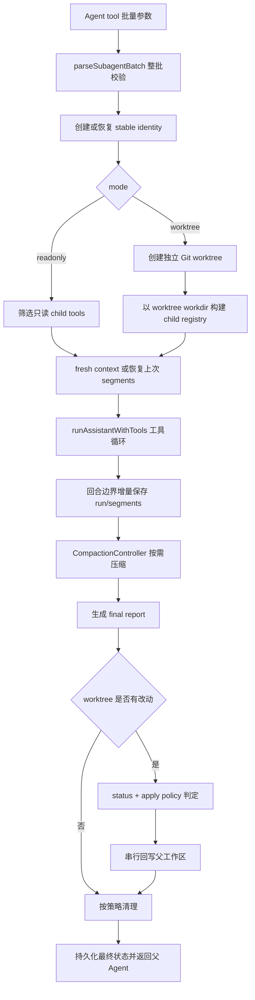
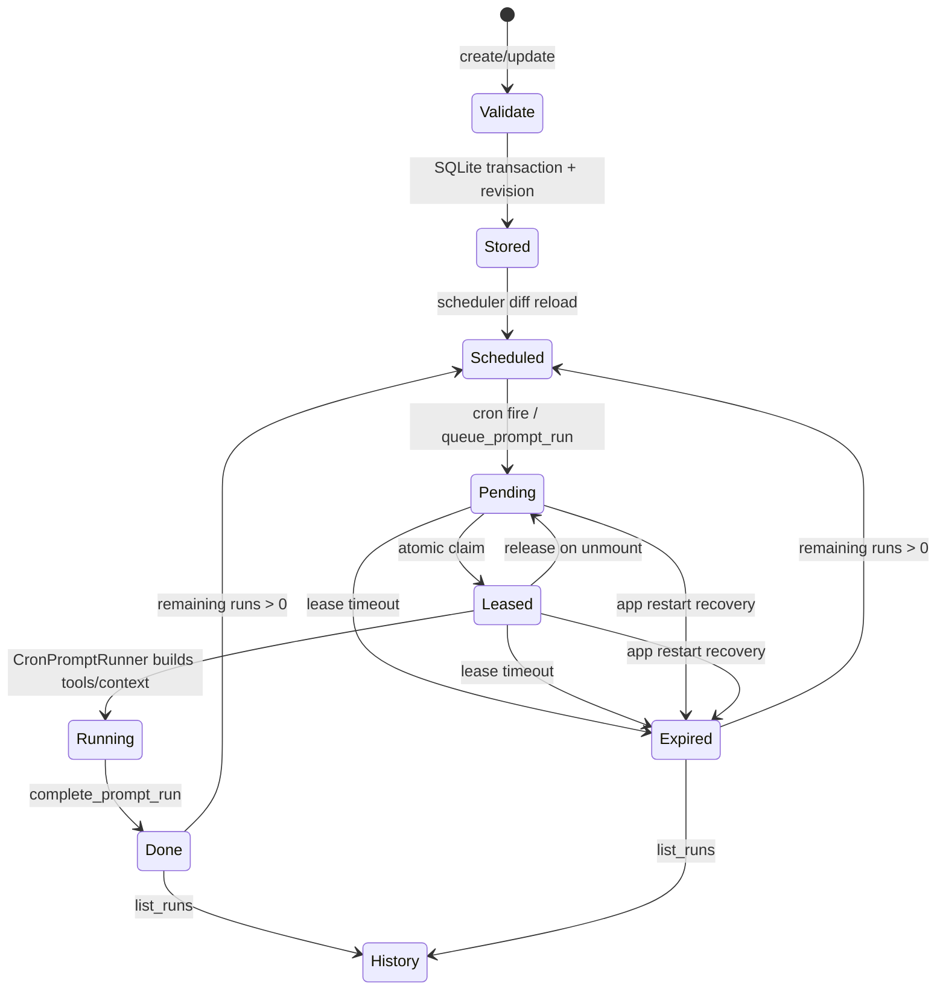

# 第 10 章：Subagents、Hooks 与自动化

## 本章目标

读完本章后，你应当能够解释 Subagent 如何批量创建、并发执行、恢复上下文和回写工作树；区分 Hook、Todo 与 Cron 的状态所有者和生命周期；并能沿着 `validate → store → schedule → claim → run → complete/release → history → restart recovery` 定位一次自动化任务。

本章按用户要求适当精简，但每项功能仍给出入口、实现方案、数据流和安全边界。

## 先读哪些文件

- [`subagents/agentTool.ts`](../../agent-gui/src/lib/subagents/agentTool.ts)、[`validate.ts`](../../agent-gui/src/lib/subagents/validate.ts) 与 [`scheduler.ts`](../../agent-gui/src/lib/subagents/scheduler.ts)；
- [`subagents/run.ts`](../../agent-gui/src/lib/subagents/run.ts)、[`store.ts`](../../agent-gui/src/lib/subagents/store.ts) 与 [`bus.ts`](../../agent-gui/src/lib/subagents/bus.ts)；
- [`subagent_worktree.rs`](../../agent-gui/src-tauri/src/commands/workspace/subagent_worktree.rs) 与 [`subagent_store.rs`](../../agent-gui/src-tauri/src/commands/history/subagent_store.rs)；
- [`automation/store.ts`](../../agent-gui/src/lib/automation/store.ts)、[`hookRunner.ts`](../../agent-gui/src/lib/automation/hookRunner.ts) 与 [`todoTools.ts`](../../agent-gui/src/lib/tools/todoTools.ts)；
- [`services/automation/store.rs`](../../agent-gui/src-tauri/src/services/automation/store.rs)、[`scheduler.rs`](../../agent-gui/src-tauri/src/services/automation/scheduler.rs) 与 [`CronPromptRunner.tsx`](../../agent-gui/src/components/cron/CronPromptRunner.tsx)。

## 1. 四种机制先分清

| 机制 | 目标 | 状态所有者 | 是否持久化 | 何时执行 |
| --- | --- | --- | --- | --- |
| Subagent | 把独立子任务交给另一个 Agent Runtime | TypeScript Subagent Runtime；History SQLite 保存身份与运行记录 | 是 | 父 Agent 调用 `Agent` 工具时 |
| Hook | 在 Agent 生命周期事件旁执行脚本或 HTTP 请求 | Automation 配置持久化；单次执行由 `HookRunScope` 管理 | 配置是，执行队列不是 | `agent_start`、`turn_start`、工具前后等事件 |
| Todo | 让当前模型维护结构化任务清单 | 当前 conversation 的内存状态 | 否 | 模型调用 `TodoWrite` 时 |
| Cron | 按六段 Cron 表达式执行 Bash、HTTP 或 Prompt | Rust `AutomationStore` 与 `AutomationScheduler` | 是 | 调度器到点触发 |

核心区别是：Subagent 创建新的模型执行上下文；Hook 不改变主回合，只接收事件；Todo 不负责调度；Cron 不依赖某个聊天回合持续存在。

## 2. Subagent 的调度与执行方案

### 2.1 `Agent` 工具入口与整批校验

`createSubagentTools()` 在 Builtin Registry 中注册 `Agent` 工具。一次调用可以提交一批 agent spec，但最多为 `MAX_AGENTS = 8`。`parseSubagentBatch()` 会先完成整批校验，再启动任何子任务，因此采用 **all-or-nothing** 语义：只要某个 spec 的 id、template、mode、apply policy 或路径参数无效，整批都会被拒绝，不会留下“前几个已经运行、后几个失败”的半执行状态。

每个 spec 的稳定 `id` 不只是显示名称。它用于：

- 在 roster 中标识角色；
- 找到上一次运行并决定是否 `resume`；
- 串行化同一身份的连续任务；
- 关联持久化的 identity、run、segment 和消息总线记录。

模板负责提供默认 role、prompt、mode 等配置，显式字段只能按校验规则覆盖，冲突字段会在真正运行前报错。

### 2.2 三层并发限制

`SubagentScheduler` 使用独立信号量限制三类资源：

1. Subagent 总运行数，默认最多 8；
2. 同时执行的 `Agent` 工具调用数，默认最多 8；
3. 子代理内部 Bash 执行数，默认最多 4。

不同 agent id 可以并发；同一 id 的运行通过专属队列串行。这样既能并行拆题，又不会让同一个长期身份的两个运行同时覆盖上下文。子代理的工具表会移除 `Agent`，所以不能递归创建更多 Subagent，避免指数级扩散。

### 2.3 两种执行模式

| 模式 | 工具集合 | 工作目录 | 适用场景 |
| --- | --- | --- | --- |
| `readonly` | `selectReadOnlyTools()` 只保留只读能力 | 父工作目录 | 调研、审阅、定位源码、分析日志 |
| `worktree` | `selectWorktreeTools()` 构建受限 child registry | 独立 Git worktree | 修改代码、运行测试、产出可回写文件 |

这里的隔离主要是 **Git 工作区隔离**，不是操作系统沙箱。子代理仍与父进程共享机器、用户权限和部分应用级资源，因此工具筛选、路径策略和审批仍然必要。

### 2.4 一次运行的完整生命周期

`executeSubagentRun()` 把过程明确分为 provision、execute、settle、report：

1. 创建或加载 identity；
2. 创建 worktree、筛选工具并确定 child workdir；
3. 根据 `resume` 恢复最近 run 的 segments，或构建全新上下文；
4. 调用与主 Chat 相同的 Agent 工具循环；
5. 每个回合边界增量持久化，避免进程中断后只剩最终摘要；
6. 检查 worktree、决定 apply 与 cleanup；
7. 把摘要、diff、应用结果、错误和持久化警告组成结构化 report。

子代理复用主 Chat 的 `CompactionController`，长任务不会因为独立上下文而失去压缩能力。恢复时加载的是该 stable id 最近一次可恢复运行的 segments，不是把父会话全部复制过去。

## 3. Worktree 的创建、回写与清理

### 3.1 创建与状态采集

Rust `subagent_worktree_create` 先确认 `workdir` 属于 Git 仓库，再在 `.agent-subagents` 下创建唯一目录和 `agent/subagent/...` 分支。名称会清洗非法字符、规避 Windows 保留名，并在冲突时有限次数重试。

运行结束后，`subagent_worktree_status` 收集：

- porcelain status；
- diff stat 与受长度上限保护的 diff；
- untracked file 列表；
- diff 是否被截断。

这份状态既用于父 Agent 阅读，也作为 apply policy 的输入。它不靠模型自行声称“改了哪些文件”。

### 3.2 Apply policy

| 策略 | 行为 |
| --- | --- |
| `none` | 永不回写，只在报告中保留状态与 diff |
| `auto` | 成功运行且满足安全条件时自动回写 |
| `explicit` | 只有改动全部落在 `allowed_output_paths` 内才回写 |

`explicit` 必须提供允许路径。`decideWorktreeApply()` 从 Git status 解析真实改动路径，支持受控 glob，同时拒绝超出范围的文件；因此“模型说只改了某目录”不能代替机器校验。

多个子代理可能同时结束，但回写通过 `enqueueWorktreeApply()` 顺序执行，避免它们并发修改父工作区。Rust 应用顺序为：

1. 收集 tracked 与 untracked 路径并拒绝不安全相对路径；
2. 在 worktree 临时暂存生成 binary patch；
3. 优先在父仓库执行 `git apply --check` 后 `git apply`；
4. 失败时尝试 `git apply --3way`；
5. 仍失败时使用逐文件复制/删除 fallback，并检测父文件是否发生冲突。

三路都无法安全应用时返回失败，不会强行覆盖父仓库 HEAD。应用结果会记录 `applyMethod`、patch 字节数、复制/删除/冲突文件，便于父 Agent判断。

### 3.3 清理策略

只有满足策略的成功运行才自动清理。失败、取消、状态读取失败、应用失败，或仍有未应用改动时通常保留 worktree，避免丢失可恢复成果。Rust cleanup 只接受 `.agent-subagents` 路径和 `agent/subagent/` 分支；`force=false` 时脏工作树删除失败也会原样保留。

## 4. Identity、历史与消息总线

Subagent identity、run header、segments 和 message 都写入共享的 History SQLite。`createSubagentConversationStore()` 在前端提供 hydrate、缓存、增量保存和清理；Rust `subagent_store.rs` 负责事务和表级约束。删除父 conversation 时，对应 Subagent 数据也会被级联清理。

消息总线由 `SendMessage` 工具写入持久化记录，通道分为：

- `direct`：发给指定 agent 或父 Agent；
- `shared`：广播共享进展；
- `decision`：发布已作出的决定；
- `question`：请求其他参与者回答。

每条消息有单调序号。子代理在回合边界读取与自己相关的新消息，并把快照包装成内部更新消息加入上下文；父 Agent也能读取 roster 与总线摘要。消息持久化意味着运行重启后仍能看到协作记录，但它不是实时共享内存：正在进行的模型请求要到下一个检查点才能消费新消息。

设计亮点是把“身份”和“某一次运行”分开：stable identity 可以长期复用，run 则保留独立状态、worktree 和结果。代价是恢复逻辑必须同时处理 schema 版本、损坏 segment、陈旧 worktree 与历史裁剪。

## 5. Hook 的实现方案

Hook 配置由 Automation Store 持久化，支持八个事件：`agent_start`、`turn_start`、`message_start`、`message_end`、`tool_execution_start`、`tool_execution_end`、`turn_end`、`agent_end`。执行类型为 command 或 HTTP。

每次 conversation run 创建一个 `HookRunScope`：

- 按事件预先分组已启用 Hook；
- `dispatch(event)` 只入队，不阻塞主 Agent 状态机；
- 模块级 `executionChain` 保证全应用 Hook 顺序一致；
- 单 scope 最多积压 16 个 dispatch batch，溢出后丢弃并只报告一次 warning；
- `close()` 停止接收新事件，但允许已排队任务排空；
- `cancel()` 丢弃队列并调用 `hook_cancel_scope` 终止正在运行的脚本或 HTTP 请求。

command Hook 通过 Rust shell runner 执行，并注入 `AGENT_HOOK_EVENT`、`AGENT_HOOK_NAME`、`AGENT_CONVERSATION_ID` 与 `AGENT_WORKDIR`。HTTP Hook 顺序执行配置的请求并汇总失败。单个 Hook 报错只进入 `onWarning`，不会把主回合直接改成失败，这是旁路自动化不破坏核心对话状态的关键设计。

安全边界包括：脚本 timeout 被限制在 1 秒到 10 分钟；HTTP URL、方法、header 和 body 统一由 Rust 校验；同步到远端的 header 值会替换为 `__agent-masked__`，回传 patch 时再用本地旧值恢复。

## 6. Todo 为什么不是持久化任务

`createTodoTools()` 只注册一个 `TodoWrite`。每次调用必须提交完整列表，旧列表会被整体替换；每项包含 `content`、`status` 和 `activeForm`，并且最多只能有一项 `in_progress`。

状态由 `todoStateByConversationId` 保存在前端内存中，conversation 结束时 `disposeTodoToolState()` 清理。工具结果中的 `details.kind = "todo_write"` 供 transcript/UI 渲染，但没有进入 Automation SQLite，也没有定时触发能力。因此 Todo 适合模型在一个任务中展示计划进度，不适合提醒、后台执行或跨重启恢复。

## 7. Cron 的持久化与调度方案

### 7.1 配置与一致性

Cron 支持 `bash`、`http`、`prompt` 三种类型。前端 `automation/store.ts` 只是权威状态的镜像：首次通过 `automation_snapshot` 拉取，之后消费 `automation:cron-changed` 事件。修改时发送 create/update/delete/reorder 操作和 `baseRevision`；Rust 在 `BEGIN IMMEDIATE` 事务内比较 revision，冲突就返回新快照，前端最多重放 3 次字段级 patch。

Rust `validate_cron_task()` 是深度校验的唯一事实源：Cron 必须是“秒、分、时、日、月、周”六段格式；不同 kind 必须分别带 script、requests 或 prompt + selectedModel；`remainingExecutions = 0` 会自动禁用任务。HTTP URL、method 与 body 规则也在这里统一规范化。

任务、Hook、运行记录和 revision 都存入设置数据库中的 `automation_*` 表。日志每个任务最多保留 200 条、最长 30 天，单条输出最多 50000 字符。

### 7.2 Bash 与 HTTP

`AutomationScheduler` 使用 `tokio_cron_scheduler`，配置变化后执行 diff reload：只移除或重建发生变化的 job；某个表达式无效时仅写入该任务的 `lastError`，不会冻结整个调度器。

触发前会重新检查 enabled 与 remaining count。同一 task id 已在运行时，新一次触发记录为 skipped，不与旧运行重叠。Bash 使用系统 workdir 和 shell runner，默认 60 秒超时；HTTP 按配置顺序执行请求并汇总各自状态。完成记录、剩余次数递减、自动禁用和日志裁剪在同一事务中完成。

### 7.3 Prompt 的 claim/lease 协议

Prompt 任务不能直接在 Rust 中调用浏览器侧模型 Runtime，因此 Rust 负责可靠队列，React `CronPromptRunner` 负责真正的 Agent 执行：

具体过程如下：

1. Scheduler 把序列化的 `PromptRunRequest` 作为 `pending` 行写入 SQLite，并发出 `automation:prompt-pending`；
2. `automation_claim_prompt_runs` 在单个事务中把全部未过期 pending 行改为 `leased`，StrictMode 双挂载或重复轮询也不能重复领取；
3. `CronPromptRunner` 检查 Agent 执行模式、workdir、provider、API key、模型和 Skills，再构建受 `runtimeScope = cron_auto_prompt` 限制的 Builtin Registry；
4. 它调用 `runAssistantWithTools()`，只保存最终结论，不把隐藏推理和中间 tool call 当日志输出；
5. 成功或失败后调用 `automation_complete_prompt_run`，完成操作是幂等的；临近 5 分钟 lease 时先主动 abort，避免晚到 completion 与过期清理竞争；
6. 组件在领取后卸载会 `release` 回 pending；完成上报会按 1、5、15 秒退避重试；
7. Rust 每 30 秒清扫过期 lease。应用启动时把上一次进程残留的 pending/leased 全部记为 expired，而不是静默丢失或重复执行。

## 8. 设计亮点、异常与安全边界

1. **校验先于并发**：Subagent 整批拒绝，避免半批启动；Automation 深度校验集中在 Rust，避免桌面与 Web 两套规则漂移。
2. **身份、运行、消息分表**：稳定身份可恢复，单次运行仍有独立审计边界。
3. **Git 隔离与权限策略分层**：worktree 解决代码版本冲突，工具筛选和 allowed paths 解决能力边界，两者不能互相替代。
4. **回写单队列**：子代理运行可以并发，父工作区 mutation 串行，减少竞态。
5. **Hook 失败旁路化**：外部脚本或网络故障不会直接破坏 Chat 状态机，但 warning 仍可见。
6. **Cron 配置与执行解耦**：SQLite 是事实源，scheduler 可随时重建；Prompt 再通过持久化 lease 桥接 Rust 调度与前端模型 Runtime。
7. **秘密不离开桌面**：HTTP header 快照只暴露掩码；Provider key 由本地 settings 在真正执行 Prompt 时读取。

需要注意的边界：Subagent worktree 不是系统沙箱；Todo 重启即丢失；Hook 全局串行可能被慢任务拖延；Prompt 到期会计入一次执行并递减 remaining count；远端 Web UI 可以同步和管理配置，但模型、Shell、worktree 与 Hook 的实际执行仍发生在已连接桌面端。

## 验证与扩展

- 关键测试：`agent-gui/test/subagents/*.test.mjs`、`agent-gui/test/tools/todo-tools.test.mjs`，以及 Rust `services::automation` 和 `commands::workspace::subagent_worktree` 测试。
- 修改入口：增加 Subagent mode 从 `types.ts`、`validate.ts`、`policy.ts` 和 child registry 开始；增加 Cron kind 从前后端 wire type、Rust validator、scheduler executor 与设置 UI 开始。
- 练习：选一个 `prompt` Cron task，手工列出从 `queue_prompt_run()` 到 `CronPromptRunner` 再到 `complete_prompt_run()` 的每次状态变化，并说明应用在 claim 后立即重启时为什么不会重复执行。

[上一章：Memory、History 与 Compaction](09-memory-history-and-compaction.md) · [相关：工作区与后台进程](13-workspace-terminal-git-ssh.md) · [返回总览](README.md) · [下一章：Tauri / Rust 后端](11-tauri-rust-backend.md)
