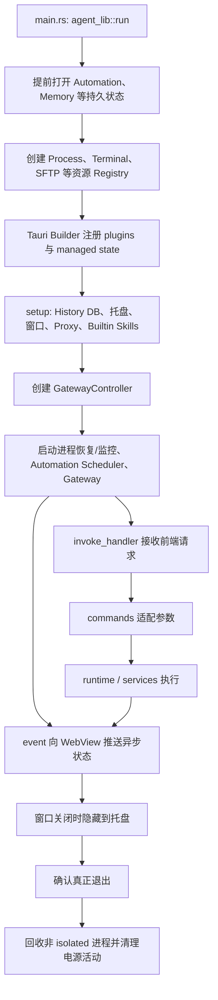

# 第 11 章：Tauri / Rust 后端

## 本章目标

读完本章后，你应当能够解释桌面程序如何启动和退出，理解 `commands → runtime → services` 三层分工，知道前端 `invoke()` 如何映射到 Rust command，以及终端、后台进程、Memory、Automation、Gateway 等长生命周期资源由谁持有和清理。

本章按用户要求适当精简，重点讲清实现方案和边界，不逐项罗列全部 command。

## 先读哪些文件

- [`main.rs`](../../agent-gui/src-tauri/src/main.rs) 与 [`lib.rs`](../../agent-gui/src-tauri/src/lib.rs)；
- [`commands/mod.rs`](../../agent-gui/src-tauri/src/commands/mod.rs)、[`runtime/mod.rs`](../../agent-gui/src-tauri/src/runtime/mod.rs) 与 [`services/mod.rs`](../../agent-gui/src-tauri/src/services/mod.rs)；
- [`commands/workspace/fs.rs`](../../agent-gui/src-tauri/src/commands/workspace/fs.rs)、[`commands/runtime/terminal.rs`](../../agent-gui/src-tauri/src/commands/runtime/terminal.rs)；
- [`commands/integration/memory.rs`](../../agent-gui/src-tauri/src/commands/integration/memory.rs) 与 [`commands/integration/gateway.rs`](../../agent-gui/src-tauri/src/commands/integration/gateway.rs)；
- [`capabilities/default.json`](../../agent-gui/src-tauri/capabilities/default.json) 与 [`tauri.conf.json`](../../agent-gui/src-tauri/tauri.conf.json)。

## 1. 从二进制入口到完整运行时

`main.rs` 本身只调用 `agent_lib::run()`。真正的装配发生在 `lib.rs`：



### 1.1 Builder 之前为什么先创建状态

`run()` 在构造 Builder 前先创建：

- `AutomationStore` 与 `AutomationScheduler`；
- `MemoryStore`；
- `PowerActivityManager`；
- `ManagedProcessRegistry`；
- `TerminalSessionRegistry`；
- 依赖 Terminal registry 的 `SftpSessionRegistry`；
- 控制真实退出的 `AtomicBool`。

这些对象需要被多个 command、service 和退出回调共享，因此统一包在 `Arc` 中，再通过 `.manage(...)` 交给 Tauri。command 使用 `State<Arc<T>>` 取得同一个实例，而不是每次调用临时创建资源。

### 1.2 `setup()` 的启动顺序

`setup()` 依次完成以下工作：

1. 初始化 History SQLite；
2. 配置系统托盘，Windows 额外配置无边框窗口；
3. 启动本地代理服务；
4. 同步写入 builtin Skills，失败只记录日志，不阻止应用打开；
5. 把 `AppHandle` 注入 Terminal/SFTP，使后台线程能够发事件；
6. 创建 `GatewayController`，把 Automation、Memory、Terminal、SFTP、Managed Process 等能力接入远程桥；
7. 为 Managed Process 绑定 notifier，执行启动恢复并启动监控；
8. 为 Automation 绑定 notifier，启动 scheduler；
9. 启动 Gateway controller，再异步从设置数据库加载远程配置。

顺序上的亮点是先建立本地事实源与资源所有者，再开放远程连接。即使 Gateway 配置加载失败，本地桌面能力仍可工作。

### 1.3 窗口关闭不等于进程退出

主窗口收到 `CloseRequested` 时会 `prevent_close()` 并隐藏到托盘。真正退出必须把 `allow_exit` 设为 true；若仍有 Terminal session，应用会重新显示主窗口并发出 `terminal:exit-requested`，等待用户确认。

真实退出时显式调用 `ManagedProcessRegistry::shutdown_cleanup()` 和 `PowerActivityManager::clear_all()`。这是必要的，因为操作系统终止进程时不能保证 Rust `Drop` 完整运行。应用从休眠恢复时还会调用 `GatewayController::nudge_connection()`，主动修复已失效的长连接。

## 2. `commands`、`runtime`、`services` 如何分工

| 层次 | 主要职责 | 典型内容 | 不应承担什么 |
| --- | --- | --- | --- |
| `commands` | 暴露 Tauri command、解析 serde 参数、取得 `State`、转换错误 | 文件、Settings、History、Terminal、Gateway command | 不应为每次调用重新创建长期资源 |
| `runtime` | 直接管理操作系统资源和执行细节 | Shell、PTY、Process、SSH、SFTP、平台路径 | 不负责页面状态和业务配置同步 |
| `services` | 持有跨调用、跨连接的业务状态 | Gateway、Memory、Automation、Skills、Tunnel、Workspace Watch | 不直接渲染 UI |

`commands/mod.rs` 又按 app、automation、config、history、integration、runtime、workspace 分组，并通过 re-export 保持 `commands::fs`、`commands::terminal` 等稳定调用路径。`lib.rs` 的 `app_invoke_handler!()` 使用 `tauri::generate_handler!` 明确注册白名单；未列入其中的函数即使带 `#[tauri::command]`，前端也无法调用。

分层不是绝对的。例如 `commands/workspace/fs.rs` 自身包含大量路径校验、文件类型识别、版本冲突检查和阻塞任务调度；部分 Git command 也直接封装 Git 业务操作。阅读时应以“谁拥有长期状态、谁直接拥有 OS 资源”为判断标准，而不是机械地认为 command 一定只有几行。

## 3. 前端 `invoke` 到 Rust command 的实现方案

调用链可以概括为：

```text
React/TypeScript invoke(command, payload)
  → Tauri command 白名单
  → serde 反序列化参数 / 注入 State
  → runtime 或 service
  → Result<T, E>
  → serde 序列化返回值或错误
```

### 3.1 文件：结构化错误与乐观版本控制

前端调用 `invoke("fs_read_text", { workdir, path, start_line, ... })`。Rust command 使用 `#[tauri::command(rename_all = "snake_case")]`，因此前端入参名与 Rust 参数保持 snake_case；返回结构常用 `#[serde(rename_all = "camelCase")]`，适合直接进入 TypeScript。

`fs_read_text` 把阻塞文件操作放入 `run_blocking_fs()`。`fs_write_text` 写已有文件时必须带读取阶段得到的 `expected_mtime_ms` 和 `expected_content_hash`，写入前再次比较；文件已被其他编辑器改变时返回冲突，而不是静默覆盖。错误使用 `FsCommandError` 结构化返回，可携带错误类别、路径和 workdir，UI 能区分越界、过大、非 UTF-8、版本冲突等情况。

### 3.2 Terminal：command 只借用 Registry

`terminal_create` 的核心参数是 cwd、project path key、shell、标题和行列数。Tauri 自动注入 `State<Arc<TerminalSessionRegistry>>`，command 随后调用 `registry.create(...)`。

PTY、输入线程、输出缓冲和订阅者都留在 registry 内。command 返回的是 session snapshot，不会把 OS handle 暴露给前端。这种“句柄留在 Rust、前端只持有 session id”的方案同样用于 SSH Terminal 和 SFTP。

### 3.3 Memory：阻塞存储与 History 聚合

前端 `memory_search({ args })` 对应 Rust `memory_search(state, args)`。command 用 `spawn_blocking` 调用 `MemoryStore::search()`，再调用 History 搜索，将历史匹配合并进 `MemorySearchResponse`。

这里 command 不只是简单转发，它是两个本地事实源的聚合边界；但写锁、SQLite connection 和文件索引仍由 `MemoryStore` 持有。

### 3.4 Gateway：转发给长生命周期 Controller

`gateway_status` 从 `State<Arc<GatewayController>>` 读取快照；connect/disconnect/nudge/chat/tunnel command 都转发给同一 controller。连接重试、远程 inbox、gRPC 收发和同步状态不会随着一次 invoke 结束而销毁。

## 4. Runtime 资源如何拥有和清理

| 资源 | 所有者 | 实现方案 | 清理方式 |
| --- | --- | --- | --- |
| 一次 Shell 执行 | `ShellRunRegistry` | 以 scope/run id 保存取消句柄 | 完成移除；取消 command 终止 |
| Managed Process | `ManagedProcessRegistry` | 持有 Child、日志、状态和 SQLite journal | stop、启动 reconcile、监控、真实退出清理 |
| 本地/SSH Terminal | `TerminalSessionRegistry` | 本地 PTY 或 SSH channel + 输入线程 + tail buffer | close/close project；registry Drop 兜底 |
| SFTP | `SftpSessionRegistry` | 复用 Terminal 的 SSH 连接语义，保存传输任务和取消状态 | session/transfer close；Terminal 关闭时联动清理 |

Managed Process 的 journal 让“应用重启后进程还在”成为可恢复状态。恢复时不仅检查 PID，还比较进程 start time，避免 PID 被操作系统复用后误杀无关进程。monitor 持续更新退出码和状态，并向桌面事件及 Gateway 推送变化。

Terminal 同时提供两种读取方式：普通 `terminal:event` 用于 session 元数据变化，`terminal:stream` 用于高频字节流。输出保留在 Rust buffer 中，所以 WebView 暂时不可见或重新 attach 时仍能读取 tail，而不是完全依赖事件不丢失。

## 5. Service 的长生命周期业务状态

- **MemoryStore**：持有 Memory 根目录、SQLite connection mutex 和 mutation lock。Markdown 是事实源，索引可重建。
- **AutomationStore / Scheduler**：Store 管 SQLite、revision 和运行记录；Scheduler 从 Store 重建 cron job，并通过 notifier 通知 WebView/Gateway。
- **Skills service**：文件写操作受全局写锁保护，安装任务通过 `OnceLock<Mutex<...>>` 的 job registry 跟踪，临时目录在 `Drop` 中清理。
- **GatewayController**：负责连接状态、远程 chat inbox 和协议处理，内部还组合 TunnelStore、TunnelProxy 与 WorkspaceWatchService。
- **WorkspaceWatchService**：合并本地 WebView 和 Gateway 两个来源的 desired workdir 集合，按工作目录维护单调 revision，再把 `workspace:activity` 推给订阅者。
- **Tunnel service**：保存 tunnel 配置和运行状态，真正的公共入口仍由 Gateway 管理。

设计亮点是“状态集中、入口多路”：同一 Memory、Terminal 或 Workspace 能力既可被桌面 invoke 调用，也可被 Gateway envelope 调用，但最终落到同一个资源所有者，避免本地和远程形成两套不一致状态。

## 6. Invoke 与事件系统为什么同时存在

`invoke` 适合一次请求对应一次结果，例如读文件、创建 Terminal、查询 Memory。`event` 适合生命周期比一次请求更长的状态：

| 事件 | 作用 |
| --- | --- |
| `terminal:event` | session 创建、关闭、标题或状态变化 |
| `terminal:stream` | Terminal 高频输出 |
| `gateway:status` | 远程连接和 runtime readiness 变化 |
| `gateway:chat-request-ready` | 通知 WebView 有远程 Chat 请求可领取 |
| `workspace:activity` | 文件树失效与工作区变更 |
| `automation:*` | Cron/Hook 快照变化、Prompt pending/expired |

可靠实现不能假设事件永不丢失。因此多数领域同时提供 snapshot/list command：组件挂载时先拉快照，再订阅增量；重连后重新拉取或携带 revision/cursor 恢复。Terminal 更进一步保留 Rust 输出 buffer，Automation 和 Gateway Chat 则把待处理记录写入 SQLite。

## 7. Capability、Command 白名单与业务安全

`capabilities/default.json` 只授权 `main` 和 `agent-*` 窗口使用有限的 core window、创建 WebView 和 opener 权限。自定义 Rust command 仍由 `generate_handler!` 控制可调用范围。

`tauri.conf.json` 开启 `withGlobalTauri`，并把 CSP 设为 `null`。这意味着安全模型高度依赖可信的打包前端、依赖供应链和严格的 command 入参校验。Capability 不是业务权限的替代品：即使窗口可调用 `fs_write_text`，Rust 仍必须校验 workdir、相对路径、符号链接、文件版本和大小；Shell、Git 删除、SSH、Tunnel 等高风险操作还要由前端工具审批策略约束。

需要特别注意：

1. 不应把任意未验证 URL、HTML 或脚本注入受信任 WebView；
2. 新 command 必须同时审查 handler 注册、参数上限、路径/网络边界、取消和日志脱敏；
3. 长任务不能阻塞 Tauri 主线程，应使用 async runtime、`spawn_blocking` 或专用线程；
4. 资源清理不能只依赖 `Drop`，真实退出和异常恢复都要有显式路径；
5. 远程 Gateway 只是另一条入口，不能绕过本地 command/service 的安全校验。

## 验证与扩展

- 关键验证：`cargo check --manifest-path agent-gui/src-tauri/Cargo.toml --tests`，以及 runtime、Memory、Automation、Gateway 相关 Rust tests。
- 修改入口：新增无状态 command 从 `commands` 和 `app_invoke_handler!()` 开始；新增 OS 资源先设计 registry；新增长生命周期业务先设计 service、managed state、事件与恢复路径。
- 练习：选择 `fs_write_text` 或 `terminal_create`，画出 TypeScript payload、Rust command、状态所有者、返回值和失败恢复的完整链路，并指出其中哪一步阻止陈旧写入或资源泄漏。

[上一章：Subagents、Hooks 与自动化](10-subagents-hooks-and-automation.md) · [相关：工作区、终端、Git 与 SSH](13-workspace-terminal-git-ssh.md) · [返回总览](README.md) · [下一章：Go Gateway 与 Web UI](12-gateway-and-webui.md)
