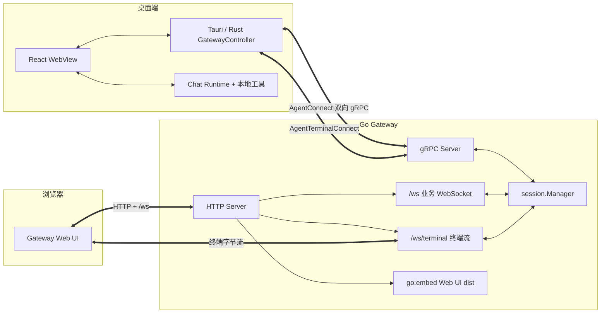
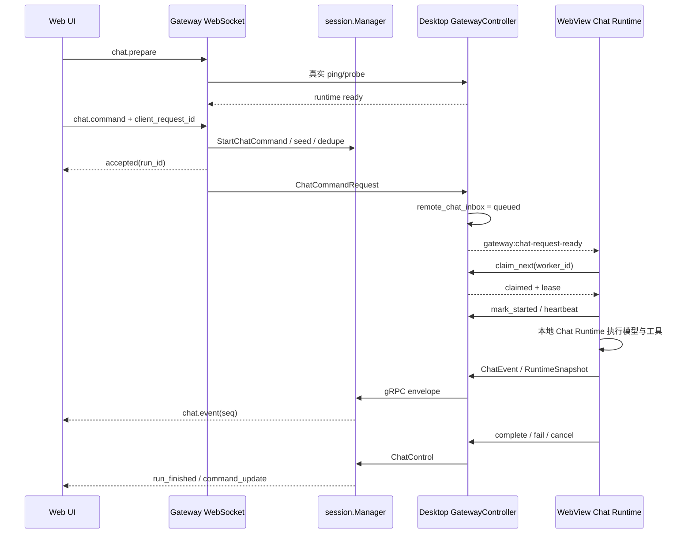

# 第 12 章：Go Gateway 与 Web UI

## 本章目标

读完本章后，你应当能够解释 Gateway 为什么同时提供 gRPC、HTTP 和 WebSocket，理解 `session.Manager` 如何连接浏览器请求与桌面 Agent，追踪一次远程 Chat 的 enqueue、claim、lease、stream 和恢复流程，并知道 Web UI 如何用 Gateway adapter 替换本地 Tauri backend。

本章按用户要求适当精简，重点保留协议、状态机、可靠性和安全边界。

## 先读哪些文件

- [`cmd/gateway/main.go`](../../agent-gateway/cmd/gateway/main.go) 与 [`internal/config/config.go`](../../agent-gateway/internal/config/config.go)；
- [`internal/auth`](../../agent-gateway/internal/auth)、[`internal/server`](../../agent-gateway/internal/server) 与 [`internal/session`](../../agent-gateway/internal/session)；
- [`proto/v1/gateway.proto`](../../agent-gateway/proto/v1/gateway.proto) 与 [`embed.go`](../../agent-gateway/embed.go)；
- [`web/src/app/GatewayApp.tsx`](../../agent-gateway/web/src/app/GatewayApp.tsx)、[`useGatewaySession.ts`](../../agent-gateway/web/src/app/hooks/useGatewaySession.ts)；
- [`web/src/lib/gatewaySocket.ts`](../../agent-gateway/web/src/lib/gatewaySocket.ts) 与 [`web/src/lib/chat/stream`](../../agent-gateway/web/src/lib/chat/stream)；
- [`web/src/lib/chat/transcript`](../../agent-gateway/web/src/lib/chat/transcript) 与 [`web/src/shims/tauriCore.ts`](../../agent-gateway/web/src/shims/tauriCore.ts)。

## 1. Gateway 的双协议架构

Gateway 自己不调用模型，也不直接操作用户电脑。它把“已连接桌面 Agent”暴露成受认证的远程服务：

桌面与 Gateway 的主控制面是 `AgentConnect(stream AgentEnvelope) returns (stream GatewayEnvelope)`；终端高频数据使用独立的 `AgentTerminalConnect`。浏览器通过 HTTP 获取页面和少量 API，通过 `/ws` 调用业务能力，通过 `/ws/terminal` 传输终端 frame。

分离终端流的原因是避免大量字节输出挤占普通 request/response、Chat 控制和心跳队列。Web UI 构建后的 `web/dist` 由 `//go:embed all:web/dist` 编入 Go binary，部署时不需要额外静态文件服务器。

## 2. 启动、认证与 HTTP 服务

### 2.1 进程启动

`config.Load()` 从 flag 和环境变量加载共享 token、gRPC/HTTP 地址、TLS、超时和消息大小。token 为空会直接退出；默认 gRPC 为 `:50051`，HTTP 默认面向 HTTPS 端口，开发通常显式使用 `:50052`。TLS cert/key 要么同时提供，要么都不提供。

`main.go` 创建一个 `session.Manager`，再并行启动 gRPC 与 HTTP：

- gRPC 注册认证 interceptor、keepalive、消息大小限制和 `AgentGateway` service；
- HTTP 设置读写/空闲超时，挂载 API、WebSocket、Tunnel 和嵌入静态资源；
- 收到退出信号后，HTTP 最多等待 10 秒；gRPC graceful stop 最多等待 3 秒，超时则强制 `Stop()`。

### 2.2 三条认证路径

| 入口 | 认证方案 |
| --- | --- |
| HTTP API | `Authorization: Bearer ...`，token 先做 SHA-256，再 constant-time compare |
| 业务/终端 WebSocket | origin 检查；连接后的第一帧必须是 `auth`，之后才启动正常业务 |
| gRPC stream/unary | interceptor 从 metadata 的 `authorization` 或 `token` 校验 |

`Authenticate` 是 gRPC bootstrap 特例：unary interceptor 不预先拦截它，方法内部校验请求 token，生成 session id，并记录 agent id/version；后续 stream 仍必须通过 metadata token 认证。注意共享 token 只证明“知道同一个秘密”，并不提供多用户角色和细粒度 ACL。

### 2.3 HTTP 路由

- `GET /healthz`：进程健康；
- `GET /api/status`：认证后的 Agent 状态；
- `POST /api/files/import`：把浏览器上传内容交给桌面处理；
- `GET /api/public/history-shares/{token}`：公开历史分享；
- `GET /image-proxy`：受限制的图片代理；
- `/t/{slug}/...`：公开 Tunnel 代理；
- `/`：Web UI 静态资源和 SPA fallback。

`index.html` 使用 no-store/no-cache 语义，带 hash 的 `assets/*` 可长期缓存；缺失的静态扩展名资源不会错误 fallback 到 HTML。这样发布新版本时入口能及时更新，已指纹化 bundle 又能获得缓存收益。

## 3. `session.Manager` 是 Gateway 的状态核心

`session.Manager` 组合多个相互独立的 hub/store：

| 子系统 | 保存或协调什么 |
| --- | --- |
| session registry | 当前 Agent session、auth snapshot、session epoch、heartbeat/runtime readiness |
| sync hub | History、Settings、Terminal、SFTP、Chat queue 等桌面快照 |
| conversation stream store | 每个 conversation 的有序 Chat 事件、run、snapshot、订阅和去重 |
| command queue | Agent 短暂离线时暂存普通命令，最多 10 条，默认等待 30 秒 |
| workspace hub | 浏览器订阅的 workdir 集合和 activity 广播 |
| managed process hub | 后台进程状态与日志事件 |
| tunnel runtime | tunnel 配置、连接数、过期与代理状态 |
| status subscriber hub | 向 WebSocket 客户端推送在线状态 |

### 3.1 Agent 连接替换与心跳

新 `AgentConnect` 会替换旧 session，并递增 session epoch。旧连接的晚到响应不能写入新 session。每个 Agent 入站 envelope 都刷新 heartbeat；周期 ping 走独立 `pingCh`，不会被普通 outbound queue 阻塞。

Agent 重连后，Manager 会把 command queue drain 到新 session，并重新推送 workspace watch set。对需要响应关联的请求，`RegisterStreamAndSendContext()` 在同一个已捕获 session 上完成“注册响应 stream + 发送请求”，避免两步之间 session 被替换，导致请求发给新连接、响应监听却留在旧连接。

### 3.2 离线队列不是通用消息持久化

command queue 只缓冲短期普通命令：最大 10 条，过期或等待超过 30 秒就失败。它不保存完整 Chat transcript，也不跨 Gateway 进程重启。Chat 有独立的 conversation stream 与桌面 inbox 协议；History/Settings 等则依赖桌面快照重新同步。

## 4. 一次远程 Chat 的实现方案

具体步骤如下：

1. Web UI 先调用 `chat.prepare`。Gateway 不是只看旧状态，而是向桌面做一次有 timeout 的真实 runtime probe。
2. `chat.command` 必须带 `client_request_id`。Gateway 生成 canonical run id，并在进程内保留 24 小时去重记录；重连重试不会重复启动同一 prompt。
3. 已知 conversation id 时，Gateway 可先 seed user message；随后桌面回传的同一 user echo 会被吞掉，保证 transcript 只出现一次。draft conversation 要等桌面返回真实 id 后再 bind。
4. Gateway 把 `ChatCommandRequest` 发给桌面；`GatewayController` 写入 `remote_chat_inbox` 并唤醒 WebView worker。
5. worker 调用 `gateway_chat_claim_next` 原子领取最早可执行请求。未开始 lease 默认 15 秒；标记 started 后改为 30 分钟，并通过 heartbeat 续租。
6. 若桌面已有本地 prompt 在运行，远程请求可进入 `queued_in_gui`：它释放 lease，由桌面 Chat queue 接管，浏览器移除短暂 optimistic bubble，等待真正的 `run_queued`/后续 stream。
7. Runtime 执行期间，ChatEvent、ChatControl 与 RuntimeSnapshot 经 gRPC 回到 Gateway，统一规范化为 conversation stream。
8. complete、fail、cancel 更新桌面 ledger/inbox，并在 Gateway 产生 terminal 事件。未开始 lease 过期会回到可领取状态；已开始 lease 过期则标记失败并上报，避免另一个 worker 同时接管正在执行的模型请求。

这个方案把“网络送达”和“桌面真正开始执行”分开。accepted 只表示 Gateway 接受命令；claimed 表示某个 worker 暂时拥有它；started 才表示本地 Runtime 已建立执行；run_finished 才是最终结果。

## 5. Conversation Stream 如何保证有序与可恢复

每个 conversation 有一条独立事件日志，核心不变量由同一把 store mutex 保护：

1. `seq` 按 conversation 单调递增，不随 run 重置；
2. 每个 run 的 `run_finished` exactly-once，重复 terminal 信号被吞掉；
3. 新 `run_started` 到来时会先 supersede 旧 active run；
4. activity 与改变它的事件在同一锁内生成；
5. subscriber 写入是非阻塞的，慢订阅者溢出后关闭并要求按 cursor 重订阅。

事件最多保留 10 分钟、4096 条、8 MiB；订阅 buffer 为 256。客户端订阅时携带 `after_seq` 与 `stream_epoch`。如果 epoch 改变、cursor 越界或所需事件已淘汰，Gateway 返回 reset，而不是伪装成连续流。

`RuntimeSnapshot` 不属于 seq 日志，它表示活跃 run 在某个 `as_of_seq` 时的完整 transcript 状态。Gateway 重启、Agent 重连或早期 token 已丢失时，Web UI 先用 snapshot 重建，再只应用更高 seq 的事件，避免 token 缺口或重复渲染。

## 6. WebSocket 路由与慢客户端保护

`websocket_routes.go` 用 request type → handler 表集中登记协议：

- Chat/History/Settings：conversation、历史、配置和队列；
- FS/Workspace/Git：工作目录读写、watch、版本控制；
- Terminal/SFTP/Process：会话、传输和后台进程；
- Skills/Memory/Cron：桌面知识、持久化与自动化；
- Tunnel/Provider：远程代理和模型列表。

普通请求都带 id，响应按同一 id 关联；push event 没有 request id。WebSocket connection 为每个 pending request 保存 resolver 和 timeout，连接断开时统一 reject，客户端重连后由上层决定重试或重新订阅。

服务端把控制队列与可丢的数据队列分开。`ping`、`error`、`chat.subscription_reset`、`chat.command_update` 和 correlated response 使用优先路径。慢客户端时，流事件或订阅数据可以被 shed，并通知客户端 resubscribe；若连某个 request 的关联响应都无法入队，则关闭 socket，让客户端通过重连恢复，而不是留下永远 pending 的 Promise。

## 7. Web UI 客户端如何复用桌面功能

### 7.1 登录与全局 Socket

`useGatewaySession()` 从 storage 读取 token，先通过 HTTP 验证；登录、退出或 token 变化时调用 `resetGatewayWebSocketClient()`。`getGatewayWebSocketClient(token)` 保证一个 token 对应一个复用客户端，内部管理：

- request id 与 pending Promise；
- timeout、WebSocket 重连和前台唤醒；
- status、history、settings、terminal、SFTP、process、tunnel、workspace 和 chat push；
- 断线时的统一清理与重订阅入口。

### 7.2 Stream、Transcript 与命令管线

`ConversationStreamClient` 的 registration 跨断线保留。重连后用 `lastSeq + streamEpoch` 恢复；如果 live event 早于 subscribe response 到达，最多暂存 512 条，等 sync 完成后按序 drain；gap/reset 会触发 resync，失败退避上限为 30 秒。

`TranscriptStore` 与 `turnReducer` 把 token、thinking、tool call/result、search、usage、error 转成稳定 turn；同时处理 `run_started`、`run_finished`、`run_queued`、`rebased` 和 `snapshot`。snapshot 与 replay 在一次提交中合并，避免 UI 短暂回退到旧状态。

`ChatCommandPipeline` 管理 optimistic user entry 以及 accepted、bound、queued_in_gui、failed。它以 `client_request_id` 对齐本地 optimistic 消息、Gateway canonical run 和桌面 echo；如果命令被停放到 GUI queue 或启动失败，会撤销 optimistic 变更，避免重复或闪烁。

### 7.3 Tauri Shim 与专用 Adapter

Vite alias 把 `@tauri-apps/api/core` 替换为 `shims/tauriCore.ts`。因此共享的 Memory、Skills、Settings 等前端代码仍可调用 `invoke()`，但浏览器 shim 会把 command 翻译成 Gateway WebSocket 请求。

高频或有专门协议的功能不走通用 shim：

- Terminal 使用 `gatewayTerminalClient` 和独立 terminal stream client；
- SFTP 使用 `gatewaySftpClient`；
- Git 使用 `gatewayGitClient`；
- Workspace activity 使用专门订阅 client。

这种方案降低桌面/Web 两端的 UI 重复量，但不能假设所有 Tauri command 都可远程使用。新增共享功能时必须同时检查 WebSocket route、Go session 转发、Rust Gateway bridge 和 Web adapter。

## 8. 设计亮点与安全边界

1. **数据面分流**：普通控制、Chat stream 与 Terminal stream 不互相堵塞。
2. **连接 epoch**：旧 Agent session 的晚到响应不会污染新连接。
3. **送达、领取、开始、完成分阶段**：网络重试和桌面队列不会造成重复模型运行。
4. **conversation 级 cursor**：run 可以更替，浏览器仍沿一条连续日志恢复。
5. **snapshot + replay**：兼顾实时增量和断线后的完整重建。
6. **优先控制队列**：慢客户端先牺牲可恢复流数据，不牺牲认证、错误和关联响应。
7. **Web shim 复用**：共享业务代码保留类似 Tauri 的调用形状，真正 backend 按平台替换。

边界也很明确：Gateway 当前是共享 token 模型，不是多租户权限系统；未启用 TLS 时 token 和数据依赖外层可信网络；Gateway 的 stream/dedupe 多为进程内状态，服务重启要依靠桌面 runtime snapshot、History/settings resync 恢复；浏览器不能直接访问桌面文件系统，所有路径和危险操作仍必须由桌面 Rust 和工具审批校验。

## 验证与扩展

- 关键验证：`go -C agent-gateway test ./...`、`pnpm --dir agent-gateway/web test`、`pnpm --dir agent-gateway/web build`。
- 修改入口：增加远程能力时从 protobuf/envelope、`websocket_routes.go`、`session.Manager`、Rust `GatewayController`/bridge 和 Web adapter 五处检查；改变 Chat stream 时必须补 cursor、reset、snapshot 与慢客户端测试。
- 练习：模拟 Web UI 在收到两个 token event 后断线，列出它重连时发送的 cursor、Gateway 可能返回 replay/reset/snapshot 的三种结果，以及 `TranscriptStore` 如何避免重复应用前两个 token。

[上一章：Tauri / Rust 后端](11-tauri-rust-backend.md) · [相关：请求生命周期](03-agent-request-lifecycle.md) · [返回总览](README.md) · [下一章：工作区、终端、Git、SSH、SFTP 与隧道](13-workspace-terminal-git-ssh.md)
