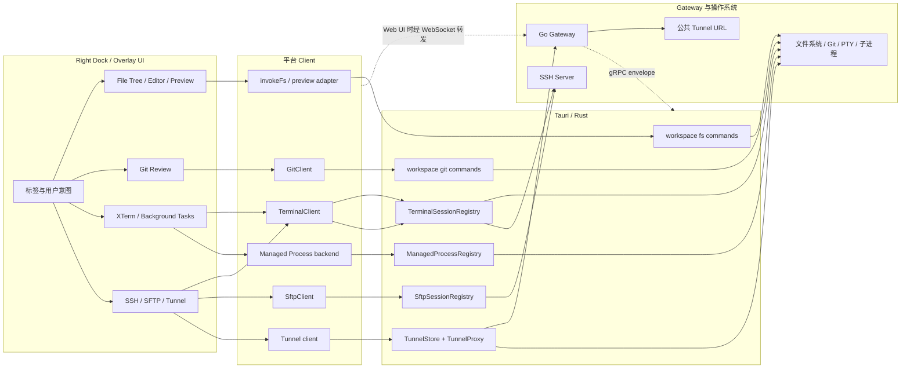
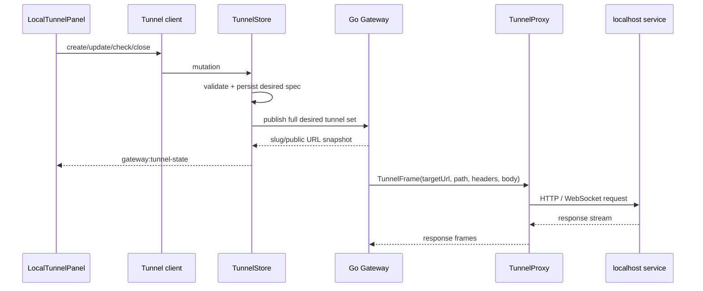

# 第 13 章：工作区、终端、Git、SSH、SFTP 与隧道

## 本章目标

读完本章后，你应当能够从 Right Dock 的一个标签页追踪到真正的本地或远程 backend，理解文件树、Monaco 编辑器、Git Review、PTY 终端、后台进程、SSH、SFTP 和 Tunnel 的实现方案，并能判断状态应该保存在 React、Tauri/Rust、Gateway 还是操作系统资源中。

本章功能很多，但它们共享同一个核心原则：UI 只保存用户意图和可恢复视图状态，真正的文件、进程、连接与 Git 仓库状态由 backend 持有；桌面端与 Web UI 可以更换传输层，却不能各自维护互相冲突的事实源。

## 先读哪些文件

- [`rightDockRegistry.tsx`](../../agent-gui/src/components/project-tools/rightDockRegistry.tsx)、[`rightDockModel.ts`](../../agent-gui/src/components/project-tools/rightDockModel.ts) 与 [`useRightDockSessions.ts`](../../agent-gui/src/components/project-tools/useRightDockSessions.ts)；
- [`file-tree/useFileTreeData.ts`](../../agent-gui/src/components/project-tools/file-tree/useFileTreeData.ts) 与 [`file-tree/model.ts`](../../agent-gui/src/components/project-tools/file-tree/model.ts)；
- [`WorkspaceCodeEditorOverlay.tsx`](../../agent-gui/src/components/workspace-editor/WorkspaceCodeEditorOverlay.tsx)、[`WorkspaceFilePreviewOverlay.tsx`](../../agent-gui/src/components/workspace-editor/WorkspaceFilePreviewOverlay.tsx)；
- [`terminal/types.ts`](../../agent-gui/src/lib/terminal/types.ts)、[`tauriTerminalClient.ts`](../../agent-gui/src/lib/terminal/tauriTerminalClient.ts) 与 [`runtime/terminal`](../../agent-gui/src-tauri/src/runtime/terminal)；
- [`managed-process/store.ts`](../../agent-gui/src/lib/managed-process/store.ts) 与 [`runtime/managed_process.rs`](../../agent-gui/src-tauri/src/runtime/managed_process.rs)；
- [`git/types.ts`](../../agent-gui/src/lib/git/types.ts)、[`tauriGitClient.ts`](../../agent-gui/src/lib/git/tauriGitClient.ts) 与 [`commands/workspace/git.rs`](../../agent-gui/src-tauri/src/commands/workspace/git.rs)；
- [`sftp/types.ts`](../../agent-gui/src/lib/sftp/types.ts)、[`tauriSftpClient.ts`](../../agent-gui/src/lib/sftp/tauriSftpClient.ts) 与 [`runtime/sftp.rs`](../../agent-gui/src-tauri/src/runtime/sftp.rs)；
- [`services/tunnel`](../../agent-gui/src-tauri/src/services/tunnel)、[`LocalTunnelPanel.tsx`](../../agent-gui/src/components/project-tools/LocalTunnelPanel.tsx)。

## 1. 一套 UI，多种资源所有者

工作区工具的完整调用关系如下：



这里需要区分三类状态：

| 状态 | 例子 | 事实源 |
| --- | --- | --- |
| 用户意图 | 当前标签、标签顺序、面板宽度、展开目录 | React + Settings |
| 可恢复视图 | Monaco model/view state、Terminal attach snapshot、文件树 bucket | 前端内存缓存，必要时从 backend 重建 |
| 真实资源 | 文件内容、Git index、PTY、SSH channel、子进程、SFTP transfer | Rust registry、系统进程或远端服务器 |

如果把第三类状态复制到 React 并允许 UI 自行推断，就会出现“界面显示正在运行，但进程已经退出”或“界面认为文件未变，磁盘已被外部修改”的错误。项目因此大量采用 snapshot + event：先读取权威快照，再消费增量事件。

## 2. Right Dock：注册表、派生标签和保活

### 2.1 工具注册表

`RIGHT_DOCK_TOOL_DEFINITIONS` 注册四个单例工具：

| kind | UI | 可用条件 | 关键特点 |
| --- | --- | --- | --- |
| `fileTree` | 文件树 | 必须有项目 | 跨项目保留 LRU bucket，不按项目强制 remount |
| `gitReview` | Git Review | 必须有项目 | 以项目路径作为 key，切项目时重建仓库视图 |
| `tunnel` | 本地 Tunnel | 存在 Tunnel client | 不一定要求项目，可管理全局公开入口 |
| `sshTunnel` | SSH 连接 | 必须有项目 | 组合 SSH terminal tab 与 SFTP tab |

注册表保存标题、图标、可用性、容器 class 和 render 函数。`RightDockContent` 遍历定义；非当前工具通常不卸载，而是放在 `hidden` wrapper 后继续 mounted。这样文件树缓存、Git 加载状态和表单输入不会因切换标签反复丢失。

保活也有代价：隐藏组件仍可能执行 effect。因此每个工具必须显式接收 `active`，把轮询、搜索、动画和昂贵刷新限制在可见状态。文件树的 fallback polling 和搜索就是按这个规则实现的。

### 2.2 Terminal 与 Background Tasks 为什么不是普通持久化标签

Terminal 标签的存在来自 `TerminalClient.list()` 或共享 session event，而不是 Settings。`useRightDockSessions()` 只把 active tab 和 tab order 等用户意图写进项目设置，绝不会把 session 列表反写为“持久化事实”。这样应用重启或 Gateway 重连后，UI 会以 Rust/Gateway 的真实 session 为准。

创建 Terminal 时还处理了广播与 RPC 响应竞态：若 created event 先于 create response 到达，hook 会在 15 秒窗口内从“新出现的 session id”中识别本次创建结果并激活它，避免终端已创建但标签未切换。

Background Tasks 更彻底：它是由 Managed Process snapshot 派生的临时标签。关闭只表示当前会话隐藏；新任务出现后可以再次展示，不写入 Right Dock Settings。

## 3. 文件树、编辑器与预览

### 3.1 文件树加载方案

文件树的数据层集中在 `useFileTreeData()`：

1. `fs_list` 每次只读取一层，目录展开时按需加载；
2. 每个项目有独立 bucket，`touchFileTreeBucket()` 维护 LRU 顺序；
3. `trackersRef` 为每个项目保存 `loading` 与 `epochByPath`；
4. 相同路径的重复请求在 ref 中同步去重，避免 React batching 放大请求；
5. 强制刷新会增加 path epoch，旧请求即使晚到也会被丢弃；
6. 响应经过排序后才进入纯函数 model，所有 bucket mutation 都先计算、再一次性 `setState`。

这一方案解决两个常见问题：快速展开/收起造成同一路径重复读取，以及网络或远程转发乱序导致旧目录内容覆盖新内容。

### 3.2 精确失效优先，低频轮询兜底

桌面端和支持该协议的 Web backend 通过 `WorkspaceActivityClient` 订阅 `workspace:activity`。事件先进入 path-aware reducer；标签隐藏时只累计 dirty 信息，重新激活时一次性刷新 root 和受影响的已展开目录。

只有 backend 不提供 activity client 时，才启用 10 秒 fallback poll，并且仅在文件树可见、已初始化且有项目时运行。它比无条件全树轮询更节省 I/O，也减少 Gateway 流量。

搜索使用 `fs_mention_list`，最多返回 80 项，180ms debounce；隐藏标签保留旧结果，重新激活才重新查询。创建、重命名、删除完成后只刷新父目录，并同步更新本地 subtree，避免等待全树刷新。

### 3.3 文件编辑的乐观并发控制

`WorkspaceCodeEditorOverlay` 以 Monaco 多 tab 工作：每个 tab 保存当前内容、已保存内容、mtime、content hash 和状态；`viewStatesRef` 保存光标、选区与滚动位置，切 tab 时恢复。

读取使用 `fs_read_editable_text`。保存使用 `fs_write_text`，同时提交：

- `expected_mtime_ms`；
- `expected_content_hash`；
- 当前要写入的完整内容。

Rust 若发现磁盘版本已变化，会返回版本冲突。前端把 tab 标成 `conflict`，禁止继续静默保存，要求用户 reload 后重新合并。这个设计比“最后一次保存覆盖一切”更适合同时存在编辑器、Git 操作、外部 IDE 和 Agent 工具写入的工作区。

关闭 dirty tab、关闭包含多个 dirty tab 的 overlay、用磁盘版本 reload dirty tab，都必须经过保存/丢弃确认。Monaco model 和 view state 会在 tab 真正关闭或项目切换时清理，避免长期泄漏。

### 3.4 预览不是简单地把路径塞给浏览器

`WorkspaceFilePreviewOverlay` 先通过 backend 读取受限字节，再按扩展名和 MIME 选择图片、PDF、HTML、Markdown、文档、表格、音频、视频或文本视图。二进制内容转为 Blob URL，并在切换或卸载时 revoke。

Markdown 资源由 `workspaceMarkdownAssets.ts` 分类为 external、inline、hash、workspace 或 unsupported。工作区相对路径会归一化，图片通过 `fs_read_workspace_image` 读取，链接由受控回调打开；不能把任意本地绝对路径直接交给浏览器。

桌面端通常由 Tauri command 读文件；Web UI 中相同组件通过 `invokeFs`/Tauri shim 转成 Gateway 请求。共享的是 UI 语义，不是文件系统权限。

## 4. Git Review 的调用链与可靠性

### 4.1 统一 `GitClient`

`GitClient` 覆盖 status、branches、init、switch/create branch、diff、log、commit details、stage/unstage、commit、fetch/pull/push、discard、stash 和 remote 设置。桌面实现 `tauriGitClient` 把 camelCase 输入转换为 Tauri command；Web UI 使用对应 Gateway client，但最终仍由桌面 Rust 对目标工作区执行 Git。

典型 mutation 流程是：

```text
用户操作 → GitClient mutation → Rust 执行系统 git → 返回 GitOperationResponse
        → 前端重新拉取 status / branch / history → 用权威状态更新 UI
```

前端不依赖本地乐观修改 Git index。这样即使 hook、外部 IDE 或 Git 自身改变工作区，下一次 refresh 仍能收敛到真实状态。

### 4.2 为什么调用系统 Git

`commands/workspace/git.rs` 使用系统 `git`，而不是 libgit2。优点是行为更接近开发者命令行环境，支持现有 credential helper、工作树与新 Git 特性；代价是必须认真处理进程、locale、交互和输出上限。

每条 Git 命令具备以下保护：

- 60 秒超时，超时后终止整个子进程树；
- `GIT_TERMINAL_PROMPT=0`，防止后台 command 永久等待凭据输入；
- `GIT_OPTIONAL_LOCKS=0`，降低只读操作制造锁竞争的概率；
- `LC_ALL=C`，让瞬时锁错误和“分支未完全合并”等文本匹配稳定；
- `index.lock`、`cannot lock ref` 等瞬时错误最多尝试 3 次，间隔 160ms；
- diff patch 最大 512 KiB，未跟踪单文件最大 128 KiB，超限设置 `truncated`；二进制文件单独列入 `binaryFiles`。

Git stdout/stderr 先写临时文件再读取，避免大输出堵住 child pipe。破坏性操作在 UI 侧还有第二道边界：discard 单文件、discard all、删除分支和 force delete 都需要确认；Rust 仍负责路径、仓库和参数校验，不能只信任前端确认框。

## 5. 本地终端与 Managed Process

### 5.1 Terminal 的控制面与数据面

`TerminalClient` 提供 session 控制面：shell options、list、create、createSsh、prompt、latency、SSH tab、rename、close 和 subscribe。高频 I/O 则放在 `TerminalStreamClient.attach()` 返回的 handle 中。

桌面端使用两类事件：

| 通道 | 内容 | 频率 |
| --- | --- | --- |
| `terminal:event` | created、closed、rename、running/exit、SSH 状态、tab snapshot | 低频元数据 |
| `terminal:stream` | 带 start/end offset 的原始字节 | 高频输出 |

attach 返回 snapshot、`outputStartOffset` 和 `outputEndOffset`。如果组件重新挂载或网络短暂断开，可以先恢复 Rust buffer，再接收新 chunk；offset 让调用方判断是否重复、缺口或截断。

### 5.2 输入背压和 resize 合并

`TauriTerminalStreamHandle` 不对每个按键单独 invoke：输入累计到 4 KiB 或等待 8ms 后批量发送。队列高水位为 256 KiB、低水位为 128 KiB；超过高水位时进入 `paused: true`，UI 可以停止继续灌入数据，而不是无限占用内存。

resize 只保留最新 cols/rows，并以约 16ms 合并发送。拖动面板时，Rust PTY 收到的是接近屏幕刷新节奏的最新尺寸，而不是数百个中间值。

Rust `TerminalSessionRegistry` 持有本地 PTY 或 SSH channel、输出 buffer、输入线程、session metadata 与订阅者。关闭 session 时由 registry 终止资源并广播 closed；React 标签只是其投影。

### 5.3 Managed Process 的重启恢复

后台任务与交互式 PTY 分开管理。前端 `managed-process/store.ts` 只接受 fetch、event 或 operation response 中的权威 snapshot，不存在把 React state 写回 Rust 的路径；较旧 revision 会被拒绝，但传输层的 `agentOnline` 仍可更新。

Rust `ManagedProcessRegistry` 同时保存 child handle、状态、日志和 SQLite journal。journal 记录进程 PID、进程 start time、owner PID/start time 与 `isolated`：

- 正常非 isolated 进程退出后，从 registry 和 journal 清理；
- 应用崩溃后重启，遗留的非 isolated 进程被回收；
- isolated 进程只有在 PID 与 start time 同时匹配时才恢复，防止 PID 已复用却误杀或误认别人的进程；
- 正常应用退出时显式终止非 isolated 进程，保留 isolated 进程及其 journal 记录。

这是一种“进程身份不仅是 PID”的设计。PID 可复用，start time 才能把 journal 记录与真实 OS 进程绑定。

## 6. SSH 与 SFTP

### 6.1 SSH 连接生命周期

SSH session 仍由 `TerminalSessionRegistry` 管理，因此本地 Terminal 和 SSH Terminal 对 UI 暴露相同的 session、snapshot、stream 和 close 语义。不同之处在于创建可能返回 prompt 而不是 snapshot。

支持的认证和交互包括：

- password；
- private key 与可选 passphrase；
- keyboard-interactive，可处理密码、OTP 或多阶段提示；
- 首次 host key 信任提示；
- 已知 host key 改变时拒绝连接，而不是再次当成首次连接；
- HTTP CONNECT / SOCKS 等代理配置；
- latency 探测、自动重连和 remote exec 能力。

prompt 通过 `promptId` 存入 Rust pending registry，前端用 `answerSshPrompt()` 或 `cancelSshPrompt()` 完成。prompt 有超时，答案是否回显由服务器提示决定。保存的 password 只在能够安全自动响应的情形使用；keyboard-interactive 的后续因子仍要求用户输入。

### 6.2 Host key 为什么独立存储

SSH 主机配置描述“连到哪里、用谁登录、如何认证”；known host 描述“对端公钥身份”。二者生命周期不同，因此 known host 独立保存在 `ssh_known_hosts`。第一次连接可显式 trust；同一 host/port 后续返回不同 fingerprint 时直接报错，必须由用户 reset 后重新信任。

这防止配置同步或密码修改意外重置中间人攻击保护。

### 6.3 SFTP 复用 SSH 身份，但不永久复用失效 channel

`SftpClient` 对 local/remote 两侧提供 list、stat、mkdir、rename、delete；transfer 支持 upload/download、recursive 和 overwrite。transfer 状态为 queued、running、completed、failed 或 cancelled，通过 `sftp:event` 推送进度。

`SftpSessionRegistry` 依赖 `TerminalSessionRegistry`，因为 SFTP 必须建立在已认证的 SSH 连接上。缓存项不仅保存 SFTP channel，还保存 SSH `connection_id`：SSH 重连会递增 connection id，旧 channel 自动失效并重新打开。远端 list/stat/read 遇到 session/channel closed、broken pipe 或 connection reset 时，会清缓存并重试一次；permission denied、not found 等业务错误不会伪装成重连问题。

Terminal session 关闭时，与该 session 相关的 transfer 会被取消并清理缓存。UI 删除目录和覆盖目标前还会再次确认，避免把远程批量操作当成普通文件点击。

## 7. Tunnel：Gateway 是公共入口，桌面端连接本地服务

Tunnel 把桌面机器上的 HTTP 服务暴露为 Gateway 公共路径。控制面与数据面分开：



`TunnelStore` 持久化桌面端的 desired set；create/update/close 后都发布完整集合，而不是依赖一串可能丢失的增量。Gateway 分配 slug 和 public URL。发布后 10 秒没有收到支持该协议的 snapshot，桌面会标记 `gateway_unsupported`，仍保留本地 desired 状态。

本地 target probe 超时为 2 秒，并有节流。target URL 的安全限制非常明确：

- 只允许 `http`；
- host 只能是 `localhost` 或 IP 地址；
- 禁止 URL credentials；
- 禁止 fragment；
- TTL 只接受 Rust 白名单中的值。

`TunnelProxy` 是无状态数据面，每个 frame 都带 target URL，并再次执行校验。HTTP body channel 深度为 64，WebSocket channel 深度为 128；队列溢出时关闭对应 stream，而不是无限缓存。Gateway 负责公共 URL、路径 rewrite 和浏览器连接，桌面 Proxy 只负责访问本地 target，因此 Gateway 服务器本身不需要能访问用户的 localhost。

## 8. 桌面与 Web UI 的能力边界

| 功能 | 桌面端 | Web UI |
| --- | --- | --- |
| 文件树、编辑、预览 | Tauri command 直接访问项目路径 | WebSocket → Gateway → 桌面 Agent；无在线 Agent 时不可用 |
| Terminal | 本地 PTY/SSH registry | 独立 terminal WebSocket，再转桌面 Terminal registry |
| Git | Rust 调用系统 Git | Gateway Git route 转发，仍在桌面工作区执行 |
| SFTP | Rust 复用本机 SSH session | Gateway 转发到同一 SFTP registry |
| 打开系统文件管理器 | 可用 | 通常隐藏，因为浏览器没有对应 OS 集成 |
| Tunnel | 桌面访问本地 target | Web UI 管理状态，Gateway 提供公共入口 |

项目工具目录中的部分代码带有 mirror notice，要求桌面前端和 Gateway Web UI 字节级或语义级同步。修改 File Tree、Git Review、Terminal 类型或设置模型时，应先搜索 Web 端镜像，再检查专用 adapter；不能只让桌面 UI 编译通过。

## 9. 设计亮点、异常与安全检查

1. **事实源单一**：Terminal、Managed Process、Git、SFTP 均以 backend snapshot 为准。
2. **乱序防护**：文件树 path epoch、Terminal offset、Managed Process revision 分别解决三类陈旧响应。
3. **恢复优先**：Terminal buffer、Managed Process journal、SSH reconnect connection id 都允许 UI 或应用重启后重建状态。
4. **高频数据分流**：Terminal stream 与控制事件分开，Tunnel 也使用有界数据通道。
5. **乐观并发不是盲目覆盖**：编辑保存带 mtime/hash，SSH patch 带前置状态，Git mutation 后重新读取状态。
6. **破坏性操作双重保护**：前端确认改善用户体验，Rust 路径、参数和目标校验才是安全边界。

排查本章功能时，先问“真实资源还存在吗”，再看 UI。例如 Terminal 标签异常先执行 list/attach，而不是先重置 React；Git diff 异常先检查仓库 status 和 `truncated`；SFTP 错误先区分 SSH connection 已断还是远端权限错误。

## 验证与扩展

- 关键验证：`node --test agent-gui/test/settings/right-dock-model.test.mjs agent-gui/test/tools/ssh-manager-tools.test.mjs agent-gui/test/tools/tunnel-manager-tools.test.mjs agent-gui/test/tools/shell-tools.test.mjs agent-gui/test/tools/git-graph.test.mjs`。
- 修改入口：新增 Right Dock 工具从 `rightDockRegistry.tsx` 与 settings model 开始；新增 Terminal/SFTP 能力先扩展 client type，再扩 Rust registry 和 Gateway adapter；新增 Git 操作还要补超时、输出上限与确认流程。
- 练习：选择“编辑器保存冲突”或“SSH 重连后继续 SFTP”之一，画出从 UI 请求到 Rust 状态校验、失败分支和恢复动作的完整流程，并指出防止陈旧状态被接受的字段。

[上一章：Go Gateway 与 Web UI](12-gateway-and-webui.md) · [相关：Tools、审批与安全](07-tools-and-approval.md) · [返回总览](README.md) · [下一章：设置、存储、国际化与平台差异](14-settings-storage-i18n-platform.md)
