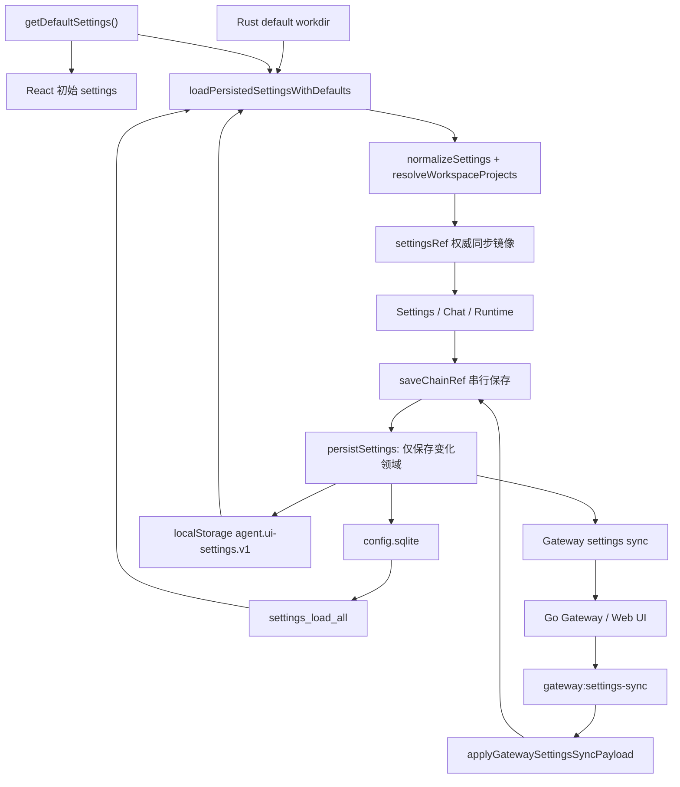

# 第 14 章：设置、存储、国际化与平台差异

## 本章目标

读完本章后，你应当能够解释设置从默认值、SQLite 和 localStorage 合并成 `AppSettings` 的过程，理解串行保存、跨端同步和 SSH 冲突处理，知道哪些字段可以公开同步、哪些秘密只能一次性传递，并能定位主题、语言和 Windows/macOS/Linux 行为差异。

设置不是一个 JSON 文件的简单读写。本项目同时存在桌面数据库、WebView localStorage、React 当前状态、Gateway 缓存快照和浏览器 Web UI；可靠实现的重点是明确每类字段的所有者、合并规则和脱敏边界。

## 先读哪些文件

- [`App.tsx`](../../agent-gui/src/App.tsx)；
- [`lib/settings/index.ts`](../../agent-gui/src/lib/settings/index.ts)、[`normalize.ts`](../../agent-gui/src/lib/settings/normalize.ts)、[`storage.ts`](../../agent-gui/src/lib/settings/storage.ts) 与 [`sync.ts`](../../agent-gui/src/lib/settings/sync.ts)；
- [`pages/settings`](../../agent-gui/src/pages/settings)；
- [`commands/config/settings`](../../agent-gui/src-tauri/src/commands/config/settings)；
- [`services/gateway/settings_sync.rs`](../../agent-gui/src-tauri/src/services/gateway/settings_sync.rs)；
- [`i18n/config.ts`](../../agent-gui/src/i18n/config.ts) 与 [`i18n/LocaleContext.tsx`](../../agent-gui/src/i18n/LocaleContext.tsx)；
- [`runtimePlatform.ts`](../../agent-gui/src/lib/runtimePlatform.ts) 与 [`runtime/platform.rs`](../../agent-gui/src-tauri/src/runtime/platform.rs)；
- [`tauri.windows.conf.json`](../../agent-gui/src-tauri/tauri.windows.conf.json)、[`tauri.macos.conf.json`](../../agent-gui/src-tauri/tauri.macos.conf.json)、[`tauri.linux.release.conf.json`](../../agent-gui/src-tauri/tauri.linux.release.conf.json)。

## 1. 设置由哪些事实源组成

`AppSettings` 是前端使用的统一视图，但字段并不都保存在同一位置：

| 设置领域 | 主要持久化位置 | 原因 |
| --- | --- | --- |
| Providers、System、MCP、Agents、SSH、Remote、Memory | Rust `config.sqlite` | 需要被 Rust service、Gateway 和应用重启共享 |
| Skills UI 状态、Chat Runtime controls | WebView localStorage | 主要由前端消费，启动时不要求 Rust 参与 |
| Right Dock、Chat sidebar、font scale | WebView localStorage | 设备和窗口相关的 UI 偏好 |
| Update、Selected Model、Theme、Locale | WebView localStorage | 启动渲染需要尽早可用，且属于用户界面选择 |
| Gateway settings snapshot | Rust 内存缓存 + Gateway session | 远端同步用的脱敏投影，不是新的永久事实源 |

加载和同步关系如下：

统一视图不等于统一所有权。比如 Theme 出现在 Gateway payload 中以便 Web UI 同步，但 Rust 数据库故意不为它制造默认值，因为真实值由 WebView localStorage 持有。

## 2. 启动加载与标准化

### 2.1 默认值先保证应用可渲染

`App` 使用 `useState(() => getDefaultSettings())` 创建初始状态。此时数据库尚未返回，界面可以显示 loading，而不是因为 settings 为 null 到处增加分支。

`loadPersistedSettingsWithDefaults()` 随后并行组合两个来源：

1. `settings_load_all` 从 SQLite 读取 Provider、System、MCP、Agents、SSH、Remote、Memory 和 Rust 计算的 `defaultWorkdir`；
2. `readLocalUiSettings()` 从 `agent.ui-settings.v1` 读取 Skills、Runtime controls、custom settings、update、model、theme 和 locale；
3. 任何缺失或格式异常的领域回退到 `getDefaultSettings()`；
4. `normalizeSettings()` 统一枚举、路径、数组、数字范围和旧 schema；
5. `resolveWorkspaceProjects()` 把 workdir 与项目列表整理成一致模型。

localStorage JSON 解析失败不会阻止应用启动，而是整组 UI 偏好回退默认值。SQLite 加载失败则由 `App` 捕获，显示保存状态错误并继续使用默认设置。

### 2.2 Runtime 默认 workdir 的注入时机

`applyRuntimeSystemDefaults()` 只在用户设置的 `system.workdir` 为空时注入 Rust 发现的默认目录，然后再次标准化 workspace projects。它不会覆盖用户已经选择的工作区。

这一逻辑同时用于首次 hydrate、远程设置事件和重新打开 Settings 后的 reload，防止不同入口产生不同项目列表。

### 2.3 `settingsRef` 为什么不是多余状态

React state 用于渲染，但连续 read-modify-write 需要同步读取最新值。`settingsRef.current` 每次都与 state 同步，并由 `setSettings()` 在调用 `setSettingsState()` 前先更新。

项目刻意不把带持久化副作用的逻辑放进 React functional state updater。开发模式 StrictMode 可能重复调用 updater；如果其中包含保存、发布或 `crypto.randomUUID()`，一次用户操作可能产生两次不可逆副作用。`settingsRef` 让“计算 next → 同步更新 ref → 更新 UI → 排队保存”成为单一路径。

## 3. 串行保存与领域级写入

### 3.1 `saveChainRef` 与 `saveSequenceRef`

用户快速修改多个设置时，较早的异步保存可能晚于较新的保存结束。项目使用两个机制：

- `saveChainRef`：把每次 `persistSettings(prev, next)` 接在前一次 Promise 后，保证跨变更按发起顺序落盘；
- `saveSequenceRef`：每次保存递增序号，只有最新序号可以把 UI 的 save state 改成 saved/error，旧响应不能覆盖新状态。

保存链会先吞掉前一次错误再继续，某个领域失败不会永久卡死后续保存。单次 `persistSettings()` 内部则把本次发生变化的独立领域放入 `Promise.all`，兼顾顺序正确和领域间并行。

### 3.2 只保存发生变化的领域

`persistSettings()` 用稳定 JSON 比较逐项决定是否调用：

- `settings_save_providers`；
- `settings_save_system`；
- `settings_save_mcp`；
- `settings_save_agents`；
- `settings_apply_ssh_patch`；
- `settings_save_remote`；
- `settings_save_memory`；
- `writeLocalUiSettings()`。

这避免每次切换主题都重写 Provider、SSH 和 MCP，也减少 Gateway sync 中不必要的广播。

System 与 Remote 保存还带业务副作用：

- `settings_save_system` 完成后调用 `AutomationScheduler.request_reload()`，因为 bash cron 使用 system workdir；
- `settings_save_remote` 完成后立即调用 `GatewayController.apply_config()`，不要求重启应用才应用新地址、token 或能力开关。

因此新增设置领域时不能只考虑“写到哪里”，还要检查哪个长生命周期 service 需要 reload 或 reconfigure。

## 4. Provider 与 SSH 秘密如何保存和同步

### 4.1 本地数据库可保存秘密，公开快照不可以

桌面端 SQLite 需要保存完整 Provider API key、SSH password、private key、passphrase 和 proxy password，因为本地模型调用与 SSH runtime 要使用它们。

离开桌面可信边界的常规 snapshot 则只保留：

- Provider 的 `apiKeyConfigured`；
- SSH 的 `passwordConfigured`、`privateKeyConfigured`、`privateKeyPassphraseConfigured`；
- proxy 的 `passwordConfigured`。

实际 secret 字符串被清空或移除。`redact_gateway_settings_sync_payload()` 还会再次删除 `providerApiKeyUpdates` 与 `sshSecretUpdates`，形成 Rust 侧的最后一道防泄漏边界。

### 4.2 一次性 secret update

当 Web UI 明确修改某个秘密时，结构快照本身无法表达新值，因此协议使用一次性字段：

- `providerApiKeyUpdates: Record<providerId, apiKey>`；
- `sshSecretUpdates: Record<hostId, {...}>`。

接收端应用到本地数据库后，后续正常 snapshot 仍只传播 configured 标志。它们是“写命令的敏感参数”，不是可以长期缓存、转发或记录日志的普通设置字段。

keyboard-interactive 是容易出错的特例。它不应因为存在普通 password/private-key configured 标志而被误判为可自动登录；标准化和脱敏代码会把这类登录 secret 清空，但 proxy password 仍独立保留 configured 状态。

### 4.3 SSH 为什么使用 patch 而不是整对象覆盖

SSH 设置包含主机列表、主机顺序、项目关联和秘密。桌面与 Web UI 可能同时编辑不同主机，整对象 last-write-wins 会丢数据。因此 `buildGatewaySshSyncPatch()` 产生：

- `hostChanges`，每项带 before/after；
- `projectAssociationChanges`，每项带 before/after；
- `hostOrderChange`；
- 单独的 `sshSecretUpdates`。

Rust `apply_ssh_patch_with_conn()` 使用 SQLite `TransactionBehavior::Immediate`。每个字段变更先比较数据库当前值与 before：

- 当前值等于 before：可以应用 after；
- 当前值已经等于 after：视为幂等重放；
- 当前值既不是 before 也不是 after：返回冲突和当前完整 SSH snapshot，不盲目覆盖。

前端收到冲突后把返回的 SSH snapshot 合入 `settingsRef`，提示用户基于最新状态重新提交。修改 auth type 时还会清空旧认证方式的秘密，避免从 password 切到 private key 后残留不可见密码。

### 4.4 Known host 不属于普通 SSH 配置

`ssh_known_hosts` 单独保存 host、port、公钥类型、key material、fingerprint 与信任时间。SSH 配置同步不会自动删除它。首次连接需要显式 trust；已知 fingerprint 变化时拒绝连接，用户必须执行 reset/trust 流程。

这样“编辑主机名称、密码或项目关联”不会弱化 host key 校验。

## 5. Gateway settings sync 的字段边界

### 5.1 同步 payload 包含什么

`buildGatewaySettingsSyncPayload()` 生成的公开投影包括：

- system；
- 脱敏 custom providers；
- MCP、Agents；
- 脱敏 SSH；
- Remote 的 Web Terminal、Web SSH、Web Git、Tunnel 能力开关；
- Memory；
- 可同步 custom settings；
- Skills、Chat Runtime controls、Selected Model、Theme、Locale。

Remote 的 Gateway 地址、token、TLS 等连接秘密不会按普通 UI 设置同步给浏览器。Automation cron/hook 的 HTTP headers 在 Rust snapshot 中也会先 mask，远端 round-trip sentinel 后再由本地 store 恢复原值。

### 5.2 哪些 UI 偏好保持设备本地

`syncableCustomSettings()` 和应用合并逻辑故意排除或本地优先处理：

- font scale；
- Chat sidebar collapse；
- Right Dock width。

这些值依赖屏幕、窗口和设备习惯，不应该在大屏桌面与小屏浏览器之间互相覆盖。

Right Dock 的项目状态可以同步，但 width 保留本机值。项目 bucket 使用 `(stateVersion, writerId)` 的确定性全序选择赢家，并把 openVersion、stateVersion、lastUsedAt 取最大值；Windows/POSIX 路径先经 `workspaceProjectPathKey()` 标准化。两端在同版本并发写入时也能收敛，而不是各自认为自己更新。

### 5.3 Rust DB snapshot 为什么省略 Theme 和 Locale

`load_gateway_settings_sync_snapshot()` 从数据库构建启动快照时，故意不填 theme、locale、selectedModel、skills、chatRuntimeControls 和 customSettings。这些字段属于 WebView localStorage。

Gateway controller 会把数据库 snapshot 与 WebView 之前发布的 cached snapshot 合并；没有缓存时字段保持缺失，接收端把缺失解释为“保留当前值”。如果 Rust 在 WebView 启动前伪造 `theme: light`，就可能把用户真实的 dark 设置覆盖掉。

### 5.4 收到远端设置事件后的流程

`App` 监听 `GATEWAY_SETTINGS_SYNC_EVENT`：

1. 从 `settingsRef.current` 取得当前快照；
2. `applyGatewaySettingsSyncPayload()` 按字段合并、应用 SSH patch/secret update；
3. 再执行 runtime default 与 normalize；
4. 如果公开字段或一次性秘密发生变化，立即更新 ref 与 React state；
5. 把结果重新放进同一 `saveChainRef`，写入本地数据库/localStorage；
6. 只有公开字段变化时才再次 publish，避免秘密或无意义 echo 循环。

断线重连后仍以完整 snapshot 恢复；revision、patch 前置条件和本地字段合并共同处理重复、乱序与并发修改。

## 6. 国际化与主题

### 6.1 国际化实现

`LocaleContext` 只提供两个值：当前 `locale` 与 `t(key)`。当前支持 `zh-CN`、`en-US`，默认 `zh-CN`；翻译字典集中在 `i18n/config.ts`。

组件不直接拼接 locale 分支，而是通过 `useLocale()` 获取 `t`。动态值通常先取模板，再替换 `{name}`、`{count}` 等占位符。新增功能时应同时补中文、英文 key，并检查桌面 UI 与 Gateway Web UI 的镜像字典。

Monaco 是一个额外边界：它在 lazy import 时读取 NLS 全局设置，因此 ChatPage 会在加载编辑器模块前设置首选 locale。只更新 React 文案并不能自动改变所有第三方编辑器语言。

### 6.2 主题解析与传播

Theme 支持 `light`、`dark`、`system`。`resolveEffectiveTheme()` 对 system 调用 `matchMedia('(prefers-color-scheme: dark)')`；`subscribeToSystemThemePreference()` 监听系统变化，最终由 `App` 在 `<html>` 上切换 `dark` class。

Tailwind/CSS 变量可以随根 class 更新，但 Monaco、XTerm、Diff、Markdown/Mermaid 等拥有独立 theme 配置的组件仍必须显式接收 `effectiveTheme`。排查“主界面已经变暗但编辑器仍是浅色”时，应找这些二次主题入口，而不是只检查 `<html class="dark">`。

## 7. 平台识别与行为差异

### 7.1 平台识别

前端 `resolveRuntimePlatform()` 优先调用 Rust command `app_runtime_platform`。如果不是 Tauri 环境或 invoke 失败，再根据 `navigator.userAgent` 与 `navigator.platform` 推断。浏览器推断只是 fallback，涉及文件路径、窗口和执行程序时仍应以 Rust 编译目标为准。

Rust `runtime/platform.rs` 还负责：

- `~` 展开；
- macOS GUI 环境补充 `/opt/homebrew/bin`、`/usr/local/bin`、`~/.local/bin` 等 PATH；
- Windows 按当前目录、PATH 和 PATHEXT 解析 `.COM/.EXE/.BAT/.CMD`；
- shell basename 与跨平台路径处理。

### 7.2 Windows

`tauri.windows.conf.json` 设置 `decorations: false`，因此应用使用 [`WindowsTitleBar.tsx`](../../agent-gui/src/components/WindowsTitleBar.tsx) 自绘标题栏、菜单和窗口按钮。安装包目标为 NSIS 与 MSI，并使用 Windows 专用图标。

自绘标题栏意味着拖动区域、最大化/还原、缩放和菜单命令都属于应用代码；普通浏览器页面或 macOS 不应复用这些窗口 API。

### 7.3 macOS

`tauri.macos.conf.json` 使用 `titleBarStyle: Overlay`，traffic lights 位于 `(18, 18)`，打包目标为 `.app` 与 DMG，并开启 hardened runtime。GUI 应用从 Finder/Dock 启动时 PATH 通常比交互 shell 少，因此 Rust 启动外部命令前补常见 Homebrew 路径。

用户点击 Dock 图标触发 `RunEvent::Reopen` 时，应用重新显示主窗口。traffic lights 的留白与交互由 macOS 专用布局处理，不等同于 Windows 自绘按钮。

### 7.4 Linux

Linux release override 构建 AppImage、deb、rpm，并开启 updater artifacts。具体发行版仍可能缺少 WebKit、系统库或桌面集成依赖，所以“配置中有 deb/rpm”不代表任意 Linux 环境都能无前置条件构建。

### 7.5 所有平台共同的关闭语义

主窗口收到 `CloseRequested` 时统一 `prevent_close()` 并隐藏到托盘，而不是直接退出进程。真正退出由显式命令确认，以便处理仍在运行的 Terminal 和 Managed Process。macOS Dock reopen、系统 resume 与 Gateway reconnect 又分别有恢复路径。

## 8. 修改设置功能时的检查清单

新增或修改一个设置字段时，按下面顺序检查：

1. `AppSettings` 类型、默认值和 normalize；
2. Settings 页面输入是否把空值、删除和值未改变区分开；
3. 应存 SQLite 还是 localStorage；
4. `persistSettings()` 的 changed detection 与 Rust save command；
5. 是否需要 service reload/apply config；
6. 是否进入 Gateway payload；若进入，是否需要 redaction；
7. incoming merge 的冲突与设备本地字段策略；
8. 中英文翻译；
9. 桌面/Web 镜像与平台专用分支；
10. normalize、sync、SSH patch、i18n 和 runtime-platform tests。

最危险的错误通常不是字段没显示，而是秘密进入日志/快照、较旧异步保存覆盖新值、远端默认值覆盖本地真实值，或仅更新桌面端却忘记 Web UI 镜像。

## 验证与扩展

- 关键验证：`node --test agent-gui/test/settings/*.test.mjs agent-gui/test/i18n/*.test.mjs agent-gui/test/runtime-platform.test.mjs`。
- 修改入口：普通业务设置从 `AppSettings → normalize → storage → Rust table` 开始；跨端设置还要修改 `sync.ts` 与 Gateway merge；敏感字段必须增加一次性 update、Rust 应用逻辑和脱敏测试。
- 练习：为一个无敏感信息的布尔设置画出 default、hydrate、页面修改、串行保存、Gateway sync、远端合并和重启恢复七步链路，并说明它为何应放 SQLite 或 localStorage。

[上一章：工作区、终端、Git、SSH、SFTP 与隧道](13-workspace-terminal-git-ssh.md) · [相关：Go Gateway 与 Web UI](12-gateway-and-webui.md) · [返回总览](README.md) · [下一章：测试、构建与发布](15-testing-build-and-release.md)
