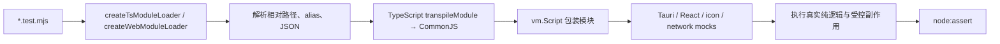
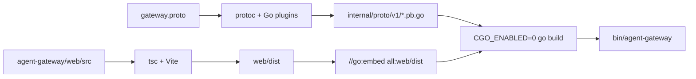

# 第 15 章：测试、构建与发布

## 本章目标

读完本章后，你应当能够根据改动范围选择最小但充分的验证命令，理解 Node Test Runner 如何执行 TypeScript 业务逻辑，区分 Rust/Go 单元测试与边界测试，追踪桌面应用和 Gateway 的构建产物链，并能说明版本、签名、updater manifest、发布说明和 macOS 公证如何衔接。

工程验证的目标不是“把所有命令都跑一遍”这么简单，而是确认每一层真正验证了什么。源码结构测试不能替代真实逻辑测试，`cargo check` 不能替代 `cargo test`，Vite build 也不能证明 Gateway 协议兼容。

## 先读哪些文件

- [`agent-gui/test/README.md`](../../agent-gui/test/README.md) 与 [`agent-gateway/test/README.md`](../../agent-gateway/test/README.md)；
- [`agent-gui/package.json`](../../agent-gui/package.json) 与 [`agent-gateway/web/package.json`](../../agent-gateway/web/package.json)；
- [`agent-gui/test/helpers/load-ts-module.mjs`](../../agent-gui/test/helpers/load-ts-module.mjs) 与 [`agent-gateway/test/helpers/load-web-module.mjs`](../../agent-gateway/test/helpers/load-web-module.mjs)；
- [`Makefile`](../../Makefile) 与 [`Dockerfile`](../../Dockerfile)；
- [`agent-gui/src-tauri/build.rs`](../../agent-gui/src-tauri/build.rs)、[`agent-gateway/embed.go`](../../agent-gateway/embed.go)；
- [`scripts/release`](../../scripts/release)；
- [`tauri.windows.release.conf.json`](../../agent-gui/src-tauri/tauri.windows.release.conf.json)、[`tauri.macos.release.conf.json`](../../agent-gui/src-tauri/tauri.macos.release.conf.json)、[`tauri.linux.release.conf.json`](../../agent-gui/src-tauri/tauri.linux.release.conf.json)。

## 1. 测试分层与真实覆盖范围

| 测试层 | 主要命令 | 真正验证什么 | 不能证明什么 |
| --- | --- | --- | --- |
| 桌面 Node 业务测试 | `pnpm --dir agent-gui test:frontend` | Settings、Chat、Memory、Provider、Tools、Skills、Subagents 等 TypeScript 逻辑 | 不启动真实 WebView，不运行 Rust command |
| 桌面源码结构/UI 契约测试 | `node --test agent-gui/test/ui/*.test.mjs` 等 | 镜像文件、文案、组件 wiring、危险入口是否仍存在 | 不能证明真实点击和浏览器布局 |
| Rust 测试 | `cargo test --manifest-path agent-gui/src-tauri/Cargo.toml` | SQLite、Memory、Automation、Terminal、SSH、Git helper、Gateway service 等 Rust 逻辑 | 不验证 React UI；平台专用代码仍受当前 target 限制 |
| Rust 编译门禁 | `cargo check ... --tests` | crate 与测试目标能编译、类型和 feature 正确 | 不执行测试断言 |
| Go package / boundary 测试 | `go -C agent-gateway test ./...` | auth、HTTP、WebSocket、session、tunnel、upload、gRPC 路由与恢复 | 不连接真实公网部署或真实桌面 GUI |
| Gateway Web UI Node 测试 | `pnpm --dir agent-gateway/web test` | Socket client、stream、transcript、history、settings、sidebar 等浏览器侧逻辑 | 不是真浏览器 E2E，不验证 CSS 像素布局 |
| TypeScript/Vite build | 两个前端的 `pnpm ... build` | 全项目类型检查、模块解析和生产 bundle | 不执行运行时断言 |
| 平台安装包验证 | `tauri build` 与签名/公证命令 | Rust release binary、前端资源和 installer 能打包 | 只能在匹配 OS、证书和系统依赖的环境验证 |

`pnpm --dir agent-gui test` 比 `test:frontend` 更重：它使用 `node --test test/**/*.test.mjs`，会包含 `test/backend/cargo-smoke.test.mjs`。该 wrapper 实际运行 `cargo test --manifest-path src-tauri/Cargo.toml`，超时为 180 秒。因此“GUI 全量测试通过”同时包含 Node 与 Rust test suite，而不是只有前端测试。

## 2. Node Test Runner 如何加载 TypeScript

### 2.1 自定义 VM loader

项目没有把 Jest/Vitest 作为主要测试框架。`.mjs` 测试使用 Node `node:test`，再通过自定义 loader 执行 `.ts/.tsx`：



桌面 loader 使用别名包 `typescript-transpile`，固定到 TypeScript 6 的 JS compiler API。原因是项目的 `typescript` 依赖已指向 TypeScript 7，而 loader 仍需要 `transpileModule`、`ModuleKind` 等 API。前端正式 build 则由 package script 中的 `tsc` 完成，两条链的职责不同。

loader 把 ES module 转为 CommonJS，在 `vm.Script` 中执行，并为 Tauri `invoke/listen`、React JSX、icons、TypeBox 和部分 pi-ai 模块提供真实实现或可控 mock。它可以测试真实 reducer、队列、Provider payload 和 schema 逻辑，但没有 DOM、WebView、PTY 或 SQLite，除非测试显式启动外部进程。

### 2.2 真实逻辑测试与源码结构测试

阅读 `.mjs` 时先看它如何取得被测对象：

- 调用 `createTsModuleLoader().loadModule(...)`，通常是在执行真实 TypeScript 逻辑；
- `fs.readFileSync()` 后用正则或字符串断言，通常是源码结构/镜像契约测试；
- mock `invoke()` 并断言 command/payload，验证前端 adapter，而不是 Rust command 本身；
- 启动 `cargo`、`git`、HTTP server 或子进程，才跨越了单纯的内存单元边界。

例如 `tool-approval-ui.test.mjs` 读取组件源码，适合守住 wiring 与文案；`chat-turn-queue.test.mjs` 执行队列状态机；`cargo-smoke.test.mjs` 真正启动 Rust test suite。三者都由 Node Test Runner 报告，但覆盖强度完全不同。

### 2.3 Web UI 测试

Gateway Web loader 同样用 TypeScript `transpileModule + vm.Script`，支持 `@/` alias、CSS 空模块、Tauri shim 和 React/icon mocks。`agent-gateway/test/webui` 更偏跨目录的浏览器 helper、Socket 与配置逻辑，`agent-gateway/web/test` 更贴近 Web UI 源码中的 transcript/sidebar/store。

这些测试不应统称为端到端测试。真正的端到端至少要启动 Gateway、建立 WebSocket/gRPC、连接 Agent 或操作真实浏览器。Go `test/tunnel`、`test/websocket` 等更接近协议边界/E2E，但通常仍使用本地测试 server 和受控连接。

## 3. 桌面构建产物链

### 3.1 只构建前端

`pnpm --dir agent-gui build` 等价于：

```text
tsc → vite build → agent-gui/dist
```

`tsc` 验证整个前端类型与模块解析；Vite 把 React、CSS、Monaco、Markdown 等资源打包。该命令不编译 Rust，也不产生可安装应用。

### 3.2 Tauri build

`pnpm --dir agent-gui tauri build` 或 `make build` 会读取 `tauri.conf.json`：

1. 执行 `beforeBuildCommand: pnpm build` 生成 `dist`；
2. Cargo 编译 `agent-gui/src-tauri`；
3. `build.rs` 读取 `AGENT_APP_VERSION`，没有时回退 `agent-gui/package.json`；
4. `build.rs` 用 `tonic_prost_build` 从同一份 `agent-gateway/proto/v1/gateway.proto` 生成 Rust gRPC client；
5. Windows target 额外嵌入 app manifest；
6. Tauri 把前端 dist、Rust binary、icons、capabilities 和平台配置组装成安装包。

Rust proto 在 Cargo build 时生成，不要求先手工运行 `make proto`。Go proto 则不同，生成文件提交在 `agent-gateway/internal/proto/v1`，修改 `.proto` 后必须运行 `make proto` 更新它们。

### 3.3 平台 bundle

| 平台 | 目标 | Release 特点 |
| --- | --- | --- |
| Windows | NSIS、MSI | 无边框窗口配置、专用图标、release 生成 updater artifacts |
| macOS | `.app`、DMG | hardened runtime，release 需要签名、公证、staple 与 Gatekeeper 验证 |
| Linux | AppImage、deb、rpm | release 生成 updater artifacts，构建机需要对应系统库与 bundler 工具 |

`make desktop-build-*` 先检查 Rust target 是否安装。交叉编译不能自动解决系统 SDK、签名证书和平台 bundler 缺失；通常应在对应 OS 的构建机完成最终安装包验证。

## 4. Gateway 构建与 Docker

### 4.1 本地二进制

`make gateway-build` 的依赖链是：



`make proto` 会显式检查 `protoc`、`protoc-gen-go` 和 `protoc-gen-go-grpc`。`make webui` 使用 offline install 后构建；`embed.go` 使用 `all:web/dist`，因为 Vite chunk 可能以下划线开头，普通 embed 规则会静默遗漏。

最终 Go binary 使用 `CGO_ENABLED=0`，便于生成单文件静态服务。跨平台目标通过 GOOS/GOARCH 构建 Linux amd64、Linux arm64 和 Windows amd64。

### 4.2 Docker 多阶段构建

`Dockerfile` 分三阶段：

1. Node 22 + pnpm 构建 Web UI；
2. Go builder 下载模块、复制 Web dist、以 `-trimpath -ldflags='-s -w'` 构建 Gateway；
3. Debian slim 只安装 CA certificates，创建 uid 10001 的非 root 用户并复制 binary。

运行镜像只暴露 HTTP 8080 和 gRPC 50051，不包含 Node、Go compiler 或源码。`make gateway-docker-smoke` 启动临时容器并轮询 `/healthz`；它依赖 Docker daemon 和 curl，因此不应作为每次纯文档或 UI 改动的默认门禁。

## 5. 版本与发布流程

### 5.1 Tag 是版本事实源

`release-version.mjs` 只接受 `v` 开头的完整 semver tag，例如 `v1.2.3` 或 `v1.2.3-beta.2`。`prepare-app-version-from-tag.mjs`：

- 解析 release tag、app version 和 prerelease；
- 可写入 GitHub env/output；
- 可生成仅包含 `{ "version": "1.2.3" }` 的 Tauri config overlay；
- 不修改 `package.json`。

这样开发分支可以一直保留 `0.0.0-dev`，release build 再通过 tag overlay 和 `AGENT_APP_VERSION` 注入真实版本，避免发布脚本在源码中制造额外版本提交。

`make github-release-main RELEASE_TAG=vX.Y.Z` 当前会检查 tag、切换并 fast-forward `main`、要求工作树干净、安装锁定依赖、运行 release tests 与 Cargo check，最后创建 annotated tag 并 push。执行前必须确认仓库实际发布基线与 Makefile 中的 `main` 一致；如果仓库使用 `master`，应先校正发布流程，不能直接运行并假设分支名会自动适配。

### 5.2 Updater manifest

平台 release config 开启 `createUpdaterArtifacts`，Tauri 为安装包生成 `.sig`。`create-tauri-updater-manifest.mjs` 扫描 artifact + signature pair，生成 `latest.json`：

- version 来自 release tag；
- notes 来自 release notes 文件；
- URL 指向 GitHub Release asset；
- platform key 区分 macOS app、Windows NSIS/MSI、Linux AppImage/deb/rpm；
- Windows generic key 优先 NSIS，缺失时回退 MSI；
- Linux generic key只允许指向 AppImage，不能错误指向 deb/rpm；
- 没有匹配签名时直接失败。

updater manifest 是安全元数据，不应在缺签名时降级为 unsigned URL。

### 5.3 AI release notes 的安全回退

`create-ai-release-notes.mjs` 从前一个 tag、commit log、diff stat、changed files 和 GitHub generated notes 构建受限上下文。它要求模型不得发明功能、指标或兼容性结论，先尝试 Chat Completions，失败再尝试 Responses API。

缺少 API key、请求失败或模型返回空内容时，脚本复制提供的 fallback notes；没有文件时生成最小 release note。发布因此不依赖 AI 服务必然在线。API key、base URL、model 和 timeout 都通过环境变量注入，不能写入仓库或日志。

### 5.4 签名、Secrets 与 macOS 公证

`bootstrap-github-secrets.sh` 使用已认证的 `gh` CLI，把证书 P12、证书密码、签名 identity、Apple ID/team 和 app-specific password 写入 GitHub Secrets。脚本可以从 Keychain 导出 identity，但证书与密码文件是本机前置条件，不属于仓库资产。

`make desktop-build-macos-release` 的关键顺序是：

1. 检查 Rust target、Developer ID identity 和 notary profile；
2. 清理可能冲突的 Apple 环境变量，执行 Tauri release build；
3. `codesign --verify` 检查 `.app`；
4. 签名 DMG；
5. `notarytool submit --wait`；
6. `stapler staple/validate`；
7. `spctl --assess` 验证 app 与 DMG。

签名、公证和 GitHub Secrets 都是有外部副作用的发布操作。普通本地验证只检查脚本与 release tests，不应自动上传 secret、创建 tag 或提交公证。

## 6. 风险分级验证矩阵

| 改动范围 | 最小验证 | 追加验证 |
| --- | --- | --- |
| 仅 UI 样式/组件 wiring | 相关 `agent-gui/test/ui` 或功能测试；`pnpm --dir agent-gui build` | 手工运行 Tauri dev 检查真实布局、主题和平台窗口 |
| Chat Runtime / Provider / Tools | 相关 Node 测试；`pnpm --dir agent-gui build` | `pnpm --dir agent-gui test:frontend`；涉及 Rust tool 再跑 Cargo |
| Rust command / SQLite / runtime | 对应 Rust test；`cargo check ... --tests` | `cargo test --manifest-path ...`；前端 adapter 测试 |
| Gateway Go handler/session | `go -C agent-gateway test ./...` | Web UI tests；真实 Gateway + desktop smoke |
| Gateway protocol | Go tests、Cargo check/test、两端 Web UI tests/build | 重新生成 Go proto；验证旧/新连接、reset/snapshot/慢客户端 |
| Web UI 独立改动 | `pnpm --dir agent-gateway/web test` 与 `build` | 本地 Gateway 浏览器 smoke；检查桌面镜像 parity |
| Release/version/updater 脚本 | `pnpm --dir agent-gui test:release` | 在对应 OS 做 unsigned bundle；正式发布环境再验证签名/公证 |
| Docker/Gateway 镜像 | Go/Web build | `make gateway-docker-smoke`，并检查非 root 与健康接口 |

所谓“最小验证”是风险下限，不是固定清单。若 UI 改动触及共享 Settings 类型，它就不再是“仅 UI”；若 `.proto` 只改注释，可以减少运行时验证，但仍应确认生成文件是否发生变化。

## 7. 常用验证命令

从仓库根目录运行：

```powershell
# 桌面 Node + Rust 全量测试
pnpm --dir agent-gui test

# 桌面前端生产构建
pnpm --dir agent-gui build

# Rust 编译门禁
cargo check --manifest-path agent-gui/src-tauri/Cargo.toml --tests

# Gateway Go 测试
go -C agent-gateway test ./...

# Gateway Web UI 测试与构建
pnpm --dir agent-gateway/web test
pnpm --dir agent-gateway/web build
```

命令失败时要记录它是否真正进入测试脚本。包管理器的依赖/安全预检失败、缺少系统 SDK、缺少 protoc、Docker daemon 未启动，与测试断言失败是不同类别，不能用同一种结论描述。

## 验证与扩展

- 关键验证：本章末尾六条工程命令；发布脚本额外运行 `pnpm --dir agent-gui test:release`。
- 修改入口：新增测试先选择正确边界；新增构建产物从 package script/Makefile 和 embed 链入手；新增发布平台要同时更新 Tauri bundle、artifact 命名、signature 与 updater manifest mapping。
- 练习：选择一次“修改 Gateway WebSocket payload”的假想改动，列出必须运行的 Go、Rust、Web UI、proto 生成和 build 命令，并说明每条命令分别阻止哪一类回归。

[上一章：设置、存储、国际化与平台差异](14-settings-storage-i18n-platform.md) · [相关：项目导读与首次运行](01-project-overview-and-setup.md) · [返回总览](README.md) · [下一章：综合排障与功能扩展](16-troubleshooting-and-extension.md)
