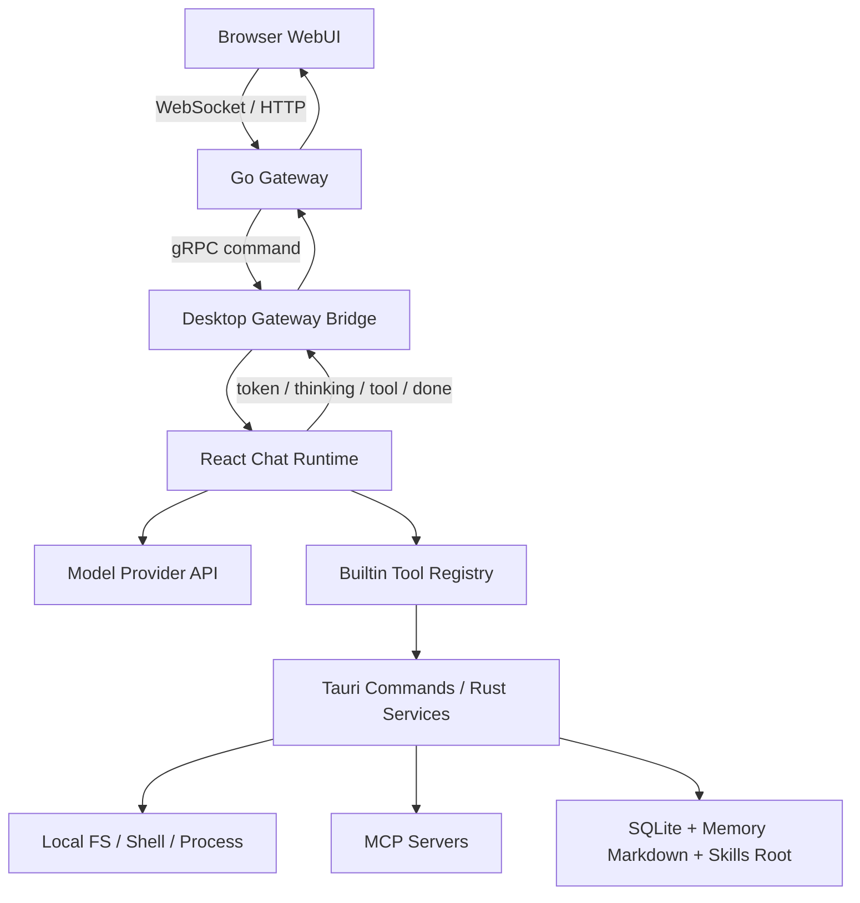
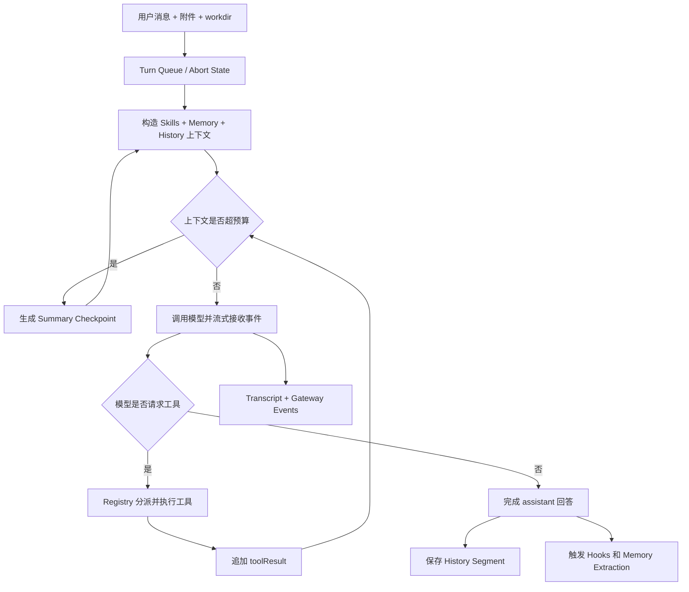
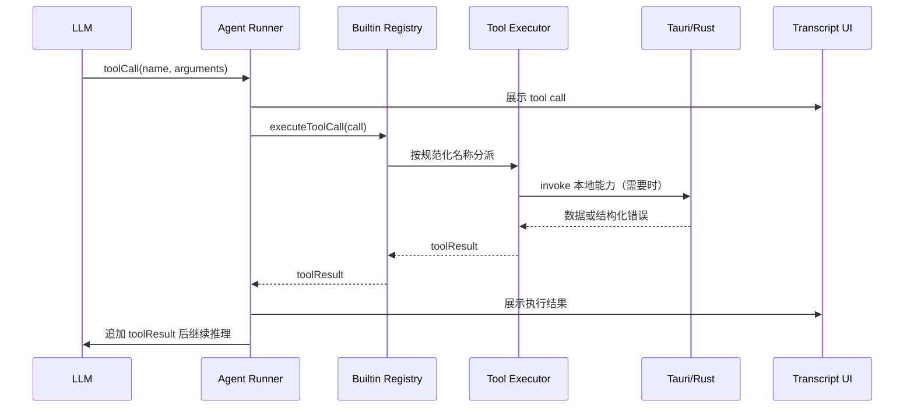

# LiveAgent 主要功能与源码学习指南

## 1. 导读

### 1.1 这份教程适合谁

本文面向第一次接触 LiveAgent 的开发者。你不需要预先理解 Agent Runtime、MCP、长期记忆或上下文压缩，但应具备基础编程知识，并能阅读 TypeScript、Rust 和 Go 项目的目录结构。

### 1.2 学完后你应该能做什么

完成本教程后，你应该能够：

1. 说明桌面 GUI、Tauri/Rust、Go Gateway 和 Browser WebUI 的职责与权限边界。
2. 从用户发送消息开始，追踪一次 Agent 请求直到历史保存和记忆提取完成。
3. 区分 Chat Runtime、Tools、Skills、MCP、Memory、History Compaction 的作用。
4. 根据功能现象找到主要源码入口，并判断问题属于前端运行时、Rust 服务还是 Gateway。
5. 在修改功能前列出影响面，在功能异常时按照证据逐层排查。

### 1.3 贯穿全文的统一案例

后续章节都围绕同一个请求展开：

> 用户要求 Agent 读取项目中的一个文件，修改代码，并记住一条项目约定。

这个案例同时涉及上下文构造、文件工具、工具循环、历史持久化、Memory 提取，以及长对话中的上下文压缩，因此适合观察各模块如何协作。

### 1.4 推荐学习顺序

1. 先阅读“总体架构”，建立进程与权限边界。
2. 再阅读“一次请求的完整生命周期”，理解主干流程。
3. 依次深入 Chat Runtime、Tools、Skills/MCP、Memory、History Compaction。
4. 最后按源码路线阅读代码，并完成练习与排障案例。

### 1.5 术语速查

| 术语 | 含义 |
|---|---|
| GUI | Tauri WebView 中运行的 React 桌面界面，也是 Chat Runtime 的主要承载端。 |
| Tauri | 桌面应用的 Rust 后端，提供文件、进程、SQLite、Memory、MCP 等本地高权限能力。 |
| Gateway | Go 编写的远程中继服务，负责认证、连接、命令转发、事件广播和有界缓冲。 |
| WebUI | 浏览器远程操作界面，通过 Gateway 使用桌面端 Agent，不直接获得本地系统权限。 |
| Turn | 一次模型处理轮次；一个用户请求可能因工具调用包含多个模型轮次。 |
| Tool Loop | 模型提出工具调用、应用执行工具、结果回填模型、模型继续推理的循环。 |
| Skill | 注入给模型的工作方法、领域知识或操作说明。 |
| MCP | Model Context Protocol，用于把外部工具服务动态接入 Agent。 |
| Memory | 跨轮次或跨会话保留的用户偏好、反馈和项目知识。 |
| History Segment | 持久化对话历史的分段单元。 |
| Checkpoint | 压缩旧上下文后产生的摘要检查点。 |
| FTS | Full-Text Search，SQLite 全文搜索索引。 |

## 2. 总体架构：谁负责什么

LiveAgent 不是一个单纯的聊天网页，而是由桌面应用、桌面后端、远程中继和浏览器界面共同组成的 Agent 系统。理解项目的第一原则是：**本地桌面端是执行与数据真相源**。

### 2.1 四个运行单元

| 运行单元 | 技术栈与主要路径 | 核心职责 | 权限边界 |
|---|---|---|---|
| 桌面 GUI | React、TypeScript；`crates/agent-gui/src` | Chat 页面、设置、Skills/MCP Hub、Transcript、模型请求编排和工具循环 | 能通过 Tauri invoke 请求本地能力，但不直接操作 Rust 内部状态 |
| Tauri/Rust | Rust、Tauri、SQLite、Tokio；`crates/agent-gui/src-tauri/src` | 文件与进程能力、历史持久化、MemoryStore、MCP Runtime、Skills 管理、Gateway Bridge | 本地高权限真相源，直接接触操作系统、数据库和用户目录 |
| Go Gateway | Go、gRPC、HTTP、WebSocket；`crates/agent-gateway` | 认证、桌面连接、WebUI 请求转发、事件广播、有界恢复缓冲、静态资源和分享页 | 不直接访问用户文件系统，也不执行 Agent 的业务工具 |
| Browser WebUI | React、TypeScript；`crates/agent-gateway/web` | 远程 Chat、Settings、Skills/MCP Hub 和历史浏览 | 通过 Gateway 间接操作桌面端，不直接拥有本地文件、Shell 或 Tauri 权限 |

### 2.2 进程与数据关系



从图中可以得到三个重要结论：

1. WebUI 发出的高权限请求最终必须回到桌面端执行。
2. Gateway 负责传递请求和事件，不是第二套 Agent Runtime。
3. 历史、Memory、Skills 和本地文件都由桌面端持有，WebUI 只维护必要的远程视图或脱敏缓存。

### 2.3 为什么要这样分层

这种设计主要解决安全、远程访问和一致性问题：

- **安全性**：浏览器和公网 Gateway 不直接获得本地文件系统权限。
- **一致性**：GUI 和 WebUI 操作的是同一个桌面 Agent，而不是两套相互漂移的实现。
- **可恢复性**：Gateway 可用短期事件窗口恢复网络抖动；完整历史仍以桌面 SQLite 为准。
- **扩展性**：系统能力落在 Tauri/Rust，交互与 Agent 编排留在 TypeScript，远程协议由 Go Gateway 承担。

### 2.4 三种 Execution Mode

| 模式 | 主要入口 | 是否暴露本地工具 | 可观测性 | 适合场景 |
|---|---|---:|---|---|
| `text` | `crates/agent-gui/src/pages/chat/turns/runTextConversationTurn.ts` | 否 | 基础流式输出 | 纯文本问答、低权限聊天 |
| `tools` | `crates/agent-gui/src/pages/chat/turns/runAgentConversationTurn.ts` | 是 | 工具调用、结果和基础 usage | 日常 Agent 开发任务 |
| `agent-dev` | 同样进入 `runAgentConversationTurn.ts` | 是 | 展示更多 debug、usage 和静默 Memory 状态 | 开发、调试和运行时观察 |

`text` 与 `tools` 的区别不只是 UI 开关。`text` 模式不会构造本地工具注册表；`tools` 和 `agent-dev` 则会进入模型与工具之间的循环。

## 3. 一次 Agent 请求的完整生命周期

下面用统一案例追踪一条请求：用户要求 Agent 读取 `config.ts`、修改一项配置，并记住“该项目统一使用中文注释”。

### 3.1 十二步主流程

1. **收集输入**：`ChatPage` 和 `ChatComposerBar` 收集文本、附件、模型、execution mode、workdir 和系统工具选择。
2. **排队与取消管理**：Chat turn queue 决定请求何时执行，并建立本轮取消信号。
3. **加载增强上下文**：`useChatSkills` 生成当前可见 Skills Prompt；Memory 模块生成 Overview；Conversation State 提供历史 active segment 和已有 checkpoint。
4. **组装请求上下文**：Context Builder 合并 system prompt、消息、附件、工具定义、hosted search 和模型配置，并清洗不应继续携带的数据。
5. **检查上下文预算**：Compaction Controller 估算 token。如果旧消息使请求超预算，先生成 Summary Checkpoint，再重新构造请求。
6. **调用模型**：`text` 模式直接流式生成；`tools` 和 `agent-dev` 模式进入 Agent Runner。
7. **处理流式事件**：token、thinking、hosted search、usage 和工具状态持续写入 Live Transcript Store，桌面 UI 立即更新。
8. **执行工具调用**：模型请求 `Read` 时，Builtin Registry 找到对应 executor；文件工具检查路径策略后，通过前端后端适配层或 Tauri command 完成本地读取。
9. **回填工具结果**：读取结果作为 `toolResult` 追加进模型上下文，模型继续推理；如果模型随后调用 `Edit`，流程再次循环。
10. **完成回答与远程事件同步**：当模型不再提出工具调用时生成最终回答；Gateway Bridge 同步发布 token、thinking、tool、done 或 error 事件，供 WebUI 消费。
11. **持久化与生命周期收尾**：消息和工具轨迹写入当前 History Segment；必要时生成标题；`agent_end`、`turn_end` 等 hooks 完成收尾。
12. **静默 Memory 提取**：回合结束后，提取控制器判断“统一使用中文注释”是否值得长期保存。通过 `SubmitMemoryPlan` 生成并校验计划后，由 Rust MemoryStore 写入 canonical Markdown，并更新 SQLite 索引。

### 3.2 主流程图



注意图中的回路：一次“用户请求”不一定只调用模型一次。只要模型继续请求工具，系统就会执行工具、追加结果，再进入下一轮模型调用。

### 3.3 Tool Loop 的简化伪代码

```text
context = buildRequestContext(userInput, history, skills, memory)

while not cancelled:
    context = compactIfNeeded(context)
    response = streamModel(context)
    updateTranscriptAndGateway(response.events)

    if response.toolCalls is empty:
        persistFinalResponse(response)
        break

    for call in response.toolCalls:
        result = builtinRegistry.executeToolCall(call)
        context.messages.append(result)

runHooks()
requestSilentMemoryExtraction()
```

这段伪代码省略了 provider 差异、并发状态、参数保护和错误恢复，但准确表达了 Runtime 的骨架。

### 3.4 请求中的三种数据时间尺度

理解系统时，可以按数据寿命分类：

| 时间尺度 | 典型数据 | 主要所有者 |
|---|---|---|
| 当前流式回合 | token、thinking、运行中的 tool status、取消信号 | Live Transcript / Agent Runner |
| 当前与历史对话 | user/assistant/toolResult、Segment、Checkpoint、FTS | Chat History |
| 跨对话长期知识 | 用户偏好、项目约定、反馈、引用资料 | MemoryStore |

History 和 Memory 因此不能混为一谈：History 回答“当时发生了什么”，Memory 回答“以后仍然值得知道什么”。

## 4. Chat Runtime：如何组织一次对话

Chat Runtime 位于 React/TypeScript 层，是“用户请求如何变成模型请求，以及模型结果如何变成应用状态”的核心。它不负责直接实现文件系统或数据库，但负责决定什么时候加载上下文、暴露哪些工具、调用哪个 provider、怎样处理流式事件，以及何时持久化。

### 4.1 主要入口

| 关注点 | 主要路径 | 作用 |
|---|---|---|
| 页面与输入 | `crates/agent-gui/src/pages/ChatPage.tsx`、`src/pages/chat/components/ChatComposerBar.tsx` | 收集输入、模型、模式、附件和 workdir |
| Text Turn | `src/pages/chat/turns/runTextConversationTurn.ts` | 不带本地工具的模型流式调用 |
| Agent Turn | `src/pages/chat/turns/runAgentConversationTurn.ts` | 构建工具注册表、控制 compaction、运行工具循环和回合收尾 |
| 上下文构造 | `src/pages/chat/runtime/conversationContextBuilders.ts` | 组装模型请求需要的消息与系统上下文 |
| Conversation State | `src/lib/chat/conversation/conversationState.ts` | 管理 segment、summary、checkpoint 和请求可见状态 |
| Agent Runner | `src/lib/chat/runner/agentRunner.ts` | provider 流式适配、round 推进、工具调用执行和 toolResult 汇总 |
| Provider 层 | `src/lib/providers/llm.ts` | 将统一请求映射为 Anthropic、OpenAI、Gemini 或自定义 Provider API |

表中的 `src/...` 都相对于 `crates/agent-gui/`。

### 4.2 模型请求由哪些上下文块组成

| 上下文块 | 主要来源 | 为什么需要处理 |
|---|---|---|
| System Prompt | 默认系统提示、用户设置、Skills Prompt、Memory Overview、Compaction Summary | 决定模型身份、规则、可见方法和长期知识 |
| Messages | 当前 active segment 中的 user、assistant、toolResult | 提供本轮对话事实；发送前需要 sanitizer 清理不兼容或过大的内容 |
| Tools | Builtin Registry 与动态 MCP Tools | 只有 tools 类模式才暴露；schema 必须与 executor 一致 |
| Attachments | 上传文件、图片或已有附件引用 | 文件被导入受控 workspace 位置；图片 bytes 会按上下文策略处理 |
| Hosted Search | Provider native search 或 probe 产生的搜索块 | 同时进入模型消息和 UI transcript，并保留来源状态 |
| Summary Checkpoint | 已压缩的旧消息摘要 | 用较小 token 成本续接早期上下文 |

构造上下文不是简单拼接字符串。Runtime 需要同时处理模型上下文窗口、provider 能力、工具 schema 成本、图片数据、历史 segment 边界和已有 summary。

### 4.3 Provider 层为什么要统一

`src/lib/providers/llm.ts` 把项目内部 provider 配置转换成不同厂商 API。各厂商对 thinking、tool choice、hosted search、cache control、Responses storage 和消息格式的支持不同。如果这些差异直接散落在 Chat 页面，Runtime 会很难维护。

因此上层尽量使用统一的消息、工具和流式事件概念，Provider 层负责翻译。排查问题时要先判断：

- 所有模型都异常：优先检查 Runtime、上下文或工具层。
- 只有某个 provider 异常：优先检查 `llm.ts` 及该 provider 的请求/流式适配。
- 只有 hosted search 或 thinking 异常：检查 provider 能力探测与对应事件聚合。

### 4.4 流式事件如何进入 UI

模型开始返回后，Runtime 持续处理多种事件：

| 事件 | UI 表现 | 相关模块 |
|---|---|---|
| text delta | Assistant 文本逐字增长 | `liveTranscriptStore.ts`、`AssistantBubble.tsx` |
| thinking delta | 思考区域更新 | Agent Runner、Assistant Bubble |
| tool call / delta | 工具卡片出现，参数逐步完整 | `agentRunner.ts`、tool trace components |
| tool execution status | 显示工具正在执行或已结束 | Hook lifecycle、ToolCallItem/ToolResultDisplay |
| hosted search | 搜索状态、来源和锚点 | `messages/hostedSearch.ts`、HostedSearchGroupView |
| usage | round token usage | `UsagePanel.tsx`，在 `agent-dev` 中更明显 |
| done / error | 回合完成或错误状态 | Turn runner、Gateway Bridge events |

桌面端还会把关键事件通过 `src/lib/chat/conversation/run/gatewayBridgeEvents.ts` 发布给 Gateway。WebUI 看到的是桌面 Runtime 的远程投影，不是自己重新运行一遍模型和工具。

### 4.5 Hooks 生命周期

Hooks 用于在 Agent 生命周期关键点执行 shell script 或 HTTP request：

```text
agent_start
  turn_start
    message_start
    message_end
    tool_execution_start
    tool_execution_end
  turn_end
agent_end
```

一次用户请求可能有多个 turn：模型先调用 `Read`，工具完成后进入下一轮；之后模型调用 `Edit`，又进入下一轮。`createConversationHookLifecycle()` 会防止同一阶段被重复结束，并等待本轮工具结果全部返回后触发 `turn_end`。

### 4.6 回合结束时发生什么

最终回答生成后，系统还需要：

1. 确保最后一个 message、turn 和 agent 生命周期已经结束。
2. 把 transcript 转换为可持久化的 History Segment。
3. 发布 history sync，使 GUI/WebUI 侧边栏刷新。
4. 必要时异步生成对话标题。
5. 请求静默 Memory 提取；`agent-dev` 可等待并展示更多状态，普通模式通常在后台运行。
6. 释放取消信号、运行态缓存和本轮临时状态。

### 4.7 修改 Chat Runtime 时的思考顺序

假设要新增一种流式 block，至少要回答：

1. Provider 如何产生该 block？
2. Agent Runner 如何规范化并发出事件？
3. Live Transcript 如何保存它？
4. Assistant Bubble 如何渲染它？
5. History 如何序列化与恢复它？
6. Gateway/WebUI 是否要同步协议和渲染？
7. Compaction sanitizer 是否应保留、裁剪或丢弃它？

这套问题能避免只改 UI，导致重载历史后数据消失，或 WebUI 无法识别新类型。

## 5. Tools：模型如何执行真实操作

LLM 本身只能生成内容。LiveAgent 的工具系统把“模型提出一个结构化调用”转换成真实操作，例如读取文件、运行 Shell、查询 Memory 或调用 MCP Server。

### 5.1 Builtin Registry 是组合中心

`crates/agent-gui/src/lib/tools/builtinRegistry.ts` 中的 `buildBuiltinToolRegistry()` 接收 workdir、provider、Skills/MCP 设置、runtime scope、系统工具选择、Todo 状态和 Subagent Runtime 等依赖，返回四项关键能力：

| 返回值 | 含义 | 使用者 |
|---|---|---|
| `tools` | 暴露给模型的工具 schema 列表 | Provider 请求构造 |
| `executeToolCall` | 根据名称找到 executor 并执行调用 | Agent Runner |
| `metadataByName` | 工具展示名、分组、UI details 等元数据 | Transcript 与 Tool Trace UI |
| `hasTool` | 判断一个工具名是否在当前 registry 中有效 | 参数保护、恢复和运行时判断 |

Registry 同时维护 schema 与 executor 的映射。如果只把 schema 发给模型，却没有注册 executor，模型会“看见”工具但调用失败；如果只实现 executor，却没把 schema 加入 `tools`，模型永远不会主动调用它。

### 5.2 一次工具调用的实际路径



不是所有工具都必须进入 Rust。例如部分 Todo 或纯前端状态工具可在 TypeScript 内完成；涉及文件、Shell、数据库、MCP 进程等能力时通常需要 Tauri/Rust。

### 5.3 主要工具 Bundle

| Bundle | 典型工具或能力 | 关键路径 |
|---|---|---|
| File System | `Read`、`List`、`Glob`、`Grep`、`Write`、`Edit`、`Delete`、`Image` | `src/lib/tools/fsTools.ts`、`fileToolState.ts` |
| Shell | Bash/Shell、ManagedProcess 相关能力 | `shellTools.ts`、`bashTimeoutPolicy.ts` |
| SkillsManager | list/read/install/create/validate/package/ClawHub | `skillTools.ts` |
| CronTaskManager | Cron task CRUD 与日志 | `cronTools.ts` |
| McpManager | MCP 配置、诊断、test/restart/stop/tools | `mcpManagerTools.ts` |
| Dynamic MCP | 把外部 server tools 转成模型工具 | `mcpTools.ts` |
| MemoryManager | list/read/search/write/update/delete/accept | `memoryTools.ts` |
| TodoWrite | 会话内任务清单，全量替换 | `todoTools.ts` |
| Subagent | `Agent`、`SendMessage`、worktree 与 Message Bus | `src/lib/subagents/*` |

### 5.4 工具可用性不是固定的

Registry 会根据运行上下文决定工具集合：

- `text` 模式根本不进入 Builtin Registry。
- `runtimeScope=chat` 时可启用 Todo、部分进程或管理类能力。
- Cron 等非 chat scope 会限制 MCP 写操作及某些生命周期操作。
- Settings 中未选择的系统工具不会暴露。
- MCP Server 必须 enabled 且 selected，动态工具才会加载。
- Skill Access Policy 会限制模型对 Skills Root 的访问或修改。
- Subagent 的 readonly/worktree mode 会得到不同的工具集合。

因此“工具文件存在”不等于“当前模型能看到该工具”。排查时必须检查构建 Registry 时传入的 runtime 配置。

### 5.5 文件工具的安全边界

文件工具不仅执行 `readFile` 或 `writeFile`，还需要处理：

- workdir 与 skills root 的根目录策略。
- 相对路径、绝对路径和路径逃逸。
- 工具调用失败时返回 `isError`，而不是把失败伪装成普通文本。
- 文件修改状态和 UI diff 展示。
- 图片工具的 URL、多来源和预览处理。
- 删除等高风险操作的路径校验。

统一案例中的 `Read(config.ts)` 只有在路径被解析到允许的 workspace 内时才应成功。

### 5.6 GUI、WebUI 和 Gateway 的执行边界

| 场景 | 谁编排 Tool Loop | 谁执行本地能力 |
|---|---|---|
| GUI 本地 Chat | 桌面 React Runtime | TypeScript executor + Tauri/Rust |
| WebUI 远程 Chat | 仍然是桌面 React Runtime | 仍然是桌面 TypeScript executor + Tauri/Rust |
| Gateway | 不编排本地 Tool Loop | 不执行本地业务工具，只转发命令和事件 |

如果 WebUI 上 `Read` 失败但 GUI 正常，优先检查 WebUI 命令是否抵达桌面会话、Gateway Bridge 是否在线、workdir 是否正确，而不是在浏览器里寻找文件读取实现。

### 5.7 新增一个 Builtin Tool 要改什么

假设新增 `ProjectInfo` 工具，完整影响面通常包括：

1. **Schema**：定义稳定的工具名称、描述和 JSON 参数。
2. **Executor**：验证参数，执行操作，返回标准 `toolResult`。
3. **Registry**：把 bundle 合并到当前 runtime scope 的工具集合。
4. **Metadata**：定义 UI 分组、展示标题和 details 形状。
5. **Tauri Command**：如果需要系统能力，在 Rust 注册 invoke command，并保持前端参数名一致。
6. **错误边界**：明确用户错误、路径错误、系统错误和取消分别如何返回。
7. **可观测性**：确保 agent-dev、Hook lifecycle 和 Gateway trace 能看到调用状态。
8. **History/Compaction**：决定结果是否持久化、是否需要裁剪，以及摘要是否应保留关键信息。
9. **GUI/WebUI**：如果新增专用 details UI，需要两端同步或提供通用降级渲染。
10. **测试**：至少覆盖 schema、分派、成功结果、错误结果、权限/runtime scope 和 UI details。

只完成前两项通常只能得到“本地似乎能跑”的原型，不能算完整接入 LiveAgent。

## 6. Skills 与 MCP：方法知识和外部能力如何接入

## 7. Memory：系统如何跨对话记住信息

## 8. History 与 Context Compaction：长对话如何保存和续接

## 9. 五个系统如何协作

## 10. 源码阅读路线

## 11. 动手练习

## 12. 常见故障排查

## 13. 功能修改检查表

## 14. 后续阅读与总结
