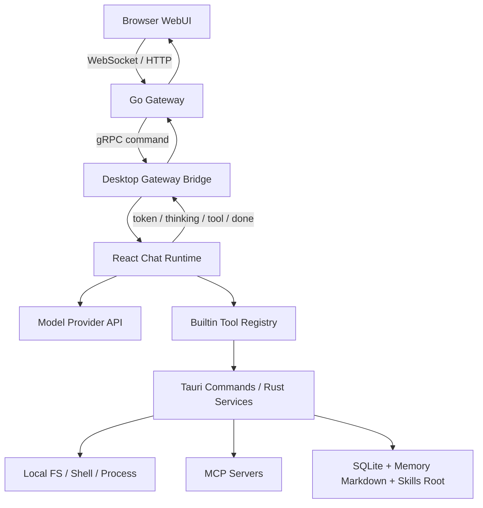
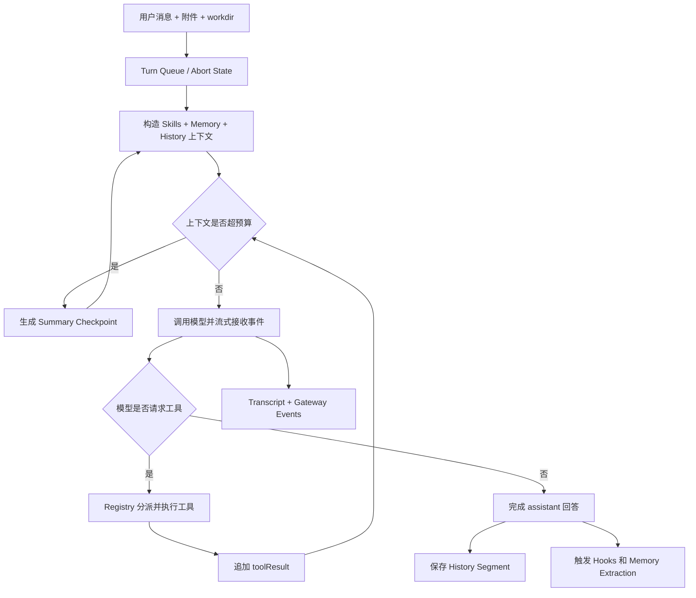

# LiveAgent 主要功能与源码学习指南

## 1. 导读

### 1.1 这份教程适合谁

本文面向第一次接触 LiveAgent 的开发者。你不需要预先理解 Agent Runtime、MCP、长期记忆或上下文压缩，但应具备基础编程知识，并能阅读 TypeScript、Rust 和 Go 项目的目录结构。

### 1.2 学完后你应该能做什么

完成本教程后，你应该能够：

1. 说明桌面 GUI、Tauri/Rust、Go Gateway 和 Browser WebUI 的职责与权限边界。
2. 从用户发送消息开始，追踪一次 Agent 请求直到历史保存和记忆提取完成。
3. 区分 Chat Runtime、Tools、Skills、MCP、Memory、History Compaction 的作用。
4. 根据功能现象找到主要源码入口，并判断问题属于前端运行时、Rust 服务还是 Gateway。
5. 在修改功能前列出影响面，在功能异常时按照证据逐层排查。

### 1.3 贯穿全文的统一案例

后续章节都围绕同一个请求展开：

> 用户要求 Agent 读取项目中的一个文件，修改代码，并记住一条项目约定。

这个案例同时涉及上下文构造、文件工具、工具循环、历史持久化、Memory 提取，以及长对话中的上下文压缩，因此适合观察各模块如何协作。

### 1.4 推荐学习顺序

1. 先阅读“总体架构”，建立进程与权限边界。
2. 再阅读“一次请求的完整生命周期”，理解主干流程。
3. 依次深入 Chat Runtime、Tools、Skills/MCP、Memory、History Compaction。
4. 最后按源码路线阅读代码，并完成练习与排障案例。

### 1.5 术语速查

| 术语 | 含义 |
|---|---|
| GUI | Tauri WebView 中运行的 React 桌面界面，也是 Chat Runtime 的主要承载端。 |
| Tauri | 桌面应用的 Rust 后端，提供文件、进程、SQLite、Memory、MCP 等本地高权限能力。 |
| Gateway | Go 编写的远程中继服务，负责认证、连接、命令转发、事件广播和有界缓冲。 |
| WebUI | 浏览器远程操作界面，通过 Gateway 使用桌面端 Agent，不直接获得本地系统权限。 |
| Turn | 一次模型处理轮次；一个用户请求可能因工具调用包含多个模型轮次。 |
| Tool Loop | 模型提出工具调用、应用执行工具、结果回填模型、模型继续推理的循环。 |
| Skill | 注入给模型的工作方法、领域知识或操作说明。 |
| MCP | Model Context Protocol，用于把外部工具服务动态接入 Agent。 |
| Memory | 跨轮次或跨会话保留的用户偏好、反馈和项目知识。 |
| History Segment | 持久化对话历史的分段单元。 |
| Checkpoint | 压缩旧上下文后产生的摘要检查点。 |
| FTS | Full-Text Search，SQLite 全文搜索索引。 |

## 2. 总体架构：谁负责什么

LiveAgent 不是一个单纯的聊天网页，而是由桌面应用、桌面后端、远程中继和浏览器界面共同组成的 Agent 系统。理解项目的第一原则是：**本地桌面端是执行与数据真相源**。

### 2.1 四个运行单元

| 运行单元 | 技术栈与主要路径 | 核心职责 | 权限边界 |
|---|---|---|---|
| 桌面 GUI | React、TypeScript；`crates/agent-gui/src` | Chat 页面、设置、Skills/MCP Hub、Transcript、模型请求编排和工具循环 | 能通过 Tauri invoke 请求本地能力，但不直接操作 Rust 内部状态 |
| Tauri/Rust | Rust、Tauri、SQLite、Tokio；`crates/agent-gui/src-tauri/src` | 文件与进程能力、历史持久化、MemoryStore、MCP Runtime、Skills 管理、Gateway Bridge | 本地高权限真相源，直接接触操作系统、数据库和用户目录 |
| Go Gateway | Go、gRPC、HTTP、WebSocket；`crates/agent-gateway` | 认证、桌面连接、WebUI 请求转发、事件广播、有界恢复缓冲、静态资源和分享页 | 不直接访问用户文件系统，也不执行 Agent 的业务工具 |
| Browser WebUI | React、TypeScript；`crates/agent-gateway/web` | 远程 Chat、Settings、Skills/MCP Hub 和历史浏览 | 通过 Gateway 间接操作桌面端，不直接拥有本地文件、Shell 或 Tauri 权限 |

### 2.2 进程与数据关系



从图中可以得到三个重要结论：

1. WebUI 发出的高权限请求最终必须回到桌面端执行。
2. Gateway 负责传递请求和事件，不是第二套 Agent Runtime。
3. 历史、Memory、Skills 和本地文件都由桌面端持有，WebUI 只维护必要的远程视图或脱敏缓存。

### 2.3 为什么要这样分层

这种设计主要解决安全、远程访问和一致性问题：

- **安全性**：浏览器和公网 Gateway 不直接获得本地文件系统权限。
- **一致性**：GUI 和 WebUI 操作的是同一个桌面 Agent，而不是两套相互漂移的实现。
- **可恢复性**：Gateway 可用短期事件窗口恢复网络抖动；完整历史仍以桌面 SQLite 为准。
- **扩展性**：系统能力落在 Tauri/Rust，交互与 Agent 编排留在 TypeScript，远程协议由 Go Gateway 承担。

### 2.4 三种 Execution Mode

| 模式 | 主要入口 | 是否暴露本地工具 | 可观测性 | 适合场景 |
|---|---|---:|---|---|
| `text` | `crates/agent-gui/src/pages/chat/turns/runTextConversationTurn.ts` | 否 | 基础流式输出 | 纯文本问答、低权限聊天 |
| `tools` | `crates/agent-gui/src/pages/chat/turns/runAgentConversationTurn.ts` | 是 | 工具调用、结果和基础 usage | 日常 Agent 开发任务 |
| `agent-dev` | 同样进入 `runAgentConversationTurn.ts` | 是 | 展示更多 debug、usage 和静默 Memory 状态 | 开发、调试和运行时观察 |

`text` 与 `tools` 的区别不只是 UI 开关。`text` 模式不会构造本地工具注册表；`tools` 和 `agent-dev` 则会进入模型与工具之间的循环。

## 3. 一次 Agent 请求的完整生命周期

下面用统一案例追踪一条请求：用户要求 Agent 读取 `config.ts`、修改一项配置，并记住“该项目统一使用中文注释”。

### 3.1 十二步主流程

1. **收集输入**：`ChatPage` 和 `ChatComposerBar` 收集文本、附件、模型、execution mode、workdir 和系统工具选择。
2. **排队与取消管理**：Chat turn queue 决定请求何时执行，并建立本轮取消信号。
3. **加载增强上下文**：`useChatSkills` 生成当前可见 Skills Prompt；Memory 模块生成 Overview；Conversation State 提供历史 active segment 和已有 checkpoint。
4. **组装请求上下文**：Context Builder 合并 system prompt、消息、附件、工具定义、hosted search 和模型配置，并清洗不应继续携带的数据。
5. **检查上下文预算**：Compaction Controller 估算 token。如果旧消息使请求超预算，先生成 Summary Checkpoint，再重新构造请求。
6. **调用模型**：`text` 模式直接流式生成；`tools` 和 `agent-dev` 模式进入 Agent Runner。
7. **处理流式事件**：token、thinking、hosted search、usage 和工具状态持续写入 Live Transcript Store，桌面 UI 立即更新。
8. **执行工具调用**：模型请求 `Read` 时，Builtin Registry 找到对应 executor；文件工具检查路径策略后，通过前端后端适配层或 Tauri command 完成本地读取。
9. **回填工具结果**：读取结果作为 `toolResult` 追加进模型上下文，模型继续推理；如果模型随后调用 `Edit`，流程再次循环。
10. **完成回答与远程事件同步**：当模型不再提出工具调用时生成最终回答；Gateway Bridge 同步发布 token、thinking、tool、done 或 error 事件，供 WebUI 消费。
11. **持久化与生命周期收尾**：消息和工具轨迹写入当前 History Segment；必要时生成标题；`agent_end`、`turn_end` 等 hooks 完成收尾。
12. **静默 Memory 提取**：回合结束后，提取控制器判断“统一使用中文注释”是否值得长期保存。通过 `SubmitMemoryPlan` 生成并校验计划后，由 Rust MemoryStore 写入 canonical Markdown，并更新 SQLite 索引。

### 3.2 主流程图



注意图中的回路：一次“用户请求”不一定只调用模型一次。只要模型继续请求工具，系统就会执行工具、追加结果，再进入下一轮模型调用。

### 3.3 Tool Loop 的简化伪代码

```text
context = buildRequestContext(userInput, history, skills, memory)

while not cancelled:
    context = compactIfNeeded(context)
    response = streamModel(context)
    updateTranscriptAndGateway(response.events)

    if response.toolCalls is empty:
        persistFinalResponse(response)
        break

    for call in response.toolCalls:
        result = builtinRegistry.executeToolCall(call)
        context.messages.append(result)

runHooks()
requestSilentMemoryExtraction()
```

这段伪代码省略了 provider 差异、并发状态、参数保护和错误恢复，但准确表达了 Runtime 的骨架。

### 3.4 请求中的三种数据时间尺度

理解系统时，可以按数据寿命分类：

| 时间尺度 | 典型数据 | 主要所有者 |
|---|---|---|
| 当前流式回合 | token、thinking、运行中的 tool status、取消信号 | Live Transcript / Agent Runner |
| 当前与历史对话 | user/assistant/toolResult、Segment、Checkpoint、FTS | Chat History |
| 跨对话长期知识 | 用户偏好、项目约定、反馈、引用资料 | MemoryStore |

History 和 Memory 因此不能混为一谈：History 回答“当时发生了什么”，Memory 回答“以后仍然值得知道什么”。

## 4. Chat Runtime：如何组织一次对话

## 5. Tools：模型如何执行真实操作

## 6. Skills 与 MCP：方法知识和外部能力如何接入

## 7. Memory：系统如何跨对话记住信息

## 8. History 与 Context Compaction：长对话如何保存和续接

## 9. 五个系统如何协作

## 10. 源码阅读路线

## 11. 动手练习

## 12. 常见故障排查

## 13. 功能修改检查表

## 14. 后续阅读与总结
