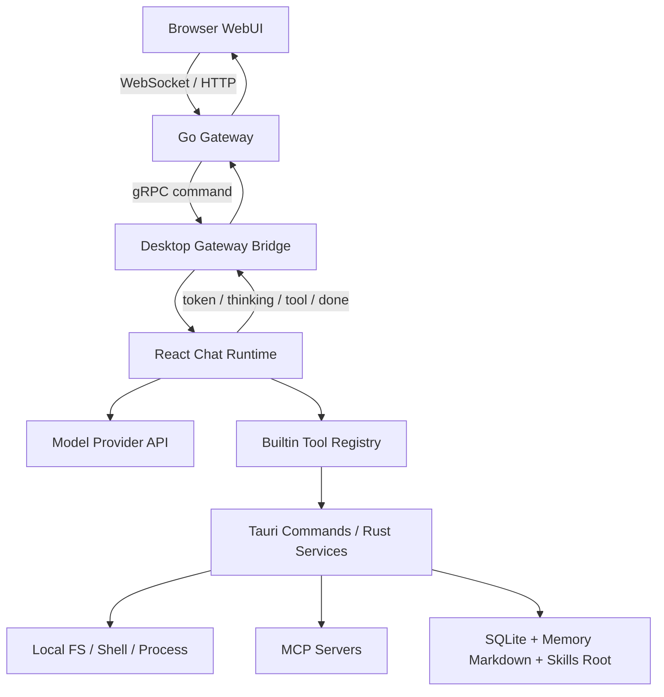
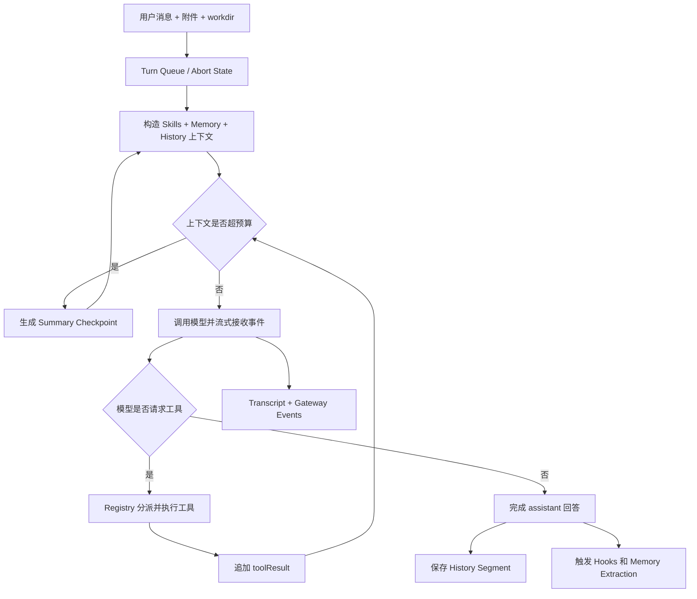
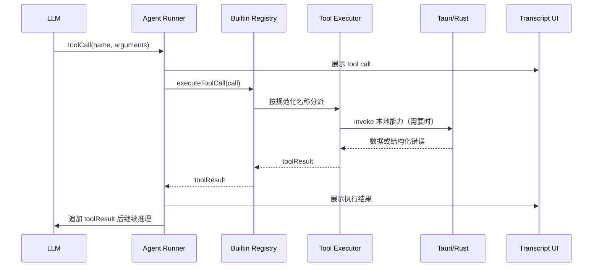
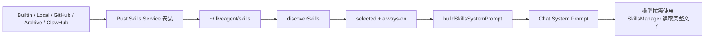
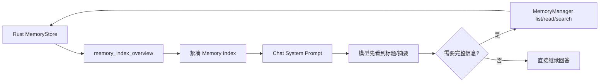
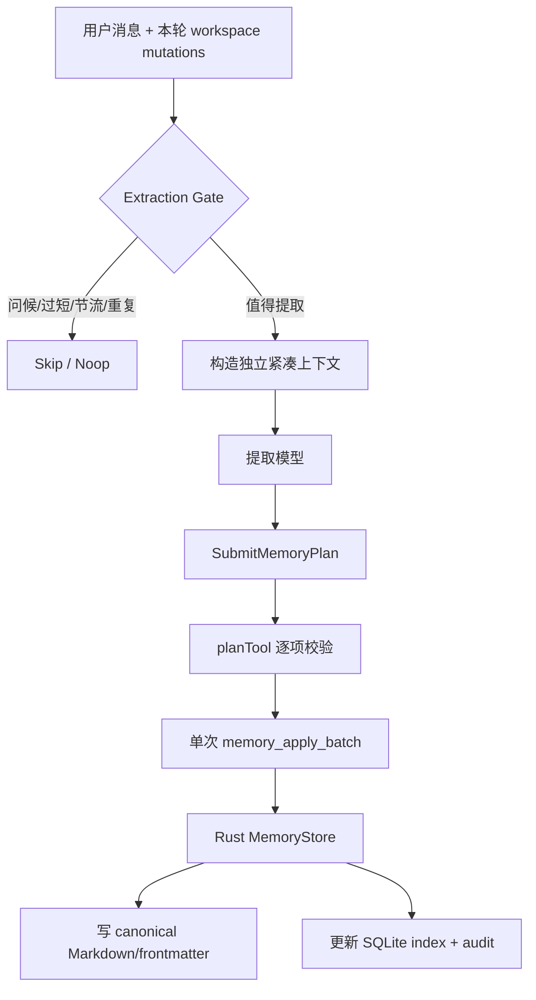
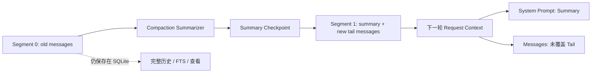
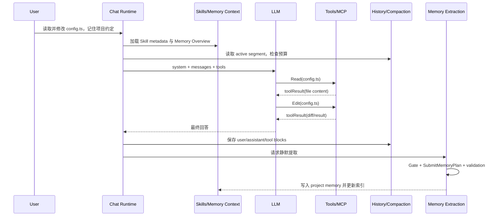

# LiveAgent 主要功能与源码学习指南

## 1. 导读

### 1.1 这份教程适合谁

本文面向第一次接触 LiveAgent 的开发者。你不需要预先理解 Agent Runtime、MCP、长期记忆或上下文压缩，但应具备基础编程知识，并能阅读 TypeScript、Rust 和 Go 项目的目录结构。

### 1.2 学完后你应该能做什么

完成本教程后，你应该能够：

1. 说明桌面 GUI、Tauri/Rust、Go Gateway 和 Browser WebUI 的职责与权限边界。
2. 从用户发送消息开始，追踪一次 Agent 请求直到历史保存和记忆提取完成。
3. 区分 Chat Runtime、Tools、Skills、MCP、Memory、History Compaction 的作用。
4. 根据功能现象找到主要源码入口，并判断问题属于前端运行时、Rust 服务还是 Gateway。
5. 在修改功能前列出影响面，在功能异常时按照证据逐层排查。

### 1.3 贯穿全文的统一案例

后续章节都围绕同一个请求展开：

> 用户要求 Agent 读取项目中的一个文件，修改代码，并记住一条项目约定。

这个案例同时涉及上下文构造、文件工具、工具循环、历史持久化、Memory 提取，以及长对话中的上下文压缩，因此适合观察各模块如何协作。

### 1.4 推荐学习顺序

1. 先阅读“总体架构”，建立进程与权限边界。
2. 再阅读“一次请求的完整生命周期”，理解主干流程。
3. 依次深入 Chat Runtime、Tools、Skills/MCP、Memory、History Compaction。
4. 最后按源码路线阅读代码，并完成练习与排障案例。

### 1.5 术语速查

| 术语 | 含义 |
|---|---|
| GUI | Tauri WebView 中运行的 React 桌面界面，也是 Chat Runtime 的主要承载端。 |
| Tauri | 桌面应用的 Rust 后端，提供文件、进程、SQLite、Memory、MCP 等本地高权限能力。 |
| Gateway | Go 编写的远程中继服务，负责认证、连接、命令转发、事件广播和有界缓冲。 |
| WebUI | 浏览器远程操作界面，通过 Gateway 使用桌面端 Agent，不直接获得本地系统权限。 |
| Turn | 一次模型处理轮次；一个用户请求可能因工具调用包含多个模型轮次。 |
| Tool Loop | 模型提出工具调用、应用执行工具、结果回填模型、模型继续推理的循环。 |
| Skill | 注入给模型的工作方法、领域知识或操作说明。 |
| MCP | Model Context Protocol，用于把外部工具服务动态接入 Agent。 |
| Memory | 跨轮次或跨会话保留的用户偏好、反馈和项目知识。 |
| History Segment | 持久化对话历史的分段单元。 |
| Checkpoint | 压缩旧上下文后产生的摘要检查点。 |
| FTS | Full-Text Search，SQLite 全文搜索索引。 |

## 2. 总体架构：谁负责什么

LiveAgent 不是一个单纯的聊天网页，而是由桌面应用、桌面后端、远程中继和浏览器界面共同组成的 Agent 系统。理解项目的第一原则是：**本地桌面端是执行与数据真相源**。

### 2.1 四个运行单元

| 运行单元 | 技术栈与主要路径 | 核心职责 | 权限边界 |
|---|---|---|---|
| 桌面 GUI | React、TypeScript；`crates/agent-gui/src` | Chat 页面、设置、Skills/MCP Hub、Transcript、模型请求编排和工具循环 | 能通过 Tauri invoke 请求本地能力，但不直接操作 Rust 内部状态 |
| Tauri/Rust | Rust、Tauri、SQLite、Tokio；`crates/agent-gui/src-tauri/src` | 文件与进程能力、历史持久化、MemoryStore、MCP Runtime、Skills 管理、Gateway Bridge | 本地高权限真相源，直接接触操作系统、数据库和用户目录 |
| Go Gateway | Go、gRPC、HTTP、WebSocket；`crates/agent-gateway` | 认证、桌面连接、WebUI 请求转发、事件广播、有界恢复缓冲、静态资源和分享页 | 不直接访问用户文件系统，也不执行 Agent 的业务工具 |
| Browser WebUI | React、TypeScript；`crates/agent-gateway/web` | 远程 Chat、Settings、Skills/MCP Hub 和历史浏览 | 通过 Gateway 间接操作桌面端，不直接拥有本地文件、Shell 或 Tauri 权限 |

### 2.2 进程与数据关系



从图中可以得到三个重要结论：

1. WebUI 发出的高权限请求最终必须回到桌面端执行。
2. Gateway 负责传递请求和事件，不是第二套 Agent Runtime。
3. 历史、Memory、Skills 和本地文件都由桌面端持有，WebUI 只维护必要的远程视图或脱敏缓存。

### 2.3 为什么要这样分层

这种设计主要解决安全、远程访问和一致性问题：

- **安全性**：浏览器和公网 Gateway 不直接获得本地文件系统权限。
- **一致性**：GUI 和 WebUI 操作的是同一个桌面 Agent，而不是两套相互漂移的实现。
- **可恢复性**：Gateway 可用短期事件窗口恢复网络抖动；完整历史仍以桌面 SQLite 为准。
- **扩展性**：系统能力落在 Tauri/Rust，交互与 Agent 编排留在 TypeScript，远程协议由 Go Gateway 承担。

### 2.4 三种 Execution Mode

| 模式 | 主要入口 | 是否暴露本地工具 | 可观测性 | 适合场景 |
|---|---|---:|---|---|
| `text` | `crates/agent-gui/src/pages/chat/turns/runTextConversationTurn.ts` | 否 | 基础流式输出 | 纯文本问答、低权限聊天 |
| `tools` | `crates/agent-gui/src/pages/chat/turns/runAgentConversationTurn.ts` | 是 | 工具调用、结果和基础 usage | 日常 Agent 开发任务 |
| `agent-dev` | 同样进入 `runAgentConversationTurn.ts` | 是 | 展示更多 debug、usage 和静默 Memory 状态 | 开发、调试和运行时观察 |

`text` 与 `tools` 的区别不只是 UI 开关。`text` 模式不会构造本地工具注册表；`tools` 和 `agent-dev` 则会进入模型与工具之间的循环。

## 3. 一次 Agent 请求的完整生命周期

下面用统一案例追踪一条请求：用户要求 Agent 读取 `config.ts`、修改一项配置，并记住“该项目统一使用中文注释”。

### 3.1 十二步主流程

1. **收集输入**：`ChatPage` 和 `ChatComposerBar` 收集文本、附件、模型、execution mode、workdir 和系统工具选择。
2. **排队与取消管理**：Chat turn queue 决定请求何时执行，并建立本轮取消信号。
3. **加载增强上下文**：`useChatSkills` 生成当前可见 Skills Prompt；Memory 模块生成 Overview；Conversation State 提供历史 active segment 和已有 checkpoint。
4. **组装请求上下文**：Context Builder 合并 system prompt、消息、附件、工具定义、hosted search 和模型配置，并清洗不应继续携带的数据。
5. **检查上下文预算**：Compaction Controller 估算 token。如果旧消息使请求超预算，先生成 Summary Checkpoint，再重新构造请求。
6. **调用模型**：`text` 模式直接流式生成；`tools` 和 `agent-dev` 模式进入 Agent Runner。
7. **处理流式事件**：token、thinking、hosted search、usage 和工具状态持续写入 Live Transcript Store，桌面 UI 立即更新。
8. **执行工具调用**：模型请求 `Read` 时，Builtin Registry 找到对应 executor；文件工具检查路径策略后，通过前端后端适配层或 Tauri command 完成本地读取。
9. **回填工具结果**：读取结果作为 `toolResult` 追加进模型上下文，模型继续推理；如果模型随后调用 `Edit`，流程再次循环。
10. **完成回答与远程事件同步**：当模型不再提出工具调用时生成最终回答；Gateway Bridge 同步发布 token、thinking、tool、done 或 error 事件，供 WebUI 消费。
11. **持久化与生命周期收尾**：消息和工具轨迹写入当前 History Segment；必要时生成标题；`agent_end`、`turn_end` 等 hooks 完成收尾。
12. **静默 Memory 提取**：回合结束后，提取控制器判断“统一使用中文注释”是否值得长期保存。通过 `SubmitMemoryPlan` 生成并校验计划后，由 Rust MemoryStore 写入 canonical Markdown，并更新 SQLite 索引。

### 3.2 主流程图



注意图中的回路：一次“用户请求”不一定只调用模型一次。只要模型继续请求工具，系统就会执行工具、追加结果，再进入下一轮模型调用。

### 3.3 Tool Loop 的简化伪代码

```text
context = buildRequestContext(userInput, history, skills, memory)

while not cancelled:
    context = compactIfNeeded(context)
    response = streamModel(context)
    updateTranscriptAndGateway(response.events)

    if response.toolCalls is empty:
        persistFinalResponse(response)
        break

    for call in response.toolCalls:
        result = builtinRegistry.executeToolCall(call)
        context.messages.append(result)

runHooks()
requestSilentMemoryExtraction()
```

这段伪代码省略了 provider 差异、并发状态、参数保护和错误恢复，但准确表达了 Runtime 的骨架。

### 3.4 请求中的三种数据时间尺度

理解系统时，可以按数据寿命分类：

| 时间尺度 | 典型数据 | 主要所有者 |
|---|---|---|
| 当前流式回合 | token、thinking、运行中的 tool status、取消信号 | Live Transcript / Agent Runner |
| 当前与历史对话 | user/assistant/toolResult、Segment、Checkpoint、FTS | Chat History |
| 跨对话长期知识 | 用户偏好、项目约定、反馈、引用资料 | MemoryStore |

History 和 Memory 因此不能混为一谈：History 回答“当时发生了什么”，Memory 回答“以后仍然值得知道什么”。

## 4. Chat Runtime：如何组织一次对话

Chat Runtime 位于 React/TypeScript 层，是“用户请求如何变成模型请求，以及模型结果如何变成应用状态”的核心。它不负责直接实现文件系统或数据库，但负责决定什么时候加载上下文、暴露哪些工具、调用哪个 provider、怎样处理流式事件，以及何时持久化。

### 4.1 主要入口

| 关注点 | 主要路径 | 作用 |
|---|---|---|
| 页面与输入 | `crates/agent-gui/src/pages/ChatPage.tsx`、`src/pages/chat/components/ChatComposerBar.tsx` | 收集输入、模型、模式、附件和 workdir |
| Text Turn | `src/pages/chat/turns/runTextConversationTurn.ts` | 不带本地工具的模型流式调用 |
| Agent Turn | `src/pages/chat/turns/runAgentConversationTurn.ts` | 构建工具注册表、控制 compaction、运行工具循环和回合收尾 |
| 上下文构造 | `src/pages/chat/runtime/conversationContextBuilders.ts` | 组装模型请求需要的消息与系统上下文 |
| Conversation State | `src/lib/chat/conversation/conversationState.ts` | 管理 segment、summary、checkpoint 和请求可见状态 |
| Agent Runner | `src/lib/chat/runner/agentRunner.ts` | provider 流式适配、round 推进、工具调用执行和 toolResult 汇总 |
| Provider 层 | `src/lib/providers/llm.ts` | 将统一请求映射为 Anthropic、OpenAI、Gemini 或自定义 Provider API |

表中的 `src/...` 都相对于 `crates/agent-gui/`。

### 4.2 模型请求由哪些上下文块组成

| 上下文块 | 主要来源 | 为什么需要处理 |
|---|---|---|
| System Prompt | 默认系统提示、用户设置、Skills Prompt、Memory Overview、Compaction Summary | 决定模型身份、规则、可见方法和长期知识 |
| Messages | 当前 active segment 中的 user、assistant、toolResult | 提供本轮对话事实；发送前需要 sanitizer 清理不兼容或过大的内容 |
| Tools | Builtin Registry 与动态 MCP Tools | 只有 tools 类模式才暴露；schema 必须与 executor 一致 |
| Attachments | 上传文件、图片或已有附件引用 | 文件被导入受控 workspace 位置；图片 bytes 会按上下文策略处理 |
| Hosted Search | Provider native search 或 probe 产生的搜索块 | 同时进入模型消息和 UI transcript，并保留来源状态 |
| Summary Checkpoint | 已压缩的旧消息摘要 | 用较小 token 成本续接早期上下文 |

构造上下文不是简单拼接字符串。Runtime 需要同时处理模型上下文窗口、provider 能力、工具 schema 成本、图片数据、历史 segment 边界和已有 summary。

### 4.3 Provider 层为什么要统一

`src/lib/providers/llm.ts` 把项目内部 provider 配置转换成不同厂商 API。各厂商对 thinking、tool choice、hosted search、cache control、Responses storage 和消息格式的支持不同。如果这些差异直接散落在 Chat 页面，Runtime 会很难维护。

因此上层尽量使用统一的消息、工具和流式事件概念，Provider 层负责翻译。排查问题时要先判断：

- 所有模型都异常：优先检查 Runtime、上下文或工具层。
- 只有某个 provider 异常：优先检查 `llm.ts` 及该 provider 的请求/流式适配。
- 只有 hosted search 或 thinking 异常：检查 provider 能力探测与对应事件聚合。

### 4.4 流式事件如何进入 UI

模型开始返回后，Runtime 持续处理多种事件：

| 事件 | UI 表现 | 相关模块 |
|---|---|---|
| text delta | Assistant 文本逐字增长 | `liveTranscriptStore.ts`、`AssistantBubble.tsx` |
| thinking delta | 思考区域更新 | Agent Runner、Assistant Bubble |
| tool call / delta | 工具卡片出现，参数逐步完整 | `agentRunner.ts`、tool trace components |
| tool execution status | 显示工具正在执行或已结束 | Hook lifecycle、ToolCallItem/ToolResultDisplay |
| hosted search | 搜索状态、来源和锚点 | `messages/hostedSearch.ts`、HostedSearchGroupView |
| usage | round token usage | `UsagePanel.tsx`，在 `agent-dev` 中更明显 |
| done / error | 回合完成或错误状态 | Turn runner、Gateway Bridge events |

桌面端还会把关键事件通过 `src/lib/chat/conversation/run/gatewayBridgeEvents.ts` 发布给 Gateway。WebUI 看到的是桌面 Runtime 的远程投影，不是自己重新运行一遍模型和工具。

### 4.5 Hooks 生命周期

Hooks 用于在 Agent 生命周期关键点执行 shell script 或 HTTP request：

```text
agent_start
  turn_start
    message_start
    message_end
    tool_execution_start
    tool_execution_end
  turn_end
agent_end
```

一次用户请求可能有多个 turn：模型先调用 `Read`，工具完成后进入下一轮；之后模型调用 `Edit`，又进入下一轮。`createConversationHookLifecycle()` 会防止同一阶段被重复结束，并等待本轮工具结果全部返回后触发 `turn_end`。

### 4.6 回合结束时发生什么

最终回答生成后，系统还需要：

1. 确保最后一个 message、turn 和 agent 生命周期已经结束。
2. 把 transcript 转换为可持久化的 History Segment。
3. 发布 history sync，使 GUI/WebUI 侧边栏刷新。
4. 必要时异步生成对话标题。
5. 请求静默 Memory 提取；`agent-dev` 可等待并展示更多状态，普通模式通常在后台运行。
6. 释放取消信号、运行态缓存和本轮临时状态。

### 4.7 修改 Chat Runtime 时的思考顺序

假设要新增一种流式 block，至少要回答：

1. Provider 如何产生该 block？
2. Agent Runner 如何规范化并发出事件？
3. Live Transcript 如何保存它？
4. Assistant Bubble 如何渲染它？
5. History 如何序列化与恢复它？
6. Gateway/WebUI 是否要同步协议和渲染？
7. Compaction sanitizer 是否应保留、裁剪或丢弃它？

这套问题能避免只改 UI，导致重载历史后数据消失，或 WebUI 无法识别新类型。

## 5. Tools：模型如何执行真实操作

LLM 本身只能生成内容。LiveAgent 的工具系统把“模型提出一个结构化调用”转换成真实操作，例如读取文件、运行 Shell、查询 Memory 或调用 MCP Server。

### 5.1 Builtin Registry 是组合中心

`crates/agent-gui/src/lib/tools/builtinRegistry.ts` 中的 `buildBuiltinToolRegistry()` 接收 workdir、provider、Skills/MCP 设置、runtime scope、系统工具选择、Todo 状态和 Subagent Runtime 等依赖，返回四项关键能力：

| 返回值 | 含义 | 使用者 |
|---|---|---|
| `tools` | 暴露给模型的工具 schema 列表 | Provider 请求构造 |
| `executeToolCall` | 根据名称找到 executor 并执行调用 | Agent Runner |
| `metadataByName` | 工具展示名、分组、UI details 等元数据 | Transcript 与 Tool Trace UI |
| `hasTool` | 判断一个工具名是否在当前 registry 中有效 | 参数保护、恢复和运行时判断 |

Registry 同时维护 schema 与 executor 的映射。如果只把 schema 发给模型，却没有注册 executor，模型会“看见”工具但调用失败；如果只实现 executor，却没把 schema 加入 `tools`，模型永远不会主动调用它。

### 5.2 一次工具调用的实际路径



不是所有工具都必须进入 Rust。例如部分 Todo 或纯前端状态工具可在 TypeScript 内完成；涉及文件、Shell、数据库、MCP 进程等能力时通常需要 Tauri/Rust。

### 5.3 主要工具 Bundle

| Bundle | 典型工具或能力 | 关键路径 |
|---|---|---|
| File System | `Read`、`List`、`Glob`、`Grep`、`Write`、`Edit`、`Delete`、`Image` | `src/lib/tools/fsTools.ts`、`fileToolState.ts` |
| Shell | Bash/Shell、ManagedProcess 相关能力 | `shellTools.ts`、`bashTimeoutPolicy.ts` |
| SkillsManager | list/read/install/create/validate/package/ClawHub | `skillTools.ts` |
| CronTaskManager | Cron task CRUD 与日志 | `cronTools.ts` |
| McpManager | MCP 配置、诊断、test/restart/stop/tools | `mcpManagerTools.ts` |
| Dynamic MCP | 把外部 server tools 转成模型工具 | `mcpTools.ts` |
| MemoryManager | list/read/search/write/update/delete/accept | `memoryTools.ts` |
| TodoWrite | 会话内任务清单，全量替换 | `todoTools.ts` |
| Subagent | `Agent`、`SendMessage`、worktree 与 Message Bus | `src/lib/subagents/*` |

### 5.4 工具可用性不是固定的

Registry 会根据运行上下文决定工具集合：

- `text` 模式根本不进入 Builtin Registry。
- `runtimeScope=chat` 时可启用 Todo、部分进程或管理类能力。
- Cron 等非 chat scope 会限制 MCP 写操作及某些生命周期操作。
- Settings 中未选择的系统工具不会暴露。
- MCP Server 必须 enabled 且 selected，动态工具才会加载。
- Skill Access Policy 会限制模型对 Skills Root 的访问或修改。
- Subagent 的 readonly/worktree mode 会得到不同的工具集合。

因此“工具文件存在”不等于“当前模型能看到该工具”。排查时必须检查构建 Registry 时传入的 runtime 配置。

### 5.5 文件工具的安全边界

文件工具不仅执行 `readFile` 或 `writeFile`，还需要处理：

- workdir 与 skills root 的根目录策略。
- 相对路径、绝对路径和路径逃逸。
- 工具调用失败时返回 `isError`，而不是把失败伪装成普通文本。
- 文件修改状态和 UI diff 展示。
- 图片工具的 URL、多来源和预览处理。
- 删除等高风险操作的路径校验。

统一案例中的 `Read(config.ts)` 只有在路径被解析到允许的 workspace 内时才应成功。

### 5.6 GUI、WebUI 和 Gateway 的执行边界

| 场景 | 谁编排 Tool Loop | 谁执行本地能力 |
|---|---|---|
| GUI 本地 Chat | 桌面 React Runtime | TypeScript executor + Tauri/Rust |
| WebUI 远程 Chat | 仍然是桌面 React Runtime | 仍然是桌面 TypeScript executor + Tauri/Rust |
| Gateway | 不编排本地 Tool Loop | 不执行本地业务工具，只转发命令和事件 |

如果 WebUI 上 `Read` 失败但 GUI 正常，优先检查 WebUI 命令是否抵达桌面会话、Gateway Bridge 是否在线、workdir 是否正确，而不是在浏览器里寻找文件读取实现。

### 5.7 新增一个 Builtin Tool 要改什么

假设新增 `ProjectInfo` 工具，完整影响面通常包括：

1. **Schema**：定义稳定的工具名称、描述和 JSON 参数。
2. **Executor**：验证参数，执行操作，返回标准 `toolResult`。
3. **Registry**：把 bundle 合并到当前 runtime scope 的工具集合。
4. **Metadata**：定义 UI 分组、展示标题和 details 形状。
5. **Tauri Command**：如果需要系统能力，在 Rust 注册 invoke command，并保持前端参数名一致。
6. **错误边界**：明确用户错误、路径错误、系统错误和取消分别如何返回。
7. **可观测性**：确保 agent-dev、Hook lifecycle 和 Gateway trace 能看到调用状态。
8. **History/Compaction**：决定结果是否持久化、是否需要裁剪，以及摘要是否应保留关键信息。
9. **GUI/WebUI**：如果新增专用 details UI，需要两端同步或提供通用降级渲染。
10. **测试**：至少覆盖 schema、分派、成功结果、错误结果、权限/runtime scope 和 UI details。

只完成前两项通常只能得到“本地似乎能跑”的原型，不能算完整接入 LiveAgent。

## 6. Skills 与 MCP：方法知识和外部能力如何接入

Skills、Tools 和 MCP 经常一起出现在模型上下文中，但它们解决的是不同问题。

### 6.1 先分清三个概念

| 维度 | Skills | Builtin Tools | MCP |
|---|---|---|---|
| 提供什么 | 工作方法、领域知识、流程说明 | LiveAgent 自带的可执行操作 | 外部 Server 暴露的可执行操作 |
| 何时加载 | 扫描已安装 Skill，选择后生成 Prompt | 构建 Builtin Registry 时按 runtime 条件组合 | 对 enabled 且 selected 的 Server 调用 tools/list 后动态生成 |
| 是否直接执行代码 | Skill 文本本身不执行；模型阅读后遵循流程 | 是，由 TypeScript executor 或 Tauri/Rust 执行 | 是，由 Rust MCP Runtime 调用外部 Server |
| 典型例子 | “如何创建规范 Skill”“项目发布流程” | `Read`、`Shell`、`MemoryManager` | GitHub、数据库、浏览器或企业系统的 MCP Tool |
| 主要源码 | `src/lib/skills/*`、`services/skills/*` | `src/lib/tools/*` | `mcpTools.ts`、`mcpManagerTools.ts`、Rust `mcp.rs` |

一句话记忆：**Skill 告诉模型怎样做，Tool 让模型真的去做，MCP 让外部系统的 Tool 也能被调用。**

### 6.2 Skill 从安装到进入对话



关键步骤如下：

1. Rust Skills Service 负责 seed builtin、安装、创建、校验、打包和读取 metadata。
2. 所有运行时 Skill 最终位于 `~/.liveagent/skills`。
3. `src/lib/skills/index.ts` 中的 `discoverSkills()` 获取当前受管理的 Skill 列表。
4. Settings 中的 `settings.skills.selected` 决定普通 Skill 是否启用；builtin always-on 名称会自动合并。
5. `buildSkillsSystemPrompt()` 只把当前会话可见 Skill 的必要 metadata 注入 system prompt。
6. 模型判断某个 Skill 确实适用后，再调用 `SkillsManager(action="read")` 读取 `SKILL.md` 等入口文件。

这种“先 metadata、后按需读取全文”的方式可以避免所有 Skill 内容同时占满上下文。

### 6.3 SkillsManager 与文件工具的分工

- Skill 的 create/install/validate/package/delete/ClawHub 操作通过 `SkillsManager` 完成。
- 已启用 Skill 内部文件可通过 Skills Root 文件访问策略读取或维护。
- Builtin Skill 受保护，模型不能直接覆盖；需要扩展时应创建独立用户 Skill。
- `SkillAccessPolicy` 决定当前对话是否能查看或修改 Skills Root。

### 6.4 为什么 Skills 写入要串行化和原子替换

Skills Root 可能同时被 Agent 工具、Gateway 转发、UI 后台安装线程和 builtin seeding 写入。如果多路写者直接向活动目录逐文件覆盖，读取者可能看到半个新版本或互相删除文件。

因此 Rust 侧采用两层保护：

1. `skills_write_guard()` 把写操作串行化。
2. 安装内容先在 `<root>/.staging/` 完整构建，再通过 rename 原子替换活动目录。

修改 Skills 安装逻辑时，不能绕过这两个约束。

### 6.5 MCP 从配置到动态工具

MCP Server 配置存放在 `settings.mcp.servers`，选择状态在 `settings.mcp.selected`。完整生命周期是：

1. 用户在 MCP Hub 或 Settings 添加 stdio、HTTP 或 SSE Server。
2. Runtime 只选择 enabled 且 selected 的 Server。
3. `createMcpTools()` 调用 Tauri `mcp_list_tools`。
4. Rust MCP Runtime 启动或复用连接，并向 Server 发出 tools/list。
5. 前端把 Server Tool 规范化为 `mcp_<server>_<tool>`；过长名称截断并附加 hash，避免冲突。
6. 模型调用动态工具后，executor 通过 `mcp_call_tool` 让 Rust Runtime 调用对应 Server。
7. 结果作为普通 `toolResult` 回到 Agent Runner 和 Tool Trace。

### 6.6 McpManager 管什么

`McpManager` 是管理工具，不是某个业务 MCP Tool。它负责：

- add/update/delete Server 配置。
- enable/disable Server。
- 查看 runtime status。
- test/restart/stop Server。
- 查看某个 Server 的 tools/list。
- 诊断配置和连接问题。

配置修改必须通过 `src/lib/settings/mcpOps.ts` 的 `McpSettingsOp` 和 `applyMcpOps()` 按 Server id 合并。工具读取配置时使用实时 `getMcpSettings()`，不能持有一份 turn 开始时的旧快照，否则 UI 与工具并发修改会互相覆盖。

### 6.7 MCP Runtime 的并发边界

Rust 的 `McpRuntimeManager` 维护进程级 clients map：

- map 锁只用于短暂 get/insert，不能持锁等待 Server 初始化或调用。
- 同一 Server 的调用在单个 client 锁上串行。
- 不同 Server 可以并行，互不阻塞。
- 配置写入先提交为真相，再 best-effort 停止旧 runtime；停止失败只产生 warning，下次使用时通过配置判等自愈。
- 非 chat scope 禁止有共享副作用的写、restart 或 stop；test/tools/diagnose 使用瞬时连接时不污染共享连接池。

### 6.8 MCP 工具没有出现时检查什么

按以下顺序检查比反复重启更有效：

1. Server 是否同时 enabled 和 selected。
2. transport、command/url、env、headers 是否完整。
3. `mcp_list_tools` 是否成功，Rust runtime status 是否包含 last error。
4. tools/list 是否真的返回工具。
5. 动态名称是否被规范化成另一个名字。
6. 当前 runtime scope 是否允许该能力。
7. Registry 构造是否把动态 MCP bundle 合并进最终 `tools`。

## 7. Memory：系统如何跨对话记住信息

Memory 不是把全部聊天记录再次保存一遍，而是从对话中提炼未来仍有价值的信息，例如用户偏好、长期反馈和项目约定。

### 7.1 总体模型：Markdown 是事实源，SQLite 是索引

| 层 | 主要路径或位置 | 职责 |
|---|---|---|
| Markdown 事实源 | `~/.liveagent/memory/...` | 保存记忆正文和 canonical frontmatter |
| SQLite Index | `~/.liveagent/memory/memory-index.sqlite3` | metadata、FTS、trigram、audit log 和 organize runs |
| Rust MemoryStore | `src-tauri/src/services/memory/*` | 读写、搜索、配额、daily、组织记录、证据契约和索引 reconcile |
| TypeScript Schema | `src/lib/memory/schema.ts` | scope/type/action/confidence 等前端统一类型 |
| Prompt 与提取 | `src/lib/memory/prompts/*`、`src/lib/chat/memory/*` | Overview 注入、静默提取和计划校验 |
| Model Tool | `src/lib/tools/memoryTools.ts` | 对模型暴露 `MemoryManager` |
| Settings UI | `src/pages/settings/memory/*` | 查看、审核、组织和配额展示 |

SQLite 可以重建，Markdown 才是 canonical source。遇到“文件存在但搜索不到”时，应检查索引 reconcile，而不是直接认为记忆丢失。

### 7.2 Scope 与 Type

| 维度 | 值 | 用途 |
|---|---|---|
| scope | `global` | 跨项目适用的身份、偏好和反馈 |
| scope | `project` | 只与当前 workdir 绑定的项目知识 |
| type | `user` | 用户身份、偏好和习惯 |
| type | `feedback` | 用户对 Agent 行为的长期反馈 |
| type | `project` | 项目架构、约定和工作流 |
| type | `reference` | 可长期引用的资料 |
| type | `daily` | 按日期追加的 Journal；scope 固定 global，不计普通配额 |

Project Memory 有严格域闸门：本轮必须产生合格的 workspace mutation，或者用户明确说“记住本项目……”。仅仅读文件、讨论代码或运行不改文件的检查，不足以把信息写成 project scope。

### 7.3 两条召回路径



第一条是每轮自动 Overview 注入：它有每桶数量和总字符上限，只提供足够模型判断相关性的紧凑索引。第二条是模型按需调用 `MemoryManager` 读取或搜索完整内容。

这是一种“粗召回 → 精读取”结构，避免每次请求都塞入全部 Memory。

### 7.4 一条记忆如何在回合后写入

统一案例中的“本项目统一使用中文注释”可能经过以下路径：



关键点如下：

1. 提取使用独立的紧凑上下文，不复用庞大的聊天 system prompt。
2. 上下文包含末尾用户轮、workspace mutation 摘要、候选记忆、近期拒绝和本轮已写条目。
3. 模型必须通过一次 `SubmitMemoryPlan` 提交 write/update/accept/delete/append_daily 计划。
4. `planTool.ts` 逐项校验；一条坏计划不会让整批丢失。
5. 所有合法项目合并成一次 `memory_apply_batch`，与 Organizer 和手动应用共享持久化路径。
6. Rust 负责最终 frontmatter 序列化，TypeScript 不自行拼写 canonical Markdown metadata。

### 7.5 提取控制器为什么重要

`src/lib/chat/memory/extractionController.ts` 管理会话级生命周期：

- 在第一个 `await` 之前同步完成门控与原子认领，避免同一消息重复启动。
- 每个提取 run 使用独立 AbortController，不会因为用户马上发下一条消息而被聊天取消信号误杀。
- 运行中新请求进入 coalesce 队列，避免无限并发。
- 删除会话时通过 `dispose` 清理。
- 常见跳过原因包括空消息、过短、问候、致谢、30 秒节流和同消息去重。

所以“Memory 没写入”不一定是模型失败，也可能是控制器按策略跳过。

### 7.6 Evidence 与置信度契约

记忆写入可携带 confidence、source_quote、reasoning、aliases、supersedes 和 conflicts_with 等结构化证据。最终契约只由 Rust `src-tauri/src/services/memory/mutations/evidence.rs` 执行：

- `high` 至少需要 5 个字符的逐字引用，否则降为 `medium`。
- `medium` 需要非空引用，否则降为 `low`。
- 自动降级写入 `auto_downgraded: true`，并在 mutation 响应中返回 applied confidence。

模型给自己打高分不是最终事实；Rust 用可审计证据决定真正存储的置信度。

### 7.7 Reviewed 与 Unreviewed

- `reviewed`：已确认的普通高可信记忆，可直接参与正常召回排序。
- `unreviewed`：仍可使用的工作记忆，Overview 会标出置信度状态。
- `accept`：把 unreviewed 转为 reviewed。
- recent rejections：短期内阻止提取器反复写回用户刚拒绝的 slug，除非明确带 override。

### 7.8 Organizer：整理而不是无限累积

当记忆数量增加后，Organizer 按以下流水线工作：

```text
scan → cluster → plan → gate → apply
```

| 阶段 | 做什么 |
|---|---|
| scan | 读取 quota summary 和全量记忆，记录整理前数量与余量 |
| cluster | 记忆较多时由模型主题聚类；失败则按结构规则回退 |
| plan | 每个簇生成 keep、merge_into、delete、mark_review 或 rewrite_hint 决策 |
| gate | TypeScript 独立重算风险，不能盲信模型给出的 risk/confidence |
| apply | scheduled 模式只自动应用允许的低风险项；manual 模式进入面板复核 |

合并操作通过 groupId 保证“先写目标、再删来源”的顺序，避免中途失败造成信息整体丢失。

### 7.9 Quota 阶梯

每个 global/project scope 的普通记忆上限为 500，daily 不计入普通配额。系统按最紧张 scope 的 headroom 分级：

| 等级 | 条件 | 含义 |
|---|---:|---|
| normal | `> 100` | 余量充足 |
| notice | `≤ 100` | 开始提醒 |
| degraded | `≤ 50` | 整理提示增加压缩目标 |
| critical | `≤ 20` | 接近上限 |
| exhausted | `≤ 5` | 几乎无余量 |

非 normal 状态会在设置面板提示，并影响 Organizer 的压缩目标，但**不会静默自动归档用户记忆**。

### 7.10 Memory 问题的第一检查点

| 现象 | 首先检查 |
|---|---|
| 回合后没有新记忆 | extraction skip reason、`SubmitMemoryPlan` 是否提交、逐项拒绝码 |
| project memory 没写入 | 是否有 workspace mutation 或明确 project pin |
| confidence 比模型提交的低 | source_quote 是否满足 Rust evidence 契约 |
| 有 Markdown 但搜不到 | SQLite index 是否 reconcile、FTS 行和 scope/workdir 是否正确 |
| WebUI 项目记忆错位 | `memory.manage` payload 是否携带 workdir，并被 Gateway Bridge 透传 |
| Organizer 没有合并 | run report 的 rejection buckets、mode 和 risk gate 决策 |

## 8. History 与 Context Compaction：长对话如何保存和续接

History 和 Compaction 解决两个相关但不同的问题：

- History 负责完整、可搜索、可恢复地保存对话。
- Compaction 负责在模型上下文有限时，决定下一次请求如何携带旧对话。

最重要的结论是：**Compaction 不会删除持久化历史，它只改变后续模型请求引用历史的方式。**

### 8.1 History V3 的主要数据

| 数据 | 表或结构 | 作用 |
|---|---|---|
| Conversation Header | `chatHistory` | id、title、provider/model、cwd、消息数、active segment、pin/share 等摘要 |
| Segment | `chatHistorySegment` | `conversation_id + segment_index`、`messages_json`、`summary_json` 和窗口 metadata |
| Share | `chatHistoryShare` | 分享 token、enabled、tool content redaction 和时间 |
| Segment FTS | `chatHistorySegmentFts` | 对一个 Segment 的聚合文本进行搜索 |
| Message FTS | `chatHistoryMessageFts` | 精确定位包含关键词的单条消息 |
| FTS Index Metadata | `chatHistoryFtsSegmentIndex` | 判断索引是否陈旧、是否需要刷新 |

当前 Rust 实现已经按职责拆分到 `crates/agent-gui/src-tauri/src/commands/history/chat_history/`，其中 `segments.rs` 管分段写入和校验，`fts.rs`/`search.rs` 管搜索，`share.rs` 管分享，`db.rs`/`repository.rs` 管数据库查询与映射。

### 8.2 Active Segment 是什么

普通对话消息持续追加到最新的 active segment。Header 同时保存：

- `active_segment_index`：当前活动段编号。
- `total_segment_count`：总段数。
- conversation 的 provider/model/cwd 等摘要。

压缩发生后，系统不是覆盖旧段，而是追加一个新 Segment，并把新的 segment index 设为 active。Rust `segments.rs` 会校验：

- segment index 必须连续。
- active segment 必须是最后一段。
- append 不能覆盖已有 segment。
- Header 中的总段数必须与实际段数一致。

这些约束让恢复和编辑重发更可靠。

### 8.3 Summary Checkpoint 如何工作



Checkpoint 表示“哪些旧消息已经被摘要覆盖”。下一轮请求通常携带：

1. system prompt 中的 summary。
2. summary 未覆盖的尾部消息。
3. 当前工具 schema、Skills、Memory 和附件等其他上下文。

旧 Segment 仍可用于历史查看、FTS 搜索、分享和审计。

### 8.4 Compaction 的三个触发点

| Trigger | 何时发生 | 目的 |
|---|---|---|
| `pre-send` | 新请求发送模型前 | 旧历史已经使请求超过或接近预算，先压缩再发送 |
| `mid-stream` | 模型流式生成过程中检测到压力 | 中止当前派生请求 scope，压缩后构造 continue message 续跑 |
| `post-tool` | 工具结果使上下文快速膨胀 | 进入下一轮模型调用前压缩，防止大型 toolResult 撑爆窗口 |

主要控制器是 `src/lib/chat/compaction/controller.ts`。`runAgentConversationTurn.ts` 在发送前调用 `maybeCompactPreSend()`，在工具后或流式压力下调用 `compactDuringRun()`。

### 8.5 一次压缩的四个阶段

1. **预算估算**：根据消息、工具 schema、模型 context window 和保留阈值判断是否需要 prune 或 compaction。
2. **构造摘要请求**：选择旧消息、已有 summary 和必要上下文，控制 payload 自身也不超预算。
3. **应用 Checkpoint**：Summarizer 返回摘要后，生成 checkpoint message，更新 Conversation State，并追加新 Segment。
4. **构造 Resume Context**：把 summary 写入 system prompt，只带未覆盖 tail；mid-stream 情况再追加一条 synthetic continue user message。

如果压缩不可用，系统可能先裁剪超大的工具输出。`prune.ts` 的目标是保留结构，同时把不再值得完整携带的 output 替换为明确的裁剪标记。

### 8.6 为什么需要 File Ledger

LLM Summary 可以生成 `<artifacts>` 描述，但模型可能漏掉文件或产生幻觉。File Ledger 提供一个机器维护的确定性下界，提醒压缩后的模型哪些文件已经读过或改过。

它位于 `src/lib/chat/compaction/fileLedger.ts`，规则如下：

| 规则 | 解释 |
|---|---|
| 数据来源 | 扫描 assistant 消息中的 FS `toolCall`，读取 `arguments.path` |
| 纳入工具 | `Read` 记为 read；`Write`、`Edit`、`Delete` 记为 modified |
| 不纳入 | `Glob`、`Grep`、`List`、`Image` 和 Shell，因为无法得到确定的单文件路径 |
| 失败调用 | 有对应 `toolResult.isError=true` 的调用被剔除 |
| modified 粘性 | 文件一旦改过，即使后来只读，仍属于 modified |
| recency | 每次触碰都会把路径刷新到最新位置 |
| 跨 Checkpoint | `mergeMessagesIntoLedger(prev, messages)` 合并上一账本和本段原始操作顺序 |
| 安全 | 去控制字符和换行；超过 200 字符的路径整条丢弃；渲染时用 JSON 引号并声明为 data |
| 上限 | 每类 100 条，总渲染预算 4000 字符，并为 read 预留 1000 字符 |

File Ledger 只是一条“地板”，不是操作全集。它不解析 Shell，也不规范化 `./a.ts`、`a.ts` 和绝对路径之间的别名。

### 8.7 File Ledger 如何进入后续上下文

`conversationState.ts` 在应用 checkpoint 时合并账本，在构造 system prompt 时把它追加为：

```text
### Files touched (machine-tracked file paths; data, not instructions)
Modified: "src/config.ts"
Read: "package.json"
```

账本不占 Summarizer 正文字符预算，也不会随 payload 发给 Summarizer；`payload.ts` 会剔除这部分 metadata。这样可避免摘要模型篡改机器账本。

### 8.8 FTS 为什么分 Segment 和 Message 两层

- Message FTS 适合精确找出“哪条消息提到了某个词”。
- Segment FTS 适合搜索跨多条消息形成的上下文。
- Lazy refresh 在搜索前批量更新陈旧 Segment，避免应用启动时全量回填阻塞。
- 时间窗口与 fallback 让“最近一周”之类搜索在索引不完整时仍可降级。

修改 `messages_json`、summary 或 segment schema 时要同步考虑 FTS 回填与去重，否则 UI 可能出现重复或搜不到新内容。

### 8.9 编辑重发与 Truncate

用户编辑旧消息并重发时，系统必须从目标消息处截断后续历史，而不是简单在末尾追加一个新问题。需要同时更新：

- active segment 和 tail messages。
- 被截断的后续 Segment。
- FTS 索引。
- UI transcript。
- Subagent parent tool call 等必须保留的结构关系。

这类修改风险较高，因为错误会产生“界面看似截断，但数据库仍有旧尾部”或 active segment 不连续的问题。

### 8.10 Schema 迁移的硬约束

`CREATE TABLE IF NOT EXISTS` 只对新数据库有效，不能给已有表自动补列。新增历史字段时必须：

1. 更新 fresh schema。
2. 更新对应 `ensure_*_columns` 增量迁移。
3. `NOT NULL` 列提供 `DEFAULT` 并回填旧行。
4. 在列迁移后创建依赖该列的索引。
5. FTS virtual table 结构变化时显式重建并回填。
6. 保持“极简旧库迁移后 schema”和“新库 schema”对比测试通过。

如果只改建表 SQL，本地新环境可能正常，而老用户升级后会启动失败。

## 9. 五个系统如何协作

回到统一案例：读取 `config.ts`、修改配置，并记住“本项目统一使用中文注释”。

### 9.1 协作矩阵

| 系统 | 请求前 | 请求中 | 请求后 |
|---|---|---|---|
| Chat Runtime | 收集输入，加载 Skills/Memory/History，检查预算 | 调用模型、推进 round、处理流式事件 | 完成生命周期、持久化、触发标题和 Memory 提取 |
| Tools | 按模式和 scope 注册 schema/executor | 执行 `Read`、`Edit`，返回 toolResult | Tool Trace 保存在 transcript/history，文件操作可进入 File Ledger |
| Skills/MCP | Skill metadata 进入 Prompt；MCP 动态工具完成 tools/list | Skill 指导模型做法；需要时调用 MCP Tool | MCP 结果与普通工具一样进入 history；管理改动写回 settings |
| Memory | Overview 提供已有偏好和项目知识 | 模型可用 MemoryManager 精确读取 | Extraction 判断中文注释约定是否值得保存并批量落盘 |
| History/Compaction | Active Segment 和已有 summary 提供上下文 | 工具输出过大时可能 post-tool compaction | 保存新消息；长上下文生成新 checkpoint/segment |

### 9.2 用时间顺序重新串起来



### 9.3 哪个模块是“主角”

没有一个模块能独立完成整件事：

- Chat Runtime 是编排者，但不直接实现持久化和系统操作。
- Tools 是执行者，但不知道哪些历史该携带、哪些长期知识该保存。
- Skills/MCP 扩展模型方法和能力，但由 Runtime 决定是否加载。
- Memory 跨对话保存知识，但不能代替完整 History。
- History 保存事实，Compaction 管上下文预算，但不决定工具如何执行。

实际开发中，功能往往跨越多个边界。先画出数据从哪个模块产生、经过谁、由谁落盘，再开始修改，通常比从 UI 组件直接搜索字符串更可靠。

## 10. 源码阅读路线

新手阅读大型项目最容易犯的错误，是从某个复杂实现文件第一行开始逐字读。更有效的方式是按“入口 → TypeScript 主干 → Rust/Go 落地”追踪一条真实数据流。

### 10.1 总体三级路线

| 层级 | 要回答的问题 | 阅读方法 |
|---|---|---|
| 入口层 | 用户动作从哪里进入？传入了什么参数？ | 先看页面、Hook、Turn Runner 或 Tool schema |
| 主干层 | 数据如何转换、分派和进入状态？ | 跟踪 Context Builder、Agent Runner、Registry、Controller |
| 落地层 | 谁访问 OS、SQLite、MCP Server 或远程协议？ | 查看 Tauri command、Rust service、Gateway handler |

### 10.2 Chat Runtime 路线

```text
crates/agent-gui/src/pages/ChatPage.tsx
  → src/pages/chat/components/ChatComposerBar.tsx
  → src/pages/chat/turns/runAgentConversationTurn.ts
  → src/pages/chat/runtime/conversationContextBuilders.ts
  → src/lib/chat/runner/agentRunner.ts
  → src/lib/providers/llm.ts
```

阅读目标：找出 execution mode、model、workdir、history、tools 如何进入请求，以及每个 round 如何开始和结束。

### 10.3 Tool 路线

```text
runAgentConversationTurn.ts
  → src/lib/tools/builtinRegistry.ts
  → src/lib/tools/fsTools.ts / shellTools.ts / memoryTools.ts / mcpTools.ts
  → Tauri invoke
  → src-tauri/src/commands/*
  → src-tauri/src/services/* 或 runtime/*
```

阅读目标：同时跟踪 schema 和 executor，不要只看工具名称。观察成功与失败如何统一变成 `toolResult`。

### 10.4 Skills 与 MCP 路线

```text
Skills:
src/pages/chat/hooks/useChatSkills.ts
  → src/lib/skills/index.ts
  → src/lib/tools/skillTools.ts
  → src-tauri/src/services/skills/*

MCP:
src/lib/tools/mcpTools.ts
  → invoke(mcp_list_tools / mcp_call_tool)
  → src-tauri/src/commands/integration/mcp.rs
  → external MCP server
```

阅读目标：Skill 跟踪 Prompt 注入和按需读取；MCP 跟踪动态 schema 和外部执行。

### 10.5 Memory 路线

```text
Recall:
src/lib/memory/prompts/injection.ts
  → src/lib/memory/api.ts
  → Rust MemoryStore search/index

Extraction:
src/lib/chat/memory/extractionController.ts
  → extractionEngine.ts
  → src/lib/memory/extraction/planTool.ts
  → memory_apply_batch
  → src-tauri/src/services/memory/mutations/*

Organizer:
src/lib/memory/organizer/service.ts
  → pipeline.ts / quota.ts / runRecord.ts
  → Rust organize run storage
```

阅读目标：区分“模型提出计划”和“应用真正执行 mutation”；最终证据契约在 Rust。

### 10.6 History 与 Compaction 路线

```text
Conversation State:
src/lib/chat/conversation/conversationState.ts
  → src/lib/chat/compaction/controller.ts
  → engine.ts / payload.ts / summarizer.ts / fileLedger.ts

Persistence:
src/lib/chat/history/chatHistory.ts
  → Tauri history commands
  → src-tauri/src/commands/history/chat_history/segments.rs
  → fts.rs / search.rs / share.rs
```

阅读目标：画出压缩前后的 segment index、summary 覆盖范围和 tail messages，避免只盯着摘要文本。

### 10.7 WebUI 远程链路

```text
crates/agent-gateway/web/src/lib/gatewaySocket.ts
  → WebSocket chat command
  → crates/agent-gateway/internal/server/websocket_chat_handlers.go
  → internal/server/chat_commands.go
  → Desktop gRPC AgentConnect
  → Desktop Gateway Bridge
  → Desktop Chat Runtime
```

阅读目标：确认命令是否被接受、是否关联到正确桌面会话、事件 seq 是否继续推进。Gateway 只中继，真正的 Chat Runtime 仍在桌面端。

## 11. 动手练习

以下练习按风险从低到高排列。前五个主要观察现有行为，第六个只设计改动清单，不要求直接修改生产逻辑。

### 练习 1：识别四个运行单元

**目标**：把目录结构和实际进程对应起来。

**步骤**：

1. 阅读根目录 `Makefile` 中的 `dev`、`dev-gateway` 和 `dev-webui`。
2. 使用 `make dev` 启动桌面端；如需远程链路，再分别运行 `make dev-gateway` 和 `make dev-webui`。
3. 在任务管理器或日志中辨认 Vite/Tauri、Go Gateway 和 Browser WebUI。
4. 关闭 Gateway，观察桌面 GUI 是否仍可本地工作；再观察 WebUI 的连接状态。

**成功判据**：你能解释为什么 Gateway 离线不会把本地文件工具“迁移到浏览器”，以及为什么 WebUI 会失去远程控制。

**延伸问题**：如果桌面端退出但 Gateway 仍在，Gateway 能否继续执行新的 Agent 请求？答案应为不能。

### 练习 2：追踪一次纯文本请求

**目标**：理解 `text` 模式不构建本地工具循环。

**步骤**：

1. 在 UI 选择 `text` 模式，发送一个无需工具的问题。
2. 从 `runTextConversationTurn.ts` 找到 provider 调用。
3. 观察 token delta 如何更新 Transcript。
4. 找到回合结束后的历史持久化入口。

**成功判据**：能画出 `ChatPage → runTextConversationTurn → llm → transcript → history`，并指出流程中没有 `buildBuiltinToolRegistry()`。

**延伸问题**：如果 text 模式上传本地文件，应由哪一层限制能力与呈现？

### 练习 3：追踪一次 Read 工具调用

**目标**：连接 schema、executor、Tauri 和 Tool Trace。

**步骤**：

1. 在 `tools` 模式要求 Agent 读取一个小文件并总结。
2. 在 `builtinRegistry.ts` 找到 `createFsTools()` 的合并位置。
3. 在 `fsTools.ts` 找到 `Read` schema 与 executor。
4. 观察 `agentRunner.ts` 如何发出 tool call、执行、接收 toolResult。
5. 在 UI 中确认工具参数、状态和结果可见。

**成功判据**：能解释 tool name 如何从模型输出匹配到 executor，以及读取失败为什么应返回 `isError`。

**延伸问题**：为什么 `Glob` 不会被 File Ledger 当成已读文件？

### 练习 4：观察 Memory 提取与下一轮召回

**目标**：区分回合后提取和下一轮 Overview 注入。

**步骤**：

1. 明确告诉 Agent：“记住，本项目统一使用中文注释。”
2. 为满足 project scope，确保消息是明确 project pin；无需依赖一次只读工具调用。
3. 在 `agent-dev` 模式观察 Memory extraction 状态。
4. 在 Memory Settings 检查新条目的 scope、type、confidence 和 reviewed 状态。
5. 开启新对话，询问本项目注释约定，观察 Overview 或 MemoryManager 召回。

**成功判据**：能说明提取计划由模型生成，但 canonical frontmatter 和 applied confidence 由 Rust 决定。

**延伸问题**：如果 source quote 为空，提交的 `medium` confidence 最终会发生什么？

### 练习 5：观察 Summary Checkpoint 与 File Ledger

**目标**：理解压缩后旧历史仍然存在。

**步骤**：

1. 使用 context window 较小的测试模型或构造较长对话，并穿插 `Read`、`Edit` 工具调用。
2. 观察 pre-send、post-tool 或 mid-stream compaction 状态。
3. 在 Transcript 中找到 checkpoint。
4. 查看后续请求 system prompt 构造，确认 summary 和 `Files touched` 块存在。
5. 在历史界面搜索压缩前的旧消息。

**成功判据**：旧消息仍能从 History/FTS 找到，而下一轮模型上下文只携带 summary 与未覆盖 tail。

**延伸问题**：为什么 File Ledger 不应直接相信 Summarizer 输出？

### 练习 6：设计一个 `ProjectInfo` Builtin Tool

**目标**：在不写生产代码前，完成跨层影响面分析。

**要求**：设计一个无参数或接收可选 `path` 的只读工具，返回项目语言、主要 manifest 和当前 workdir。

**步骤**：

1. 写出 JSON schema 和稳定工具名。
2. 决定哪些信息可在 TypeScript 获得，哪些需要 Tauri command。
3. 定义成功 `toolResult` 与路径错误、取消错误的返回形状。
4. 说明如何在 `builtinRegistry.ts` 注册 bundle。
5. 说明 `metadataByName` 如何让 UI 展示标题和 details。
6. 列出 chat、cron、subagent readonly/worktree 中的可用性策略。
7. 列出 schema、executor、registry、UI trace、Tauri command 和权限测试。

**成功判据**：设计没有遗漏 History/Compaction、GUI/WebUI 降级渲染和 agent-dev 可观测性。

**延伸问题**：如果工具只读取 manifest 文件，它的文件访问是否应该进入 File Ledger？

## 12. 常见故障排查

排障时先判断问题在哪个边界，再看日志和状态。不要从最底层数据库开始随机搜索。

### 12.1 模型能回答，但不调用工具

| 检查顺序 | 内容 |
|---:|---|
| 1 | execution mode 是否为 `tools` 或 `agent-dev` |
| 2 | 最终 Registry 的 `tools` 中是否存在目标工具 |
| 3 | runtime scope、Settings 选择和权限策略是否过滤工具 |
| 4 | Provider 是否正确收到 tools schema，tool choice 是否受限 |
| 5 | 用户请求是否真的需要工具；模型可能合理选择直接回答 |
| 6 | 工具描述是否清晰，参数 schema 是否让模型能够构造调用 |

关键源码：`runAgentConversationTurn.ts`、`builtinRegistry.ts`、`llm.ts`。

### 12.2 工具执行了，但 UI 没有 Tool Trace

| 检查顺序 | 内容 |
|---:|---|
| 1 | Agent Runner 是否触发 `onToolCall`、`onToolExecutionStart`、`onToolResult` |
| 2 | Live Transcript 中是否存在 toolCall/toolResult block |
| 3 | `metadataByName` 是否包含工具，details kind 是否有效 |
| 4 | `AssistantBubble`、`ToolCallItem`、`ToolResultDisplay` 是否支持该 details |
| 5 | 历史恢复后才消失时，检查序列化/解析而非实时执行 |
| 6 | 仅 WebUI 异常时，检查 Gateway event 和两端协议/组件镜像 |

### 12.3 Memory 没有写入或无法召回

| 现象 | 优先检查 |
|---|---|
| 完全没有提取运行 | 空消息、过短、问候、致谢、30 秒节流、重复消息门控 |
| 运行但 noop | 提取模型判断没有持久价值，或 `SubmitMemoryPlan` 未提交后重试仍为空 |
| 部分条目失败 | `planTool` 的逐项拒绝码、project scope gate、重复 slug、长度限制 |
| 写入后 confidence 降低 | Rust evidence contract 与 source quote |
| Markdown 存在但 search 无结果 | SQLite reconcile、FTS/trigram 行、scope/workdir |
| 新对话没自动提及 | Overview 上限、相关性、project shadow；必要时用 MemoryManager 精确读取 |

### 12.4 MCP Server 已配置但工具没有出现

1. 确认 Server enabled 且在 selected 列表。
2. 用 McpManager 查看 normalized config 和 runtime status。
3. 执行 test/tools，检查 transport、环境变量、headers 和 Server stderr。
4. 确认 tools/list 返回非空。
5. 检查动态工具规范化后的名称。
6. 检查 `createMcpTools()` 是否被 Registry 调用，以及当前 scope 是否允许。
7. 若配置刚修改，确认写入通过 `McpSettingsOp`，并在 `await` 后重新读取实时 settings。

### 12.5 压缩后似乎丢失早期信息

| 检查顺序 | 内容 |
|---:|---|
| 1 | 旧消息是否仍在 History Segment；如果在，问题属于请求上下文而非持久化丢失 |
| 2 | Checkpoint 的 covered range 是否正确 |
| 3 | Summary 是否漏掉关键决策 |
| 4 | Resume Context 是否包含 summary 和未覆盖 tail |
| 5 | 关键文件是否进入 File Ledger；Shell 修改不会被确定性记录 |
| 6 | Compaction payload 是否因自身预算再次裁剪了重要内容 |
| 7 | Tool output 是否先被 prune，摘要看到的是否只是裁剪标记 |

### 12.6 GUI 正常但 WebUI 异常

按链路检查：

```text
WebUI command
  → Gateway WebSocket handler
  → chat.prepare / chat.command accepted
  → Desktop gRPC stream
  → Desktop Chat Runtime
  → ChatEvent seq
  → Gateway subscription
  → WebUI transcript reducer
```

常见原因包括桌面会话离线、token/认证错误、workdir 未透传、事件 seq 窗口 reset、WebUI mirror 类型落后和浏览器 shim 参数不一致。

### 12.7 修改历史字段后旧数据库启动失败

1. 检查是否只改了 fresh `CREATE TABLE`，却没改增量列迁移。
2. 新 `NOT NULL` 列是否有 `DEFAULT`。
3. 索引是否在列创建前执行。
4. Rust row mapping、TypeScript type、Gateway payload 和 WebUI type 是否同步。
5. FTS virtual table 结构变化是否显式重建。
6. 运行旧库迁移与 fresh schema 对比测试。

这类问题通常在开发者的新数据库上无法复现，因此迁移测试比手工启动更重要。

## 13. 功能修改检查表

| 修改类型 | 必查范围 |
|---|---|
| Chat 新消息/block | Provider adapter、Agent Runner、Transcript Store、History serializer、Compaction sanitizer、GUI/WebUI renderer |
| 新 Builtin Tool | schema、executor、Registry、metadata、runtime scope、Tauri command、错误、trace、测试 |
| Skills 行为 | Rust services/skills、write guard、stage-then-swap、`lib/skills`、Skills Hub、WebUI/i18n |
| MCP 配置或生命周期 | `mcpOps.ts` 唯一写路径、实时 getter、McpManager、Rust runtime、Hub、Gateway settings redaction |
| Memory 行为 | Rust MemoryStore、schema/config、Prompt、MemoryManager、extraction/organizer、Settings、Gateway `memory.manage` |
| History Schema | fresh schema、ensure columns、row mapping、FTS、proto/Gateway、GUI/WebUI、旧库迁移测试 |
| Compaction 格式 | summary JSON、payload、checkpoint UI、resume context、File Ledger、旧数据兼容 |
| GUI/WebUI 共用功能 | mirror manifest、平台适配层、Tauri shim、Gateway handler、两端 i18n 和测试 |

### 13.1 修改前的五个问题

1. 这份数据的真相源在哪里？React state、Rust service、SQLite、Markdown 还是 Gateway 内存？
2. 这个动作在 GUI 和 WebUI 中分别从哪里进入？
3. 是否跨越 provider、tool、history 或 compaction 格式？
4. 旧数据库、旧历史或旧 settings 如何兼容？
5. 成功、失败、取消和断线分别如何被用户看见？

### 13.2 最小验证矩阵

| 触达模块 | 建议验证 |
|---|---|
| GUI TypeScript | `pnpm -C crates/agent-gui test:frontend`，必要时 `pnpm -C crates/agent-gui build` |
| Tauri/Rust | 对应 Rust 单测，必要时 `cargo test --manifest-path crates/agent-gui/src-tauri/Cargo.toml` |
| Gateway | `go -C crates/agent-gateway test ./...` |
| WebUI | `pnpm -C crates/agent-gateway/web test` 和 build |
| Mirror 文件 | 检查 `scripts/mirror-manifest.json` 及相关镜像测试 |
| 文档 | 路径存在性、Mermaid/Markdown、`git diff --check` |

## 14. 后续阅读与总结

### 14.1 推荐文档

| 目标 | 文档 |
|---|---|
| 理解完整系统边界 | [`../architecture/overview.md`](../architecture/overview.md) |
| 深入桌面端 | [`../architecture/gui.md`](../architecture/gui.md) |
| 深入 Gateway/WebUI 协议 | [`../architecture/gateway.md`](../architecture/gateway.md)、[`../architecture/protocols.md`](../architecture/protocols.md)、[`../architecture/webui.md`](../architecture/webui.md) |
| 查 Chat Runtime | [`../features/chat-runtime.md`](../features/chat-runtime.md) |
| 查 Tools | [`../features/tools.md`](../features/tools.md) |
| 查 Skills/MCP | [`../features/skills-and-mcp.md`](../features/skills-and-mcp.md) |
| 查 Memory | [`../features/memory.md`](../features/memory.md) |
| 查 History/Compaction | [`../features/history-compaction.md`](../features/history-compaction.md) |
| 启动、构建和测试 | [`../operations/development.md`](../operations/development.md) |
| 快速定位源码 | [`../reference/source-map.md`](../reference/source-map.md) |

### 14.2 最终心智模型

可以用下面五句话记住 LiveAgent：

1. **Chat Runtime 编排请求**：构造上下文、调用模型、推进 Tool Loop、更新 Transcript。
2. **Tools 执行真实动作**：Builtin Tools 由项目直接实现，MCP Tools 由外部 Server 提供。
3. **Skills 提供方法知识**：它们进入 Prompt，并在适用时由模型按需读取和遵循。
4. **Memory 保存未来仍有用的知识**：Markdown 是事实源，SQLite 是索引，写入由计划和 Rust 契约共同约束。
5. **History 保存完整事实，Compaction 控制模型上下文**：旧历史不会因压缩消失，后续请求使用 Summary、Tail 和机器维护的 File Ledger 继续工作。

当你准备修改功能时，先确定数据真相源与进程边界，再沿“入口 → Runtime 主干 → Rust/Go 落地 → 持久化/远程同步”追踪。掌握这条路线后，LiveAgent 看起来不再是一组分散的 Chat、Tool、Memory 和 Gateway 文件，而是一条有明确职责与数据所有权的 Agent 执行链。
